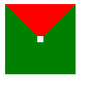

## 盒子模型

### 介绍

盒子模型，英文即box model。无论是div、span、还是a都是盒子。

但是，图片、表单元素一律看作是文本，它们并不是盒子。这个很好理解，比如说，一张图片里并不能放东西，它自己就是自己的内容。

### 盒子中的区域

一个盒子中主要的属性就5个：width、height、padding、border、margin。如下：

- width和height：**内容**的宽度、高度（不是盒子的宽度、高度）。
- padding：内边距。
- border：边框。
- margin：外边距。


> 注意：**宽度和真实占有宽度，不是一个概念！**来看下面这例子。

### 标准盒模型和IE盒模型

> 我们目前所学习的知识中，以标准盒子模型为准。

标准盒子模型：


IE盒子模型：


上图显示：

在 CSS 盒子模型 (Box Model) 规定了元素处理元素的几种方式：

- width和height：**内容**的宽度、高度（不是盒子的宽度、高度）。
- padding：内边距。
- border：边框。
- margin：外边距。

CSS盒模型和IE盒模型的区别：

- 在 <font color="#0000FF">**标准盒子模型**</font>中，<font color="#0000FF">**width 和 height 指的是内容区域**</font>的宽度和高度。增加内边距、边框和外边距不会影响内容区域的尺寸，但是会增加元素框的总尺寸。

- <font color="#0000FF">**IE盒子模型**</font>中，<font color="#0000FF">**width 和 height 指的是内容区域+border+padding**</font>的宽度和高度。

<br>

### `<body>`标签也有margin

`<body>`标签有必要强调一下。很多人以为`<body>`标签占据的是整个页面的全部区域，其实是错误的，正确的理解是这样的：整个网页最大的盒子是`<document>`，即浏览器。而`<body>`是`<document>`的儿子。浏览器给`<body>`默认的margin大小是8个像素，此时`<body>`占据了整个页面的一大部分区域，而不是全部区域。来看一段代码。


**如果想保持一个盒子的真实占有宽度不变，那么加width的时候就要减padding。加padding的时候就要减width**。因为盒子变胖了是灾难性的，这会把别的盒子挤下去。


## 认识padding

### padding区域也有颜色

padding就是内边距。<font color="#0000FF">**padding的区域有背景颜色**</font>，css2.1前提下，并且背景颜色一定和内容区域的相同。也就是说，background-color将填充**所有border以内的区域。**

### padding有四个方向

padding是4个方向的，所以我们能够分别描述4个方向的padding。

方法有两种，第一种写小属性；第二种写综合属性，用空格隔开。

小属性的写法：

```css
	padding-top: 30px;
	padding-right: 20px;
	padding-bottom: 40px;
	padding-left: 100px;
```

综合属性的写法：(上、右、下、左)（顺时针方向，用空格隔开。margin的道理也是一样的）

```css
padding:30px 20px 40px 100px;
```

如果写了四个值，则顺序为：上、右、下、左。

如果只写了三个值，则顺序为：上、右、下。左边与右侧相同。

如果只写了两个值，比如说：

```
padding: 30px 40px;
```

则顺序等价于：30px 40px 30px 40px;

要懂得，**用小属性层叠大属性**。比如：

```
padding: 20px;
padding-left: 30px;
```

下面的写法：

```
padding-left: 30px;
padding: 20px;
```

第一行的小属性无效，因为被第二行的大属性层叠掉了。


### 一些元素，默认带有padding

一些元素，默认带有`padding`，比如ul标签。不加任何样式的ul，也是有40px的padding-left。

所以，我们做站的时候，为了便于控制，总是喜欢清除这个默认的padding。

可以使用`*`进行清除：

```css
		*{
			margin: 0;
			padding: 0;
		}
```

 但是，`*`的效率不高，所以我们使用并集选择器，罗列所有的标签（不用背，有专业的清除默认样式的样式表，今后学习）：

```
body,div,dl,dt,dd,ul,ol,li,h1,h2,h3,h4,h5,h6,pre,code,form,fieldset,legend,input,textarea,p,blockquote,th,td{
    margin:0;
    padding:0;
}
```

## 认识border

border就是边框。边框有三个要素：像素（粗细）、线型、颜色。

比如：

```css

.div1{
	width: 10px;
	height: 10px;
	border: 2px solid red;
}

```

颜色如果不写，默认是黑色。另外两个属性如果不写，则无法显示边框。

### border-style

border的所有的线型如下：（我们可以通过查看[CSS参考手册](https://www.w3school.com.cn/cssref/index.asp)得到）

比较稳定的border-style就几个：solid、dashed、dotted。

### border拆分

border是一个大综合属性。比如说：

```css
border:1px solid red;
```

就是把上下左右这四个方向的边框，都设置为 1px 宽度、线型实线、red颜色。

border属性是能够被拆开的，有两大种拆开的方式：

- （1）按三要素拆开：border-width、border-style、border-color。（一个border属性是由三个小属性综合而成的）

- （2）按方向拆开：border-top、border-right、border-bottom、border-left。

现在我们明白了：**一个border属性，是由三个小属性综合而成的**。如果某一个小属性后面是空格隔开的多个值，那么就是上右下左的顺序。举例如下：

```
border-width:10px 20px;
border-style:solid dashed dotted;
border-color:red green blue yellow;
```


### border-image 属性

比如：

```css
border-image: url(.img.png) 30 round;
```

这个属性在实际开发中用得不多，暂时忽略。

### 举例1：利用 border 属性画一个三角形（小技巧）

完整代码如下：

```css
div{
	width: 0;
	height: 0;
	border: 50px solid transparent;
	border-top-color: red;
	border-bottom: none;
}

```
效果如下：<br>


### 举例2：利用 border 属性画一个三角形（更推荐的技巧）

上面的例子1中，画出来的是直角三角形，可如果我想画等边三角形，要怎么做呢？

完整代码如下：（用 css 画等边三角形）

```css
.div1{
	width: 0;
	height: 0;
	border-top: 30px solid red;
	/* 通过改变 border-left 和 border-right 中的像素值，来改变三角形的形状 */
	border-left: 20px solid transparent;
	border-right: 20px solid transparent;
}

```
另外，我们在上方代码的基础之上，再加一个 `border-radius: 20px;` 就能画出一个扇形。


