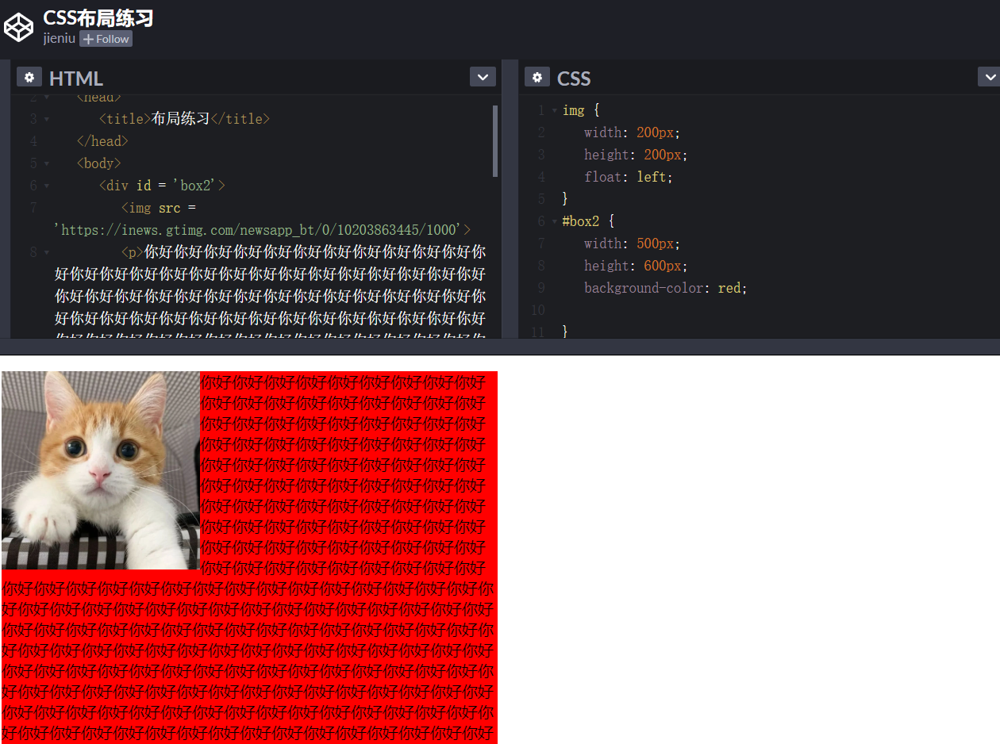
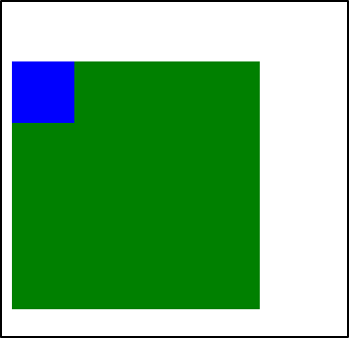
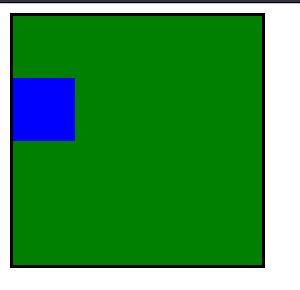

## 本文主要内容

- 标准文档流
	- 标准文档流的特性
	- 行内元素和块级元素
	- 行内元素和块级元素的相互转换
- 浮动的性质
- 浮动的清除
- 浏览器的兼容性问题
- 浮动中margin相关
- 关于margin的IE6兼容问题

## 标准文档流


web页面的制作，是个“流”，必须从上而下，像“织毛衣”。


### 标准文档流的特性

**（1）空白折叠现象：**

无论多少个空格、换行、tab，都会折叠为一个空格。

**（2）高矮不齐，底边对齐：**


**（3）自动换行，一行写不满，换行写。**


### 行内元素和块级元素

标准文档流等级森严。标签分为两种等级：

- 行内元素
- 块级元素

**行内元素和块级元素的区别：**（非常重要）

行内元素：

- 与其他行内元素并排；
- 不能设置宽、高。默认的宽度，就是文字的宽度。

块级元素：

- 霸占一行，不能与其他任何元素并列；
- 能接受宽、高。如果不设置宽度，那么宽度将默认变为父亲的100%。


**行内元素和块级元素的分类：**

从HTML的角度来讲，标签分为：

- 文本级标签：p、span、a、b、i、u、em。
- 容器级标签：div、h系列、li、dt、dd。

> PS：为甚么说p是文本级标签呢？因为p里面只能放文字&图片&表单元素，p里面不能放h和ul，p里面也不能放p。

从CSS的角度讲，CSS的分类和上面的很像，就p不一样：

- 行内元素：除了p之外，所有的文本级标签，都是行内元素。p是个文本级，但是是个块级元素。

- 块级元素：所有的容器级标签都是块级元素，还有p标签。


### 行内元素和块级元素的相互转换

我们可以通过`display`属性将块级元素和行内元素进行相互转换。display即“显示模式”。

#### 块级元素可以转换为行内元素：

一旦，给一个块级元素（比如div）设置：

```
display: inline;
```

那么，这个标签将立即变为行内元素，此时它和一个span无异。inline就是“行内”。也就是说：

- 此时这个div不能设置宽度、高度；
- 此时这个div可以和别人并排了。


#### 行内元素转换为块级元素：

同样的道理，一旦给一个行内元素（比如span）设置：

```
display: block;
```

那么，这个标签将立即变为块级元素，此时它和一个div无异。block”是“块”的意思。也就是说：

- 此时这个span能够设置宽度、高度
- 此时这个span必须霸占一行了，别人无法和他并排
- 如果不设置宽度，将撑满父亲

标准流里面的限制非常多，导致很多页面效果无法实现。如果我们现在就要并排、并且就要设置宽高，那该怎么办呢？办法是：**脱离标准流**


css中一共有三种手段，使一个元素脱离标准文档流：

- （1）浮动
- （2）绝对定位
- （3）固定定位


## 浮动的性质

> 浮动是css里面布局用的最多的属性。

现在有两个div，分别设置宽高。我们知道，它们的效果如下：


此时，如果给这两个div增加一个浮动属性，比如`float: left;`，效果如下：


这就达到了浮动的效果。此时，两个元素并排了，并且两个元素都能够设置宽度、高度了（这在上一段的标准流中，不能实现）。

浮动想学好，一定要知道三个性质。接下来讲一讲。

### 性质1：浮动的元素脱标

脱标即脱离标准流。我们来看几个例子。

证明1：


上图中，在默认情况下，两个div标签是上下进行排列的。现在由于float属性让上图中的第一个`<div>`标签出现了浮动，于是这个标签在另外一个层面上进行排列。而第二个`<div>`还在自己的层面上遵从标准流进行排列。

证明2：

span标签在标准流中，是不能设置宽高的（因为是行内元素）。但是，一旦设置为浮动之后，即使不转成块级元素，也能够设置宽高了。

所以：**一旦一个元素浮动了，那么，将能够并排了，并且能够设置宽高了。无论它原来是个div还是个span**。所有标签，浮动之后，已经不区分行内、块级了。


### 性质2：浮动的元素互相贴靠

我们给三个div均设置了`float: left;`属性之后，然后设置宽高。当改变浏览器窗口大小时，可以看到div的贴靠效果。


3号如果有足够空间，那么就会靠着2号。如果没有足够的空间，那么会靠着1号。
如果没有足够的空间靠着1号大哥，3号自己去贴左墙。

同样，float还有一个属性值是`right`，这个和属性值`left`是对称的。


### 性质3：浮动的元素有“字围”效果

来看一张图就明白了。我们让div浮动，p不浮动。



上图中，我们发现：**div挡住了p，但不会挡住p中的文字**，形成“字围”效果。

总结：**标准流中的文字不会被浮动的盒子遮挡住**。（文字就像水一样）

关于浮动我们要强调一点，浮动这个东西，为避免混乱，我们在初期一定要遵循一个原则：**永远不是一个东西单独浮动，浮动都是一起浮动，要浮动，大家都浮动。**


### 性质4：收缩

收缩：一个浮动的元素，如果没有设置width，那么将自动收缩为内容的宽度（这点非常像行内元素）。

上图中，div本身是块级元素，如果不设置width，它会单独霸占整行；但是，设置div浮动后，它会收缩


## 浮动的清除

> 这里所说的清除浮动，指的是清除浮动与浮动之间的影响。

### 前言

通过上面这个例子，我们发现，此例中的网页就是通过浮动实现并排的。

比如说一个网页有header、content、footer这三部分。就拿content部分来举例，如果设置content的儿子为浮动，但是，这个儿子又是一个全新的标准流，于是儿子的儿子仍然在标准流里。

给里面的`<li>`标签加浮动。效果却成了下面这个样子：

代码如下：

```html
<!DOCTYPE html>
<html lang="en">
<head>
	<meta charset="UTF-8">
	<title>Document</title>
	<style type="text/css">
		*{

		}
		li{
			float: left;
			width: 100px;
			height: 20px;
			background-color: pink;


		}
	</style>
</head>
<body>
	<div class="box1">
		<ul>
			<li>生命壹号1</li>
			<li>生命壹号2</li>
			<li>生命壹号3</li>
			<li>生命壹号4</li>
		</ul>
	</div>
	<div class="box2">
		<ul>
			<li>许嵩1</li>
			<li>许嵩2</li>
			<li>许嵩3</li>
			<li>许嵩4</li>
		</ul>
	</div>
</body>
</html>
```

第二组中的第1个li，去贴靠第一组中的最后一个li了（我们本以为这些li会分成两排）。

所以要清除浮动。


### 方法1：给浮动元素的祖先元素加高度


造成上述这个现象的根本原因是：li的**父亲div没有设置高度**，导致这两个div的高度均为0px（我们可以通过网页的审查元素进行查看）。div的高度为零，导致不能给自己浮动的孩子，撑起一个容器。

撑不起一个容器，导致自己的孩子没办法在自己的内部进行正确的浮动。

好，现在就算给这个div设置高度，可如果div自己的高度小于孩子的高度，也会出现不正常的现象。


给div设置一个正确的合适的高度（至少保证高度大于儿子的高度），就可以看到正确的现象。

**总结：**

**如果一个元素要浮动，那么它的祖先元素一定要有高度。**

**有高度的盒子，才能关住浮动**。

只要浮动在一个有高度的盒子中，那么这个浮动就不会影响后面的浮动元素。所以就是清除浮动带来的影响了。

### 方法2：clear:both;

网页制作中，高度height其实很少出现。为什么？因为能被内容撑高！也就是说，刚刚我们讲解的方法1，工作中用得很少。

那么，能不能不写height，也把浮动清除了呢？也让浮动之间，互不影响呢？

这个时候，我们可以使用`clear:both;`这个属性。如下：


```
clear:both;
```

clear就是清除，both指的是左浮动、右浮动都要清除。`clear:both`的意思就是：**不允许左侧和右侧有浮动对象。**

这种方法有一个非常大的、致命的问题，**它所在的标签，margin属性失效了**。

margin失效的本质原因是：上图中的box1和box2，高度为零。


### 方法3：隔墙法

上面这个例子中，为了防止第二个div贴靠到第二个div，我们可以**在这两个div中间用一个新的div隔开，然后给这个新的div设置`clear: both;`属性；同时，既然这个新的div无法设置margin属性，我们可以给它设置height，以达到margin的效果。这便是隔墙法。**


**内墙法：**


近些年，有演化出了“内墙法”：

```
<div>
	<p></p>  --浮动
	<p></p>  --浮动
	<div>设置高度撑出高度<div>
</div>

```
记住一句重要的话：**一个父亲是不能被浮动的儿子撑出高度的**。举例如下：

与外墙法相比，内墙法的优势（本质区别）在于：内墙法可以给它所在的家撑出宽度（让box1有高）。即：**可以自适应内容**。

而外墙法，虽然一道墙可以把两个div隔开，但是这两个div没有高，也就是说，无法wrap_content。


### 清除浮动方法4：overflow:hidden;

我们可以使用如下属性：

```
overflow:hidden;
```


overflow即“溢出”， hidden即“隐藏”。这个属性的意思是“溢出隐藏”。顾名思义：所有溢出边框的内容，都要隐藏掉。

`overflow:hidden;`的本意是清除溢出到盒子外面的文字。但是，前端开发工程师发现了，它能做偏方。如下：

一个父亲不能被自己浮动的儿子，撑出高度。但是，只要给父亲加上`overflow:hidden`; 那么，父亲就能被儿子撑出高了。这是一个偏方。


## 浮动清除的总结


> 我们在上一段讲了四种清除浮动的方法，本段来进行一个总结。

浮动的元素，只能被有高度的盒子关住。 也就是说，如果盒子内部有浮动，这个盒子有高，那么妥妥的，浮动不会互相影响。

### 1、加高法

工作上，我们绝对不会给所有的盒子加高度，这是因为麻烦，并且不能适应页面的快速变化。

```html
<div>     //设置height
	<p></p>
	<p></p>
	<p></p>
</div>

<div>    //设置height
	<p></p>
	<p></p>
	<p></p>
</div>
```


### 2、`clear:both;`法

最简单的清除浮动的方法，就是给盒子增加clear:both；表示自己的内部元素，不受其他盒子的影响。


```html
<div>
	<p></p>
	<p></p>
	<p></p>
</div>

<div>   //clear:both;
	<p></p>
	<p></p>
	<p></p>
</div>
```

浮动确实被清除了，不会互相影响了。但是有一个问题，就是margin失效。两个div之间，没有任何的间隙了。


### 3、隔墙法

在两部分浮动元素中间，建一个墙。隔开两部分浮动，让后面的浮动元素，不去追前面的浮动元素。
墙用自己的身体当做了间隙。

```html
<div>
	<p></p>
	<p></p>
	<p></p>
</div>

<div class="cl h10"></div>

<div>
	<p></p>
	<p></p>
	<p></p>
</div>
```

我们发现，隔墙法好用，但是第一个div，还是没有高度。如果我们现在想让第一个div，自动根据自己的儿子撑出高度，我们就要想一些“小伎俩”。

内墙法：

```html
<div>
	<p></p>
	<p></p>
	<p></p>
	<div class="cl h10"></div>
</div>

<div>
	<p></p>
	<p></p>
	<p></p>
</div>
```

内墙法的优点就是，不仅仅能够让后部分的p不去追前部分的p了，并且能把第一个div撑出高度。这样，这个div的背景、边框就能够根据p的高度来撑开了。


### 4、`overflow:hidden;`

这个属性的本意，就是将所有溢出盒子的内容，隐藏掉。但是，我们发现这个东西能够用于浮动的清除。
我们知道，一个父亲，不能被自己浮动的儿子撑出高度，但是，如果这个父亲加上了overflow:hidden；那么这个父亲就能够被浮动的儿子撑出高度了。这个现象，不能解释，就是浏览器的偏方。
并且,overflow:hidden;能够让margin生效。


## 浏览器的兼容性问题


> 讲一下上述知识点涉及到的浏览器兼容问题。


### 兼容性1（微型盒子）

**兼容性的第一条**：IE6不支持小于12px的盒子，任何小于12px的盒子，在IE6中看都大。即：IE 6不支持微型盒子。

IE6留了一个**后门**：只要给css属性之前，加上**下划线**，这个属性就是IE6的专有属性。

### 兼容性2

**兼容性的第二条：**IE6不支持用`overflow:hidden;`来清除浮动。

解决办法，以毒攻毒。追加一条：

```
_zoom:1;
```

完整写法：

```
overflow: hidden;
_zoom:1;
```

实际上，`_zoom:1;`能够触发浏览器hasLayout机制。这个机制，不要深究了，因为只有IE6有。我们只需要让IE6好用，具体的实现机制，可以自行查阅。

需要强调的是，`overflow:hidden;`的本意，就是让溢出盒子的border的内容隐藏，这个功能是IE6兼容的。不兼容的是`overflow:hidden;`清除浮动的时候。


**总结：**

我们刚才学习的两个IE6的兼容问题，都是通过多写一条hack来解决的，这个我们称为伴生属性，即两个属性，要写一起写。

属性1：

```
height:6px;
_font-size:0;
```

属性2：

```
overflow:hidden;
_zoom:1;
```

<br>

## margin相关

> 我们来讲一下浮动中和margin相关的知识。


### margin塌陷/margin重叠


**标准文档流中，竖直方向的margin不叠加，取较大的值作为margin(水平方向的margin是可以叠加的，即水平方向没有塌陷现象)**。如下图所示：


如果不在标准流，比如盒子都浮动了，那么两个盒子之间是没有塌陷现象的。

### 盒子居中`margin:0 auto;`

margin的值可以为auto，表示自动。当left、right两个方向都是auto的时候，盒子居中了：

```
margin-left: auto;
margin-right: auto;
```

盒子居中的简写为：

```
margin:0 auto;
```

对上方代码的理解：上下的margin为0，左右的margin都尽可能的大，于是就居中了。

注意：

- （1）只有标准流的盒子，才能使用`margin:0 auto;`居中。也就是说，当一个盒子浮动了、绝对定位了、固定定位了，都不能使用margin:0 auto;
- （2）使用`margin:0 auto;`的盒子，必须有width，有明确的width。（可以这样理解，如果没有明确的witdh，那么它的witdh就是霸占整行，没有意义）
- （3）`margin:0 auto;`是让盒子居中，不是让盒子里的文本居中。文本的居中，要使用`text-align:center;`


### 善于使用父亲的padding，而不是儿子的margin

我们来看一个奇怪的现象。现在有下面这样一个结构：（div中放一个p）

```
	<div>
		<p></p>
	</div>
```

上面的结构中，我们尝试通过给儿子`p`一个`margin-top:50px;`的属性，让其与父亲保持50px的上边距。结果却看到了下面的奇怪的现象：




此时我们给父亲div加一个border属性，就正常了：




如果父亲没有border，那么儿子的margin实际上踹的是“流”，踹的是这“行”。所以，父亲整体也掉下来了。

**margin这个属性，本质上描述的是兄弟和兄弟之间的距离； 最好不要用这个marign表达父子之间的距离。**

所以，如果要表达父子之间的距离，我们一定要善于使用父亲的padding，而不是儿子的margin。


## 关于margin的IE6兼容问题


### IE6的双倍margin的bug：

当出现连续浮动的元素，携带与浮动方向相同的margin时，**队首的元素，会双倍marign**。

```
	<ul>
		<li></li>
		<li></li>
		<li></li>
	</ul>
```


解决方案：

（1）使浮动的方向和margin的方向，相反。

所以，你就会发现，我们特别喜欢，**浮动的方向和margin的方向相反**。并且，前端开发工程师，把这个当做习惯了。

```
	float: left;
	margin-right: 40px;
```


（2）使用hack

单独给队首的元素，写一个一半的margin：

```
<li class="no1"></li>
```

```
ul li.no1{
	_margin-left:20px;
}
```


## Fireworks和others

### Fireworks

fireworks是Adobe公司的一个设计软件。功能非常多。Fireworks的默认文件格式是png。

标尺的快捷键：Ctrl + Alt+ R


### others


首行缩进两个汉字：

```
text-indent: 2em;
```

上方属性中，单位比较奇怪，叫做em，em就是汉字的一个宽度。indent的意思是缩进。


