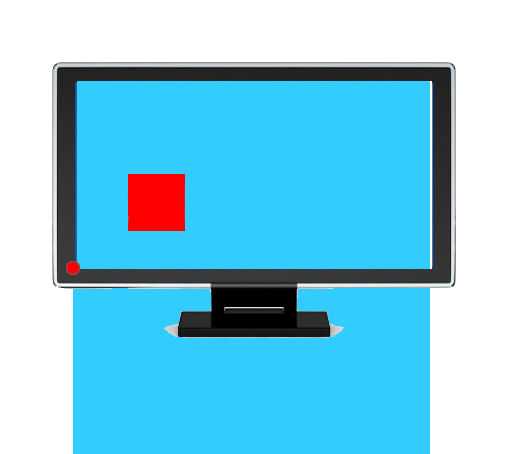

## 本文主要内容：

CSS的定位属性有三种，分别是绝对定位、相对定位、固定定位。

```
	position: absolute;  <!-- 绝对定位 -->

	position: relative;  <!-- 相对定位 -->

	position: fixed;     <!-- 固定定位 -->

```

<br>

## 相对定位

**相对定位**：让元素相对于自己原来的位置，进行位置调整（可用于盒子的位置微调）。

我们之前学习的背景属性中，是通过如下格式：

```
	background-position:向右偏移量 向下偏移量;
```

但这回的定位属性，是通过如下格式：

```
	position: relative;
	left: 50px;
	top: 50px;
```


### 相对定位不脱标

**相对定位**：不脱标，老家留坑，**别人不会把它原来的位置挤走**。

也就是说，相对定位的真实位置还在老家，只不过影子出去了，可以到处飘。

### 相对定位的用途

如果想做“压盖”效果（把一个div放到另一个div之上），我们一般**不用**相对定位来做。相对定位，就两个作用：

- （1）微调元素
- （2）做绝对定位的参考，子绝父相

### 相对定位的定位值

- left：盒子右移

- right：盒子左移

- top：盒子下移

- bottom：盒子上移

PS：负数表示相反的方向。

↘：

```
	position: relative;
	left: 40px;
	top: 10px;
```

↙：

```
	position: relative;
	right: 100px;
	top: 100px;
```

↖：

```
	position: relative;
	right: 100px;
	bottom: 100px;
```

↗：

```
	position: relative;
	left: 200px;
	bottom: 200px;

```


## 绝对定位

**绝对定位**：定义横纵坐标。原点在父容器的左上角或左下角。横坐标用left表示，纵坐标用top或者bottom表示。

格式举例如下：

```
	position: absolute;  /*绝对定位*/
	left: 10px;  /*横坐标*/
	top/bottom: 20px;  /*纵坐标*/
```
<br>

### 绝对定位脱标

**绝对定位的盒子脱离了标准文档流。**

所以，所有的标准文档流的性质，绝对定位之后都不遵守了。

绝对定位之后，标签就不区分所谓的行内元素、块级元素了，不需要`display:block`就可以设置宽、高了。

### 绝对定位的参考点（重要）

（1）如果用**top描述**，那么参考点就是**页面的左上角**，而不是浏览器的左上角：


（2）如果用**bottom描述**，那么参考点就是**浏览器首屏窗口尺寸**（好好理解“首屏”二字），对应的页面的左下角：



### 以盒子为参考点: absolute

一个绝对定位的元素，如果父辈元素中也出现了已定位（无论是绝对定位、相对定位，还是固定定位）的元素，那么将以父辈这个元素，为参考点。


（1） 要听最近的已经定位的祖先元素的，不一定是父亲，可能是爷爷：

（2）不一定是相对定位，任何定位，都可以作为儿子的参考点：

子绝父绝、**子绝父相**、子绝父固，都是可以给儿子定位的。但是在工程上，如果子绝、父绝，没有一个盒子在标准流里面了，所以页面就不稳固，没有任何实战用途。

**工程应用：**

“**子绝父相**”有意义：这样可以保证父亲没有脱标，儿子脱标在父亲的范围里面移动。于是，工程上经常这样做：

> 父亲浮动，设置相对定位（零偏移），然后让儿子绝对定位一定的距离。

（3）绝对定位的儿子，无视参考的那个盒子的padding：

**工程应用：**

绝对定位非常适合用来做“压盖”效果。

### 让绝对定位中的盒子在父亲里居中

我们知道，如果想让一个**标准流中的盒子在父亲里居中**（水平方向看），可以将其设置`margin: 0 auto`属性。

可如果盒子是绝对定位的，此时已经脱标了，如果还想让其居中（位于父亲的正中间），可以这样做：

```
	div {
		width: 600px;
		height: 60px;
		position: absolute;  绝对定位的盒子
		left: 50%;           首先，让左边线居中
		top: 0;
		margin-left: -300px;  然后，向左移动宽度（600px）的一半
	}
```


我们可以总结成一个公式：

> left:50%; margin-left:负的宽度的一半

## 固定定位: fixed

**固定定位**：就是相对浏览器窗口进行定位。无论页面如何滚动，这个盒子显示的位置不变。

备注：IE6不兼容。

**用途1**：网页右下角的“返回到顶部”

比如我们经常看到的网页右下角显示的“返回到顶部”，就可以固定定位。

```html
	<style type="text/css">
		.backtop{
			position: fixed;
			bottom: 100px;
			right: 30px;
			width: 60px;
			height: 60px;
			background-color: gray;
			text-align: center;
			line-height:30px;
			color:white;
			text-decoration: none;   /*去掉超链接的下划线*/
		}
	</style>
```

**用途2：**顶部导航条

我们经常能看到固定在网页顶端的导航条，可以用固定定位来做。

需要注意的是，假设顶部导航条的高度是60px，那么，为了防止其他的内容被导航条覆盖，我们要给body标签设置60px的padding-top。


### 5、z-index属性：

**z-index**属性：表示谁压着谁。数值大的压盖住数值小的。

有如下特性：

 （1）属性值大的位于上层，属性值小的位于下层。

 （2）z-index值没有单位，就是一个正整数。默认的z-index值是0。

 （3）如果大家都没有z-index值，或者z-index值一样，那么在HTML代码里写在后面，谁就在上面能压住别人。定位了的元素，永远能够压住没有定位的元素。

 （4）**只有定位了的元素，才能有z-index值**。也就是说，不管相对定位、绝对定位、固定定位，都可以使用z-index值。**而浮动的元素不能用**。

 （5）**从父现象**：由父元素z-index数值大小决定。意思是，如果父亲1比父亲2大，那么，即使儿子1比儿子2小，儿子1也能在最上层。


z-index属性的应用还是很广泛的。当好几个已定位的标签出现覆盖的现象时，我们可以用这个z-index属性决定，谁处于最上方。也就是**层级**的应用。


**层级：**

（1）必须有定位（除去static）

（2）用`z-index`来控制层级数。


## 总结：


<table style = "text-align: center">
	<tr>
		<td>值</td>
		<td>描述</td>
	<tr>
	<tr>
		<td>absolute</td>
		<td>生成绝对定位的元素，相对于 static 定位以外的第一个父元素进行定位。
元素的位置通过 "left", "top", "right" 以及 "bottom" 属性进行规定。</td>
	<tr>
	<tr>
		<td>fixed</td>
		<td>生成绝对定位的元素，相对于浏览器窗口进行定位。
元素的位置通过 "left", "top", "right" 以及 "bottom" 属性进行规定。</td>
	<tr>
	<tr>
		<td>relative</td>
		<td>生成相对定位的元素，相对于其正常位置进行定位。
因此，"left:20" 会向元素的 LEFT 位置添加 20 像素。</td>
	<tr>
	<tr>
		<td>static</td>
		<td>默认值。没有定位，元素出现在正常的流中（忽略 top, bottom, left, right 或者 z-index 声明）。</td>
	<tr>
	<tr>
		<td>inherit</td>
		<td>规定应该从父元素继承 position 属性的值。</td>
	<tr>
</table>


