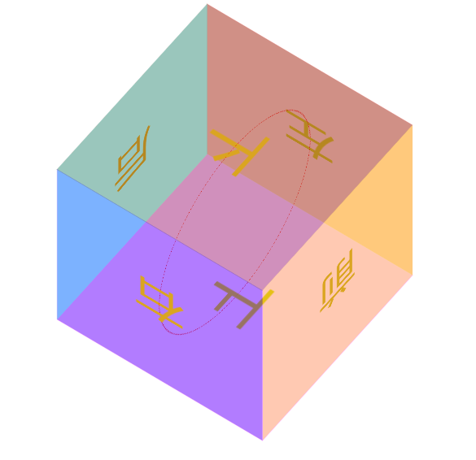

## 本文主要内容：

- 过渡：transition

- 2D 转换 transform

- 3D 转换 transform

- 动画：animation

## 过渡：transition

`transition`的中文含义是**过渡**。过渡是CSS3中具有颠覆性的一个特征，可以实现元素**不同状态间的平滑过渡**（补间动画），经常用来制作动画效果。

- 补间动画：自动完成从起始状态到终止状态的的过渡。不用管中间的状态。

- 帧动画：通过一帧一帧的画面按照固定顺序和速度播放。如电影胶片。


transition 包括以下属性：

- `transition-property: all;`  如果希望所有的属性都发生过渡，就使用all。

- `transition-duration: 1s;` 过渡的持续时间。

- `transition-timing-function: linear;`  运动曲线。属性值可以是：
	- `linear` 线性
	- `ease`  减速
	- `ease-in` 加速
	- `ease-out` 减速
	- `ease-in-out`  先加速后减速

- `transition-delay: 1s;` 过渡延迟。多长时间后再执行这个过渡动画。

上面的四个属性也可以写成**综合属性**：

```javascript
	transition: 让哪些属性进行过度 过渡的持续时间 运动曲线 延迟时间;

	transition: all 3s linear 0s;
```

其中，`transition-property`这个属性是尤其需要注意的，不同的属性值有不同的现象。我们来示范一下。

如果设置 `transition-property: width`，意思是只让盒子的宽度在变化时进行过渡。

如果设置 `transition-property: all`，意思是让盒子的所有属性（包括宽度、背景色等）在变化时都进行过渡。


## 2D 转换

**转换**是 CSS3 中具有颠覆性的一个特征，可以实现元素的**位移、旋转、变形、缩放**，甚至支持矩阵方式。

转换再配合过渡和动画，可以取代大量早期只能靠 Flash 才可以实现的效果。

在 CSS3 当中，通过 `transform` 转换来实现 2D 转换或者 3D 转换。

- 2D转换包括：缩放、移动、旋转。

我们依次来讲解。

### 1、缩放：`scale`

格式：

```javascript
	transform: scale(x, y);

	transform: scale(2, 0.5);
```

参数解释： x：表示水平方向的缩放倍数。y：表示垂直方向的缩放倍数。如果只写一个值就是等比例缩放。

取值：大于1表示放大，小于1表示缩小。不能为百分比。


### 2、位移：translate

格式：


```javascript
	transform: translate(水平位移, 垂直位移);

	transform: translate(-50%, -50%);
```

参数解释：

- 参数为百分比，相对于自身移动。

- 正值：向右和向下。 负值：向左和向上。如果只写一个值，则表示水平移动。


**应用：让绝对定位中的盒子在父亲里居中**

我们知道，如果想让一个**标准流中的盒子在父亲里居中**（水平方向看），可以将其设置`margin: 0 auto`属性。

可如果盒子是绝对定位的，此时已经脱标了，如果还想让其居中（位于父亲的正中间），可以这样做：

```
	div {
		width: 600px;
		height: 60px;
		position: absolute;  绝对定位的盒子
		left: 50%;           首先，让左边线居中
		top: 0;
		margin-left: -300px;  然后，向左移动宽度（600px）的一半
	}
```


现在，我们还可以利用偏移 translate 来做，这也是比较推荐的写法：

```javascript
	div {
	    width: 600px;
	    height: 60px;
	    background-color: red;
	    position: absolute;       绝对定位的盒子
	    left: 50%;               首先，让左边线居中
	    top: 0;
	    transform: translate(-50%);    然后，利用translate，往左走自己宽度的一半【推荐写法】
	}
```

### 3、旋转：rotate

格式：

```javascript
	transform: rotate(角度);

	transform: rotate(45deg);
```

参数解释：正值 顺时针；负值：逆时针。

我们给盒子设置了 transform 中的 rotate 旋转，但同时还要给盒子设置 transition 过渡。如果没有这行过渡的代码，旋转会直接一步到位。


> rotate 旋转时，默认是以盒子的正中心为坐标原点的。如果想**改变旋转的坐标原点**，可以用`transform-origin`属性。格式如下：


```javascript
	transform-origin: 水平坐标 垂直坐标;

	transform-origin: 50px 50px;

	transform-origin: center bottom;   //旋转时，以盒子底部的中心为坐标原点
```
：


### 4、倾斜

暂略。

## 3D 转换

### 1、旋转：rotateX、rotateY、rotateZ


**旋转的方向：（左手法则）**

左手握住旋转轴，竖起拇指指向旋转轴的**正方向**，正向就是**其余手指卷曲的方向**。

从上面这句话，我们也能看出：所有的3d旋转，对着正方向去看，都是顺时针旋转。

**格式：**

```javascript
	transform: rotateX(360deg);    //绕 X 轴旋转360度

	transform: rotateY(360deg);    //绕 Y 轴旋转360度

	transform: rotateZ(360deg);    //绕 Z 轴旋转360度

```


### 2、移动：translateX、translateY、translateZ

**格式：**

```javascript
	transform: translateX(100px);    //沿着 X 轴移动

	transform: translateY(360px);    //沿着 Y 轴移动

	transform: translateZ(360px);    //沿着 Z 轴移动

```


### 3、透视：perspective

电脑显示屏是一个 2D 平面，图像之所以具有立体感（3D效果），其实只是一种视觉呈现，通过透视可以实现此目的。

透视可以将一个2D平面，在转换的过程当中，呈现3D效果。但仅仅只是视觉呈现出 3d 效果，并不是正真的3d。

格式有两种写法：

- 作为一个属性，设置给父元素，作用于所有3D转换的子元素

- 作为 transform 属性的一个值，做用于元素自身。

格式举例：

```css
perspective: 500px;
```

### 4、3D呈现（transform-style）

3D元素构建是指某个图形是由多个元素构成的，可以给这些元素的**父元素**设置`transform-style: preserve-3d`来使其变成一个真正的3D图形。属性值可以如下：

```css
	transform-style: preserve-3d;     /* 让 子盒子 位于三维空间里 */

	transform-style: flat;            /* 让子盒子位于此元素所在的平面内（子盒子被扁平化） */

```

**案例**：立方体

```html
<!DOCTYPE html>
<html>
<head lang="en">
    <meta charset="UTF-8">
    <title></title>
    <style>
        .box {
            width: 250px;
            height: 250px;
            border: 1px dashed red;
            margin: 100px auto;
            position: relative;
            border-radius: 50%;

            /* 让子盒子保持3d效果*/

            transform-style: preserve-3d;

            /*transform:rotateX(30deg) rotateY(-30deg);*/

            animation: gun 8s linear infinite;
        }

        .box > div {
            width: 100%;
            height: 100%;
            position: absolute;
            text-align: center;
            line-height: 250px;
            font-size: 60px;
            color: #daa520;
        }

        .left {
            background-color: rgba(255, 0, 0, 0.3);
            /* 变换中心*/
            transform-origin: left;
            /* 变换*/
            transform: rotateY(90deg) translateX(-125px);
        }

        .right {
            background: rgba(0, 0, 255, 0.3);
            transform-origin: right;
            /* 变换*/
            transform: rotateY(90deg) translateX(125px);
        }

        .forward {
            background: rgba(255, 255, 0, 0.3);
            transform: translateZ(125px);
        }

        .back {
            background: rgba(0, 255, 255, 0.3);
            transform: translateZ(-125px);
        }

        .up {
            background: rgba(255, 0, 255, 0.3);
            transform: rotateX(90deg) translateZ(125px);
        }

        .down {
            background: rgba(99, 66, 33, 0.3);
            transform: rotateX(-90deg) translateZ(125px);
        }

        @keyframes gun {
            0% {
                transform: rotateX(0deg) rotateY(0deg);
            }

            100% {
                transform: rotateX(360deg) rotateY(360deg);
            }
        }
    </style>
</head>
<body>
<div class="box">
    <div class="up">上</div>
    <div class="down">下</div>
    <div class="left">左</div>
    <div class="right">右</div>
    <div class="forward">前</div>
    <div class="back">后</div>
</div>
</body>
</html>
```


## 动画

动画是CSS3中具有颠覆性的特征，可通过设置**多个节点** 来精确控制一个或一组动画，常用来实现**复杂**的动画效果。

### 1、定义动画的步骤

（1）通过@keyframes定义动画；

（2）将这段动画通过百分比，分割成多个节点；然后各节点中分别定义各属性；

（3）在指定元素里，通过 `animation` 属性调用动画。

之前,我们在 js 中定义一个函数的时候，是先定义，再调用：

```javascript
    js 定义函数：
        function fun(){ 函数体 }

     调用：
     	fun();
```

同样，我们在 CSS3 中**定义动画**的时候，也是**先定义，再调用**：

```javascript
    定义动画：
        @keyframes 动画名{
            from{ 初始状态 }
            to{ 结束状态 }
        }

     调用：
      animation: 动画名称 持续时间；
```

其中，animation属性的格式如下：

```javascript
            animation: 定义的动画名称 持续时间  执行次数  是否反向  运动曲线 延迟执行。(infinite 表示无限次)

            animation: move1 1s  alternate linear 3;

            animation: move2 4s;
```


### 2、动画属性

我们刚刚在调用动画时，animation属性的格式如下：

animation属性的格式如下：

```javascript
            animation: 定义的动画名称  持续时间  执行次数  是否反向  运动曲线 延迟执行。(infinite 表示无限次)

            animation: move1 1s  alternate linear 3;

            animation: move2 4s;
```


可以看出，这里的 animation 是综合属性，接下来，我们把这个综合属性拆分看看。

（1）动画名称：

```javascript
	animation-name: move;
```

（2）执行一次动画的持续时间：

```javascript
	animation-duration: 4s;
```

备注：上面两个属性，是必选项，且顺序固定。

（3）动画的执行次数：

```javascript
	animation-iteration-count: 1;       //iteration的含义表示迭代
```

属性值`infinite`表示无数次。

（3）动画的方向：

```javascript
	animation-direction: alternate;
```

属性值：normal 正常，alternate 反向。

（4）动画延迟执行：


```javascript
	animation-delay: 1s;
```

（5）设置动画结束时，盒子的状态：

```javascript
	animation-fill-mode: forwards;
```

属性值： forwards：保持动画结束后的状态（默认），  backwards：动画结束后回到最初的状态。

（6）运动曲线：

```
	animation-timing-function: ease-in;
```

属性值可以是：linear   ease-in-out  steps()等。

注意，如果把属性值写成**` steps()`**，则表示动画**不是连续执行**，而是间断地分成几步执行。我们接下来专门讲一下属性值 `steps()`。

### steps()的效果

我们还是拿上面的例子来举例，如果在调用动画时，我们写成：


```javascript
	animation: move2 4s steps(2);
```

有了属性值 `steps()`，我们就可以作出很多不连续地动画效果。比如时钟；再比如，通过多张静态的鱼，作出一张游动的鱼。

**step()举例：时钟的简易模型**

```html
<!DOCTYPE html>
<html>
<head lang="en">
    <meta charset="UTF-8">
    <title></title>
    <style>
        div {
            width: 3px;
            height: 200px;
            background-color: #000;
            margin: 100px auto;
            transform-origin: center bottom;    /* 旋转的中心点是底部 */
            animation: myClock 60s steps(60) infinite;
        }

        @keyframes myClock {
            0% {
                transform: rotate(0deg);
            }

            100% {
                transform: rotate(360deg);
            }
        }
    </style>
</head>
<body>
<div></div>
</body>
</html>
```

上方代码，我们通过一个黑色的长条div，旋转360度，耗时60s，分成60步完成。即可实现。


