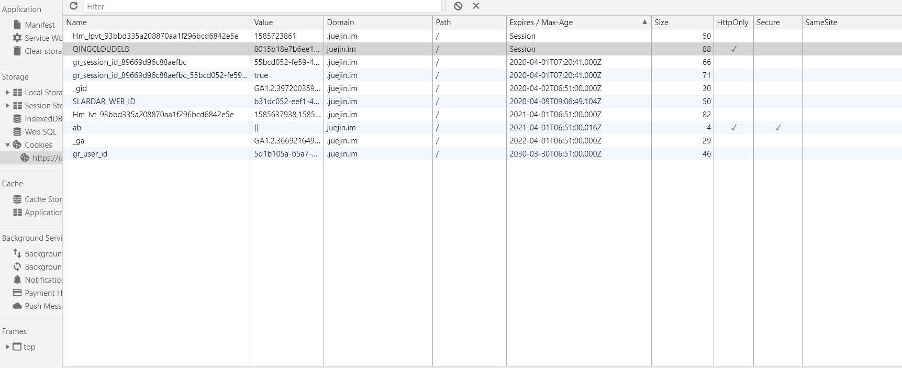

## 前言

`cookie`是什么，`cookie`就是一种浏览器管理状态的一个文件，它有name，也有value，后面那些看不见的是Domain、path等等。



**Cookie主要用于以下三个方面**：

- 会话状态管理（如用户登录状态、购物车、游戏分数或其它需要记录的信息）
- 个性化设置（如用户自定义设置、主题等）
- 浏览器行为跟踪（如跟踪分析用户行为等）

## cookie原理

第一次访问网站的时候，浏览器发出请求，服务器响应请求后，会将`cookie`放入到响应请求中，在浏览器第二次发请求的时候，会把`cookie`带过去，服务端会辨别用户身份，当然服务器也可以修改`cookie`内容。

## cookie不可跨域

cookie不能在不同的域名下用，每个cookie都会绑定单一的域名。

## cookie的属性

- **name**
  - 这个显而易见，就是代表cookie的名字的意思，一个域名下绑定的cookie，name不能相同，相同的name的值会被覆盖掉。
- **value**
  - 这个就是每个cookie拥有的一个属性，它表示cookie的值。
- **domain**
    - 这个是指的域名，这个代表的是，cookie绑定的域名，如果没有设置，就会自动绑定到执行语句的当前域，还有值得注意的点，统一个域名下的二级域名也是不可以交换使用cookie的，比如，你设置`www.baidu.com`和`image.baidu.com`,依旧是不能公用的。
- **path**
  - path这个属性默认是'/'，这个值匹配的是web的路由，举个例子：`默认路径
www.baidu.com`, `blog路径www.baidu.com/blog`， path为 `/blog`。当你路径设置成/blog的时候，其实它会给/blog、/blogabc等等的绑定cookie。

## cookie的有效期

**有效期就是前言图中的`Expires`属性**，一般浏览器的`cookie`都是默认储存的，当关闭浏览器结束这个会话的时候，这个`cookie`也就会被删除，这就是`session`(会话储存)。

如果你想要`cookie`存在一段时间，那么你可以通过设置Expires属性为未来的一个时间节点，`Expires`这个是代表当前时间的，这个属性已经逐渐被`Max-Age`所取代。

`Max-Age`，是以秒为单位的，Max-Age为正数时，cookie会在Max-Age秒之后，被删除，当**Max-Age为负数时**，表示的是临时储存，不会生出`cookie`文件，只会存在浏览器内存中，且只会在打开的浏览器窗口或者子窗口有效，一旦浏览器关闭，`cookie`就会消失，当**Max-Age为0**时，又会发生什么呢，删除`cookie`，因为`cookie`机制本身没有设置删除`cookie`，失效的`cookie`会被浏览器自动从内存中删除，所以，它实现的就是让`cookie`失效。

## secure

这个属性译为安全，http不仅是无状态的，还是不安全的协议，容易被劫持，当这个属性设置为true时，此cookie只会在https和ssl等安全协议下传输。

提示：这个属性并不能对客户端的cookie进行加密，不能保证绝对的安全性


## HttpOnly

为避免跨域脚本 (XSS) 攻击，通过JavaScript的 `Document.cookie` API无法访问带有 `HttpOnly` 标记的`Cookie`，它们只应该发送给服务端。如果包含服务端 Session 信息的 Cookie 不想被客户端 JavaScript 脚本调用，那么就应该为其设置 HttpOnly 标记。

## SameSite Cookies 

`SameSite Cookie`允许服务器要求某个`cookie`在跨站请求时不会被发送，从而可以阻止跨站请求伪造攻击（CSRF）。

SameSite cookies是相对较新的一个字段，所有主流浏览器都已经得到支持。

下面是例子：

`Set-Cookie: key=value; SameSite=Strict`

## JS操作cookie

通过`Document.cookie`属性可创建新的`Cookie`，也可通过该属性访问非HttpOnly标记的`Cookie`。
```
document.cookie = "yummy_cookie=choco"; 
document.cookie = "tasty_cookie=strawberry"; 
console.log(document.cookie); 
// logs "yummy_cookie=choco; tasty_cookie=strawberry"
```

## [服务端操作cookie](https://developer.mozilla.org/zh-CN/docs/Web/HTTP/Headers/Set-Cookie)

响应首部   `Set-Cookie `被用来由服务器端向客户端发送 `cookie`。

```
Set-Cookie: <cookie-name>=<cookie-value> 
Set-Cookie: <cookie-name>=<cookie-value>; Expires=<date>
Set-Cookie: <cookie-name>=<cookie-value>; Max-Age=<non-zero-digit>
Set-Cookie: <cookie-name>=<cookie-value>; Domain=<domain-value>
Set-Cookie: <cookie-name>=<cookie-value>; Path=<path-value>
Set-Cookie: <cookie-name>=<cookie-value>; Secure
Set-Cookie: <cookie-name>=<cookie-value>; HttpOnly

Set-Cookie: <cookie-name>=<cookie-value>; SameSite=Strict
Set-Cookie: <cookie-name>=<cookie-value>; SameSite=Lax

// Multiple directives are also possible, for example:
Set-Cookie: <cookie-name>=<cookie-value>; Domain=<domain-value>; Secure; HttpOnly
```


——-参考：
- https://juejin.im/post/59d1f59bf265da06700b0934
- https://developer.mozilla.org/zh-CN/docs/Web/HTTP/Cookies