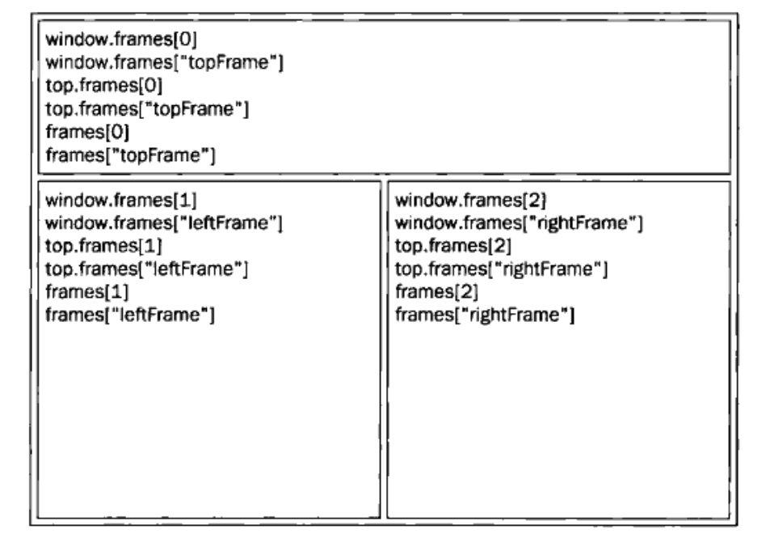
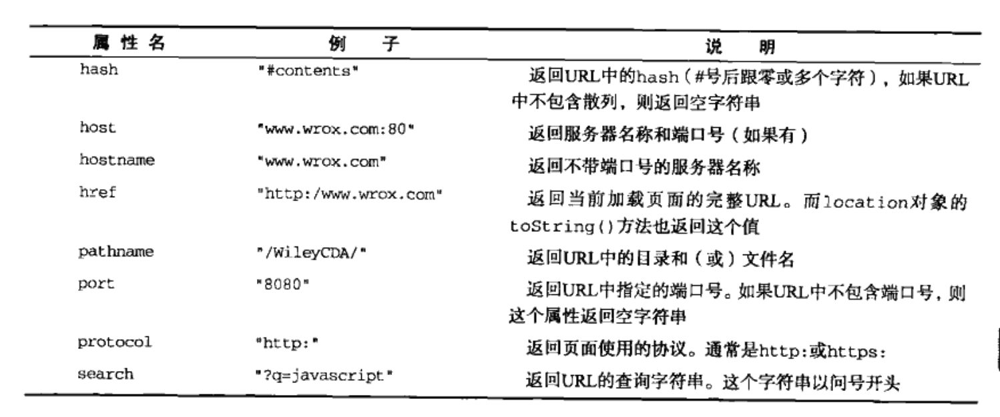

## 前言

本章内容：
- 理解window对象——BOM的核心
- 控制窗口、框架和弹出窗口
- 利用location对象中的页面信息
- 使用navigator对象了解浏览器

## window对象

BOM的核心对象是window，它表示浏览器的一个实例。

在网页中定义的任何一个对象、变量和函数，都以window作为其Global对象，因此有权访问parseInt等方法。

### 全局作用域

- 全局变量会成为window对象的属性
- 全局变量不能通过delete操作符删除，而直接在window对象上的定义的属性可以
- 尝试访问未声明的变量会抛出错误，但是通过查询window对象，可以知道某个可能未声明的变量是否存在。


### 窗口关系及框架

如果页面中包含框架，则每个框架都拥有自己的window对象，并且保存在frames集合中，可通过数值索引/框架名称来访问相应的window对象。图8-1展示了在最高层窗口中，通过代码来访问前面例子中每个框架的不同方式。

- top对象始终指向最高（最外）层的框架，也就是浏览器窗口。



- parent对象始终指向当前框架的直接上层框架。
> 除非最高层窗口是通过`window.open()`打开的，否则其window对象的name属性不会包含任何值。

- self对象，他始终指向window，实际上，self和window对象可以互换使用。

> 在使用框架的情况下，浏览器中会存在多个Global对象。在每个框架中定义的全局变量会自动成为框架中window对象的属性/

### 窗口位置

- IE、Safari、Opera、Chrome提供
  - screenLeft：窗口相对于屏幕左边的位置，IE、Opera(页面可见区域)
  - screenTop：窗口相对于屏幕上边的位置
- Firefox支持
  - screenX：窗口相对于屏幕左边的位置，Safari、Firefox、Chrome（整个浏览器窗口）
  - screenY：窗口相对于屏幕上边的位置

跨浏览器取得窗口左边和上边的位置：

```javascript
var leftPos = (typeof window.screenLeft == "number") ? window.screenLeft : window.screenX;

var topPos = (typeof window.screenTop == "number") ? window.screenTop : window.screenY;
```

将窗口精确移动到一个新位置：
- `moveTo()`：新位置的x，y坐标
- `moveBy()`：x，y方向的偏移量

### 窗口大小

- innnerWidth：页面视图区大小
- innerHeight：页面视图区大小
- outerWidth：IE9+、Safari、Firefox表示浏览器窗口大小
- outerHeight：：IE9+、Safari、Firefox表示浏览器窗口大小
- Chrome中上述4者返回相同的值，即页面视图区大小

DOM方法：

IE、Safari、Opera、Chrome、Firefox中，`document.documentElement.clientWidth`和`document.documentElement.clientHeight`保存了页面视口的信息。

调整浏览器窗口大小：
- `resizeTo()`：接收浏览器的新宽高
- `resizeBy()`：接收新窗口与原窗口的宽高之差

### 导航和打开窗口

- `window.open()`：既可以导航到一个特定的url，也可以打开一个新的浏览器窗口。
- 4个参数：要加载的url，窗口目标，一个特性字符串，表示新页面是否取代浏览器历史记录中当前加载页面的布尔值。
- 返回一个指向新窗口的引用。

------------------------------------------------------------------

弹出窗口：

如果给`window.open()`传递的第二个参数并不是一个已经存在的窗口或框架，那么该方法就会根据在第三个参数位置上传入的字符串创建一个新窗口或新标签页。

------------------------------------------------------------------

弹出窗口屏蔽程序：
- 浏览器内置程序屏蔽：`window.open()`返回null。
- 浏览器拓展/其他程序屏蔽：`window.open()`通常会抛出一个错误，可以试用`try-catch`来判断。

### 间歇调用和超时调用

- `setTimeout`
- `setInterval`

### 系统对话框

- `alert()`
- `confirm()`
- `prompt()`

## location对象

location对象既是window对象的属性，也是document对象的属性。

location对象的所有属性：


### 位置操作

`location.assign("http://www.wrox.com")`

上方代码可以立**即打开新url并在浏览器的历史记录中生成一条记录**。

如果`location.href`和`window.location`设置为一个url值，也会以该值调用assign方法。

> 修改hash的值会在浏览器的历史记录中生成一条新纪录。

**replace操作**：
- 接受一个参数，即要导航到的url
- 会导致浏览器的位置改变，但是不会在历史记录中生成新纪录，因此通过“后退”按钮（处于禁用状态）不能回到前一个页面。

reload方法：重新加载当前显示的页面。
- 不传参数：页面以最有效的方式重新加载，如从缓存中加载。
- 传递参数true：强制从服务器重新加载。

## navigator对象

识别客户端浏览器。

### 检测插件

非IE浏览器，可以使用plugins数组来达到这个目的，该数组中的每一项都包含下列属性：
- name: 插件的描述
- description：描述
- filename：插件的文件名
- length：插件处理的MIME类型数量

### 注册处理程序

`registerContentHandler`和`registerProtocalHandler`，这两个方法可以让一个站点指明它可以处理特定类型的信息。

## screen对象

## history对象

- istory对象保存着用户上网的历史记录，从窗口被打开的那一刻开始。
- history是window对象的属性。
- `go()`方法可以在用户的历史记录中任意跳转，可以向前也可以向后。接受一个参数值，表示向前或是向后跳转的页面数的整数值。负数表示向后跳转。
- `back()`方法和`foward()`方法：“后退”和“前进”按钮