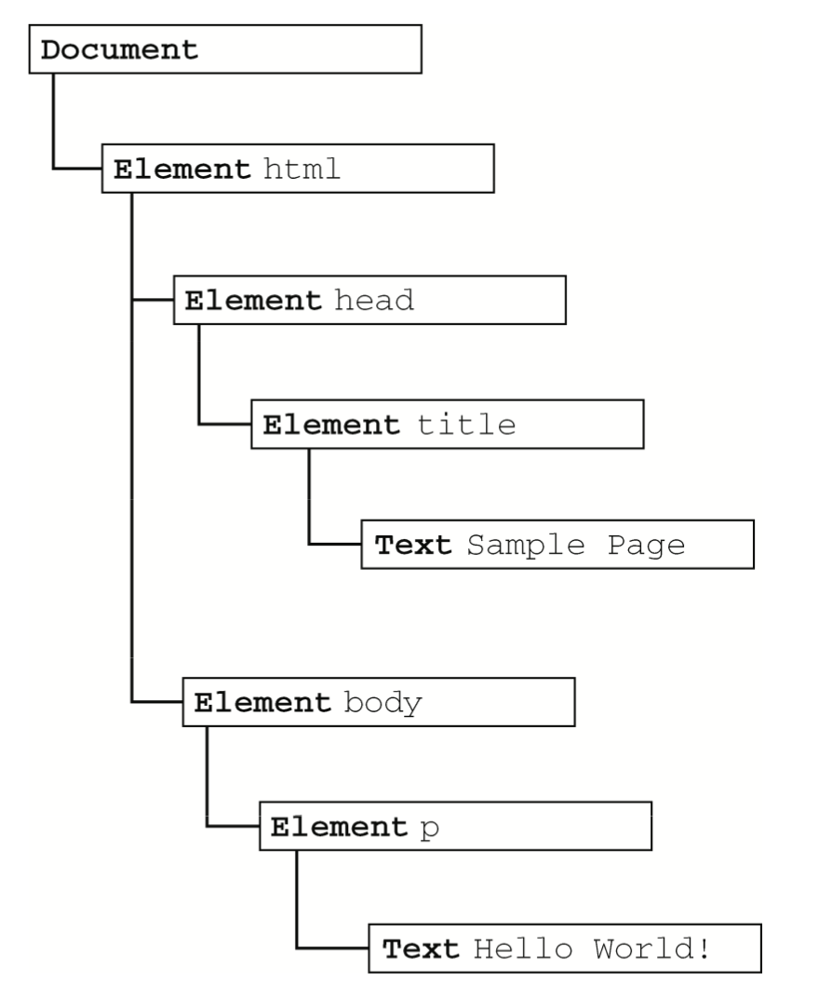
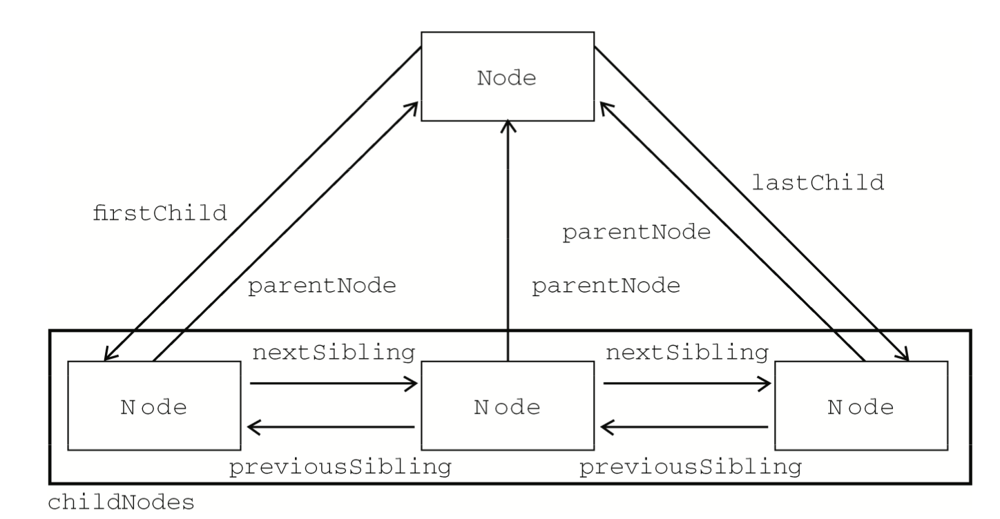

## 主要内容

- 理解包含不同层次节点的DOM
- 使用不同的节点类型
- 克服浏览器兼容问题及各种陷阱

DOM：文档对象模型，层次化的节点树，是针对HTML和XML文档的一个API。


## 节点类型



### Node类型

JavaScript 中的所有节点类型都继承自 Node 类型，因此所有节点类型都共享着相同的基本属性和方法。除了 IE 之外，在其他所有浏览器中都可以访问到这个类型。

每个节点都有一个 nodeType 属性，用于表明节点的类型。节点类型由在 Node 类型中定义的下列 12 个数值常量来表示，任何节点类型必居其一:

- Node.ELEMENT_NODE(1);
- Node.ATTRIBUTE_NODE(2);
- Node.TEXT_NODE(3);
- Node.CDATA_SECTION_NODE(4);
- Node.ENTITY_REFERENCE_NODE(5);
- Node.ENTITY_NODE(6);
- Node.PROCESSING_INSTRUCTION_NODE(7); 
- Node.COMMENT_NODE(8);
- Node.DOCUMENT_NODE(9);
- Node.DOCUMENT_TYPE_NODE(10);
- Node.DOCUMENT_FRAGMENT_NODE(11); 
- Node.NOTATION_NODE(12)

1. nodeName 和 nodeValue 属性

要了解节点的具体信息，可以使用 nodeName 和 nodeValue 这两个属性。这两个属性的值完全取 决于节点的类型。在使用这两个值以前，最好是像下面这样先检测一下节点的类型。

```javascript
if (someNode.nodeType == 1){
    value = someNode.nodeName; //nodeName 的值是元素的标签名
}
```

2. **节点关系**

节点间的各种关系可以用传统的家族关系来描述。

每个节点都有一个 **childNodes** 属性，其中保存着一个 **NodeList** 对象。**NodeList 是一种类数组对象**，用于保存一组有序的节点，可以通过位置来访问这些节点。请注意，虽然可以通过方括号语法来访问 NodeList 的值，而且这个对象也有 length 属性，但它并不是 Array 的实例。NodeList 对象的独特之处在于，它实际上是基于 DOM 结构动态执行查询的结果，因此 DOM 结构的变化能够自动反映在 NodeList 对象中。

访问保存在NodeList中的节点——**可以通过方括号，也可以使用 item() 方法**。

```javascript
var firstChild = someNode.childNodes[0];
var secondChild = someNode.childNodes.item(1); 
var count = someNode.childNodes.length;
```

对 arguments 对象使用 `Array.prototype.slice()`方法可以将其转换为数组。而采用同样的方法，也可以**将NodeList对象转换为数组**。

```javascript
//在 IE8 及之前版本中无效，IE中只能依次枚举
var arrayOfNodes = Array.prototype.slice.call(someNode.childNodes,0);
```
-------------------------------------------------------------------------------------

每个节点都有一个 **parentNode** 属性，该属性指向文档树中的父节点。包含在 childNodes 列表中的所有节点都具有相同的父节点，因此它们的 parentNode 属性都指向同一个节点。此外，包含在 childNodes 列表中的每个节点相互之间都是**同胞节点**。**通过使用列表中每个节点的 previousSibling 和 nextSibling 属性，可以访问同一列表中的其他节点**。列表中第一个节点的 previousSibling 属性 值为 null，而列表中最后一个节点的 nextSibling 属性的值同样也为 null。

父节点与其第一个和最后一个子节点之间也存在特殊关系。父节点的 **firstChild 和 lastChild** 属性分别指向其 childNodes 列表中的第一个和最后一个节点。



`hasChildNodes()`
- 在节点包含一或多个子节点的情况下返回true; 应该说，这是比查询 childNodes 列表的 length 属性更简单的方法。

`ownerDocument`
- 所有节点都有的一个属性
- 该属性指向表示整个文档的文档节点。
- 这种关系表示的是任何节点都属于它所在的文档，任何节点都不能同时存在于两个或更多个文档中。通过这个属性，我们可以不必在节点层次中通过层层回溯到达顶端，而是**可以直接访问文档节点**。 

1. 操作节点

`appendChild()`
- 用于向 childNodes 列表的末尾添加一个节点。更新完成后，appendChild() 返回新增的节点。

```javascript
var returnedNode = someNode.appendChild(newNode); 
alert(returnedNode == newNode); //true 
alert(someNode.lastChild == newNode); //true
```

> 如果传入到 `appendChild()`中的节点已经是文档的一部分了，那结果就是将该节点从原来的位置转移到新位置。任何 DOM 节点也不能同时出现在文档中的多个位置上。

`insertBefore()`
- 两个参数:要插入的节点和作为参照的节点。
- 插入节点后，被插入的节点会变成参照节点的前一个同胞节点(previousSibling)，同时被方法返回。
- 如果参照节点是null，则 `insertBefore()`与 `appendChild()`执行相同的操作。

```javascript
/插入后成为最后一个子节点
returnedNode = someNode.insertBefore(newNode, null); 
alert(newNode == someNode.lastChild); //true
//插入后成为第一个子节点
var returnedNode = someNode.insertBefore(newNode, someNode.firstChild); 
alert(returnedNode == newNode); //true
alert(newNode == someNode.firstChild); //true
//插入到最后一个子节点前面
returnedNode = someNode.insertBefore(newNode, someNode.lastChild); 
alert(newNode == someNode.childNodes[someNode.childNodes.length-2]); //true
```

`replaceChild()`
- 两个参数是:要插入的节点和要替换的节点。
- 要替换的节点将由这个方法返回并从文档树中被移除，同时由要插入的节点占据其位置。

`removeChild()`
- 这个方法接受一个参数，即要移除 的节点。被移除的节点将成为方法的返回值。
- 通过`removeChild()`移除的节点仍然为文档所有，只不过在文档中已经没有了自己的位置。

4. 其他方法

`cloneNode()`
- 用于创建调用这个方法的节点的一个完全相同的副本。
- `cloneNode()`方法接受一个布尔值参数，表示是否执行深复制。
- 在参数为true的情况下，执行深复制，也就是复制节点及其整个子节点树;
- 在参数为 false 的情况下，执行浅复制， 即只复制节点本身。
- 复制后返回的节点副本属于文档所有，但并没有为它指定父节点。
- 因此，这个节点副本就成为了一个“孤儿”，除非通过 `appendChild()`、`insertBefore()`或 `replaceChild()`将它添加到文档中

`normalize()`
- 这个方法唯一的作用就是处理文档树中的文本节点。

### Document类型

**JavaScript 通过 Document 类型表示文档**。在浏览器中，document对象是HTMLDocument(继承自Document类型)的一个实例，**表示整个 HTML 页面**。而且，document对象是 window 对象的一个属性，因此可以将其作为全局对象来访问。Document节点具有下列特征:
- nodeType 的值为 9;
- nodeName 的值为"#document";
- nodeValue 的值为 null;
- parentNode 的值为 null;
- ownerDocument 的值为 null;
- 其子节点可能是一个 DocumentType(最多一个)、Element(最多一个)、ProcessingInstruction或 Comment。

1. 文档的子节点

- `documentElement`属性，该属性始终指向 HTML 页面中的`<html>`元素。
- `document.body`: 直接指向`<body>`元素
- 所有浏览器都支持 `document.documentElement` 和 `document.body` 属性。
- `document.doctype`: 访问`<!DOCTYPE>`标签的信息。浏览器对`document.doctype`的支持差别很大。

2. 文档信息

作为HTMLDocument的一个实例，document 对象还有一些标准的 Document 对象所没有的属性。 这些属性提供了 document 对象所表现的网页的一些信息　。

`title`
- `<title>`元素中的文本。
- 显示在浏览器窗口的标题栏或标签页上。

`URL`
- URL 属性中包含页面完整的URL。

`domain`
- 只包含页面的域名，而`referrer`属性中则保存着链接到当前页面的那个页面的URL。

跨域：
- 由于跨域安全限制，来自不同子域的页面无法通过 JavaScript 通信。而通过将每个页面的 `document.domain` 设置为相同的值，这些页面就可以互相访问对方包含的 JavaScript 对象了。

`domain`的限制：
- 如果域名一开始是“松散的”(loose)，那么不能将它再设 置为“紧绷的”(tight)。换句话说，在将 `document.domain` 设置为"wrox.com"之后，就不能再将其 设置回"p2p.wrox.com"，否则将会导致错误。

3. 查找元素

`getElementById()`
- 接收一个参数:要取得的元素的 ID。
- 如果找到相应的元素则 返回该元素，如果不存在带有相应 ID 的元素，则返回 null。
- 如果页面中多个元素的 ID 值相同，`getElementById()`只返回文档中第一次出现的元素。

`getElementsByTagName()`
- 这个方法接受一个参数，即要取得元素的标签名，而**返回的是包含零或多个元素的NodeList**。
- 在 HTML 文档中，这个方法会返回一个HTMLCollection 对象，作为一个“动态”集合，该对象与 NodeList 非常类似。
- HTMLCollection 对象还有一个方法，叫做 `namedItem()`，使用这个方法可以通过元素的 `name` 特性取得集合中的项。
- HTMLCollection 还支持按名称访问项，`var myImage = images["myImage"];`
- 要想取得文档中的所有元素，可以向 `getElementsByTagName()`中传入"*"。

`getElementsByName()`
- 会返回带有给定 name 特性的所有元素。

4. 特殊集合

这些集合都是 HTMLCollection 对象， 为访问文档常用的部分提供了快捷方式，包括:
- `document.anchors`，包含文档中所有带 `name `特性的`<a>`元素;
- `document.forms`，包含文档中所有的`<form>`元素，与 `document.getElementsByTagName("form")`得到的结果相同;
- `document.images`，包含文档中所有的``元素，与 `document.getElementsByTagName("img")`得到的结果相同;
- `document.links`，包含文档中所有带 `href` 特性的`<a>`元素。

这个特殊集合始终都可以通过HTMLDocument对象访问到，而且，与HTMLCollection对象类似， 集合中的项也会随着当前文档内容的更新而更新。

5. DOM一致性检测

由于**DOM分为多个级别**，也包含多个部分，因此检测浏览器实现了DOM的哪些部分就十分必要了。`document.implementation`属性就是为此提供相应信息和功能的对象，与浏览器对DOM的实现直接对应。**DOM1级**只为 `document.implementation` 规定了一个方法，即 `hasFeature()`。

这个方法接受两个参数:要检测的 DOM 功能的名称及版本号。如果浏览器支持给定名称和版本的功能，则该方法返回 true，如下面的例子所示:
`var hasXmlDom = document.implementation.hasFeature("XML", "1.0");`

6. 文档写入

有一个 document 对象的功能已经存在很多年了，那就是将输出流写入到网页中的能力。

`write()`、`writeln()`、`open()`和`close()`
- `write()`和 `writeln()` 方法都接受一个字符串参数，即要写入到输出流中的文本。
- `write()`会原样写入，而 `writeln()`则会在字符串的末尾添加一个换行符`(\n)`。
- 在页面被加载的过程中，可以使用这两个方法向页面中动态地加入内容，如下面的例子所示。
- 方法 `open()`和 `close()`分别用于打开和关闭网页的输出流。

```html
<html>
<head>
    <title>document.write() Example</title> 
</head>
<body>
    <p>The current date and time is: 
    <script type="text/javascript">
        document.write("<strong>" + (new Date()).toString() + "</strong>"); </script>
    </p>
</body>
</html>
```

- 还可以使用 `write()`和 `writeln()`方法动态地包含外部资源.

```html
<html>
    <head>
<title>document.write() Example 3</title> </head>
<body>
<script type="text/javascript">
        document.write("<script type=\"text/javascript\" src=\"file.js\">" +
            "<\/script>");
        </script>
    </body>
</html>
```

### Element类型

Element 类型用于表现XML或HTML 元素，提供了对元素标签名、子节点及特性的访问。Element节点具有以下特征:

- nodeType 的值为 1;
- nodeName 的值为元素的标签名;
- nodeValue 的值为 null;
- parentNode 可能是 Document 或 Element;
- 其子节点可能是 Element、Text、Comment、ProcessingInstruction、CDATASection 或EntityReference。

要访问元素的标签名，可以使用 nodeName 属性，也可以使用 tagName 属性;这两个属性会返回相同的值(使用后者主要是为了清晰起见)。

1. HTML 元素

添加的这些属性分别对应于每个HTML元素中都存在的下列标准特性，这些属性都可以用来取得或修改相应的特性值

|    属性    |       用途     |
|:---------:|:--------------:|
|  id   |元素在文档中的唯一标识符|
|  title   | 有关元素的附加说明信息，一般通过工具提示条显示出来|
|  lang   |元素内容的语言代码，很少使用|
|  dir   |语言的方向，值为"ltr"或"rtl"，也很少使用|
|  className   |  与元素的 class 特性对应，即为元素指定的 CSS 类。没有将这个属性命名为 class|


```javascript
var div = document.getElementById("myDiv");//"myDiv""
alert(div.id);  //"bd" 
alert(div.className); //"Body text"
alert(div.title); //"en"
alert(div.lang); alert(div.dir);   //"ltr"
```

2. 操作特性

操作特性的 DOM 方法主要有三个,这三个方法可以针对任何特性使用：

`getAttribute()`

有两类特殊的特性，它们虽然有对应的属性名，但属性的值与通过 `getAttribute()`返回的值并不相同。
- `style`，用于通过 CSS 为元素指定样式。在通过 `getAttribute()`访问时，返回的 style 特性值中包含的是 CSS 文本，
- 通过属性来访问它则会返回一个对象。
- `onclick` 这样的事件处理程序。
- 当在元素上使用时，`onclick` 特性中包含的是 JavaScript 代码，如果通过 `getAttribute()`访问，则会返回相应代码的字符串。
- 而在访问 `onclick` 属性时，则会返回一个 JavaScript 函数(如果未在元素中指定相应特性，则返回 null)。
- 在通过 JavaScript 以编程方式操作 DOM 时，开发人员经常不使用 `getAttribute()`，而是只使用对象的属性。

---------------------------------------------------------------------------

`setAttribute()`
- 接受两个参数:要设置的特性名和值。
- 如果特性已经存在，`setAttribute()`会以指定的值替换现有的值;
- 如果特性不存在，`setAttribute()` 则创建该属性并设置相应的值。
- 通过这个方法设置的 特性名会被统一转换为小写形式。

---------------------------------------------------------------------------

- `removeAttribute()`
- 这个方法用于彻底删除元素的特性。调用这个方法不仅会清除特性的值，而且也会从元素中完全删除特性。

3. attributes 属性

Element 类型是使用 attributes 属性的唯一一个 DOM 节点类型。attributes 属性中包含一个`NamedNodeMap`，与 NodeList 类似，也是一个“动态”的集合。元素的每一个特性都由一个 Attr 节点表示，每个节点都保存在 `NamedNodeMap` 对象中。`NamedNodeMap` 对象拥有下列方法。
- `getNamedItem(name)`:返回 nodeName 属性等于 name 的节点;
- `removeNamedItem(name)`:从列表中移除 nodeName 属性等于 name 的节点; 
- `setNamedItem(node)`:向列表中添加节点，以节点的 nodeName 属性为索引; 
- `item(pos)`:返回位于数字 pos 位置处的节点。


attributes 属性中包含一系列节点，每个节点的 nodeName 就是特性的名称，而节点的 nodeValue 就是特性的值。要取得元素的 id 特性，可以使用以下代码。
`var id = element.attributes.getNamedItem("id").nodeValue;`
`var id = element.attributes["id"].nodeValue;`
`element.attributes["id"].nodeValue = "someOtherId";`

4. 创建元素

`document.createElement()`
- 这个方法只接受一个参数，即要创建元素的标签名。
- 要把新元素添加到文档树，可以使用 `appendChild()`、`insertBefore()`或 `replaceChild()`方法。

### Text类型

- nodeType 的值为 3;
- nodeName 的值为"#text";
- nodeValue 的值为节点所包含的文本; 
- parentNode 是一个 Element;
- 不支持(没有)子节点。

使用下列方法可以操作节点中的文本。

|    方法    |       用途     |
|:---------:|:--------------:|
|  `appendData(text)`   |将 text 添加到节点的末尾|
|  `deleteData(offset, count)`   |从 offset 指定的位置开始删除 count 个字符|
|  `insertData(offset, text)`   |在 offset 指定的位置插入 text|
|  `replaceData(offset, count, text)`   |用 text 替换从 offset 指定的位置开始到 offset+count 为止处的文本|
|  `splitText(offset)`   |  从 offset 指定的位置将当前文本节点分成两个文本节点|
|  `substringData(offset, count)`   |  提取从 offset 指定的位置开始到 offset+count 为止处的字符串|

- 开始与结束标签之间只要存在内容，就会创建一个文本节点。

1. 创建文本节点

`document.createTextNode()`
- 这个方法接受一个参数——要插入节中的文本。

2. 规范文本节点

`normalize()`
- 将相邻文本节点合并的方法
- 如果在一个包含两个或多个文本节点的父元素上调用 `normalize()`方法，则会将所有文本节点合并成一个节点。

## DOM 操作技术

### 动态脚本

使用`<script>`元素可以向页面中插入 JavaScript 代码
- 一种方式是通过其 `src` 特性包含外部文件
- 另一种方式就是用这个元素本身来包含代码。

创建动态脚本也有两种方式:
- 插入外部文件
- 直接插入 JavaScript 代码。

动态加载的外部 JavaScript 文件能够立即运行，比如下面的`<script>`元素:

`<script type="text/javascript" src="client.js"></script>`

### 动态样式

**能够把 CSS 样式包含到 HTML 页面中的元素有两个**：
- `<link>`元素用于包含来自外部的文件
- `<style>`元素用于指定嵌入的样式。

### 操作表格

DOM为`<table>`元素添加的属性和方法:

|    方法    |       用途     |
|:---------:|:--------------:|
|  `caption`   |保存着对`<caption>`元素(如果有)的指针|
|  `tBodies`   |是一个`<tbody>`元素的 HTMLCollection|
|  `tFoot`   |保存着对`<tfoot>`元素(如果有)的指针|
|  `tHead`   |保存着对`<thead>`元素(如果有)的指针|
|  `rows`   | 是一个表格中所有行的 HTMLCollection|
|  `createTHead()`   |  创建`<thead>`元素，将其放到表格中，返回引用|
|`createTFoot()`|创建`<tfoot>`元素，将其放到表格中，返回引用|
|`createCaption()`|创建`<caption>`元素，将其放到表格中，返回引用。|
| `deleteTHead()`|删除`<thead>`元素|
|`deleteTFoot()`|删除`<tfoot>`元素|
|`deleteCaption()`|删除`<caption>`元素|
|`deleteRow(pos)`|删除指定位置的行|
|`insertRow(pos)`|向 rows 集合中的指定位置插入一行|


---------------------------------------------------------------------------

为`<tbody>`元素添加的属性和方法如下:

|    方法    |       用途     |
|:---------:|:--------------:|
|  `rows`   |保存着`<tbody>`元素中行的 HTMLCollection|
|  `deleteRow(pos)`   |删除指定位置的行|
|  `insertRow(pos)`   |向 rows 集合中的指定位置插入一行，返回对新插入行的引用。|

---------------------------------------------------------------------------

为`<tr>`元素添加的属性和方法如下:

|    方法    |       用途     |
|:---------:|:--------------:|
|  `cells`   |保存着`<tr>`元素中单元格的 HTMLCollection|
|  `deleteCell(pos)`   |删除指定位置的单元格|
|  `insertCell(pos)`  |向 cells集合中的指定位置插入一个单元格，返回对新插入单元格的引用|


### 使用NodeList

理解 `NodeList` 及其“近亲”`NamedNodeMap` 和 `HTMLCollection`，是从整体上透彻理解 DOM 的 关键所在。这三个集合都是“动态的”;换句话说，每当文档结构发生变化时，它们都会得到更新。因此，它们始终都会保存着最新、最准确的信息。从本质上说，所有 NodeList 对象都是在访问 DOM 文档时实时运行的查询。例如，下列代码会导致无限循环:


```javascript
var divs = document.getElementsByTagName("div"),
i,
div;
for (i=0; i < divs.length; i++){
    div = document.createElement("div"); 
    document.body.appendChild(div);
}
```

如果想要迭代一个 NodeList，最好是使用 length 属性初始化第二个变量，然后将迭代器与该变 量进行比较，如下面的例子所示:
```javascript
var divs = document.getElementsByTagName("div"), 
i,
len, div;
for (i=0, len=divs.length; i < len; i++){
    div = document.createElement("div");
    document.body.appendChild(div); 
}
```
这个例子中初始化了第二个变量 len。由于 len 中保存着对 divs.length 在循环开始时的一个快 照，因此就会避免上一个例子中出现的无限循环问题。在本章演示迭代 NodeList 对象的例子中，使用 的都是这种更为保险的方式。

一般来说，应该尽量减少访问NodeList的次数。因为每次访问 NodeList，都会运行一次基于文档的查询。所以，可以考虑将从 NodeList 中取得的值缓存起来。