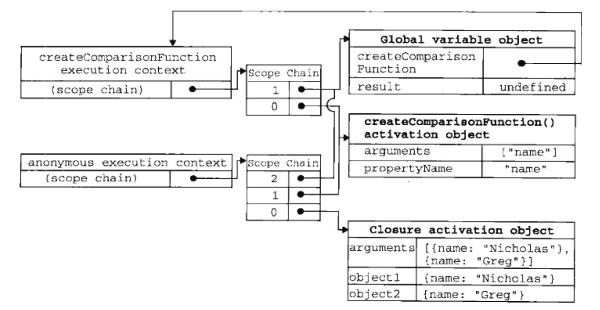

## 前言

本章内容：
- 函数表达式的特征
- 使用函数实现递归
- 使用闭包定义私有变量

定义函数的方式有两种：
- 函数声明
  - **函数声明提升**，意思是执行代码之前会先读取函数声明，意味着可以把函数声明放在调用它的语句后面
- 函数表达式
  - **使用前必须先赋值**

## 递归

函数通过名字调用自身。

`arguments.callee`
- 是一个指向正在执行的函数的指针
- 可用它来实现对函数的递归调用
- 递归时，比使用函数名更保险

eg：

```javascript
function factotial(num) {
    if (num <= 1) {
        return 1;
    } else {
        return num * arguments.callee(num-1);
    }
}
```

靠谱eg：

```javascript
var factotial = (function f(num) {
    if (num <= 1) {
        return 1;
    } else {
        return num * arguments.callee(num-1);
    }
})
```

## 闭包

闭包是指有权访问另一个函数作用域中的变量的函数。

创建闭包的常用方式就是在一个函数内部创建另一个函数。

函数被调用的时候会发生什么？
- 当某个函数被调用时，会创建一个执行环境（execution context）及相应的作用域链。
- 然后使用arguments和其他命名参数的值来初始化函数的活动对象（activation object）。
- 在作用域链中，外部函数的活动对象始终处于第二位，……，直到作用域终点为全局执行环境。

------------------------------------------------------------------

一般来说，函数执行完毕后，局部活动对象会被销毁，内存中仅保留全局作用域，但是闭包有所不同。

- 在另一个函数内部定义的函数会将包含外部函数的活动对象添加到它的作用域链中。

eg:

```javascript
function createComparisonFunction (prototypeName) {
    return function (object1, object2) {
        var value1 = object1[prototypeName];
        var value2 = object2[prototypeName];

        if (value1 < value2) {
            return -1;
        } else if (value1 > value2) {
            return 1;
        } else {
            return 0;
        }
    }
}

var compareNames = createComparisonFunction("name");
var result = compareNames({ name: "Nicholas" }, { name: "Greg" });
compareNames = null;  // 解除对匿名函数的引用，释放内存
```

`createComparisonFunction`在执行完毕后，其活动对象也不会被销毁，因为匿名函数的作用域链仍然在引用这个活动对象，直到匿名函数被销毁后，`createComparisonFunction`的活动对象才会被销毁。



> 注意⚠️：由于闭包会携带包含它的函数的作用域，因此会比其他函数占用更多的内存。过度使用闭包会导致内存占用过多，要慎重使用闭包。

### 闭包与变量

**闭包只能取到包含函数中任何变量的最后一个值。**

eg:

```javascript

function createFunctions() {
    var result = new Array();

    for (var i=0; i < 10; i++) {
        result[i] = function() {
            return i;
        }
    }
    return result;
}
```

结果：实际上，每个函数都返回10.因为，每个函数的作用域链中都保存着`createFunctions`函数的活动对象，每个函数都保存着变量i的同一个变量对象，最后结束时，i的值是10。

------------------------------------------------------------------

eg:

```javascript

function createFunctions() {
    var result = new Array();

    for (var i=0; i < 10; i++) {
        result[i] = function() {
            return i;
        }
    }(i);
    return result;
}
```

结果：符合预期，没有直接赋值闭包，而是立即执行匿名函数，将其结果赋值给数组。

### 关于this对象

eg:

```javascript
var name = "The Window";

var object = {
    name: "My Object",

    getNameFunc : function(){
        return function() {
            return this.name
        }
    }
};

alert(object.getNameFunc()());  // "The Window"
```

> 每个函数在被调用时，都会自动取得两个特殊变量：this和arguments，内部函数在搜索这两个变量时，只会搜索到其活动对象为止，因此永远不可能直接访问外部函数中的这两个变量。

> 把外部作用域中的this对象保存在一个闭包能够访问到的对象里，就可以让闭包访问该对象了。如下：

eg:

```javascript
var name = "The Window";

var object = {
    name: "My Object",

    var that = this;
    getNameFunc : function(){
        return function() {
            return this.name
        }
    }
};

alert(object.getNameFunc()());  // "My Object"
```

> this和arguments也存在同样的问题。


## 模仿块级作用域

用作块级作用域（私有作用域）的匿名函数的语法如下所示；

```javascript
(function() {
    // 这里是块级作用域
}) ();
```

以上代码定义并立即调用了一个匿名函数。

eg:

```javascript
function outputNumbers(count) {
    (function () {
        for (var i=0;i<count;i++) {
            alert(i);
        }
    })();
    alert(i);  // 导致一个错误！
}
```

> 在匿名函数中定义的任何变量，都会在执行结束时被销毁。count能被引用是因为这个匿名函数是闭包。

## 私有变量

任何在函数中定义的变量都可以被认为是私有变量，因为不能再函数的外部访问这些变量。

我们把有权访问私有变量和私有函数的公有方法称为特权方法。
- 利用闭包，在构造函数中定义特权方法
- 利用私有和特权成员

