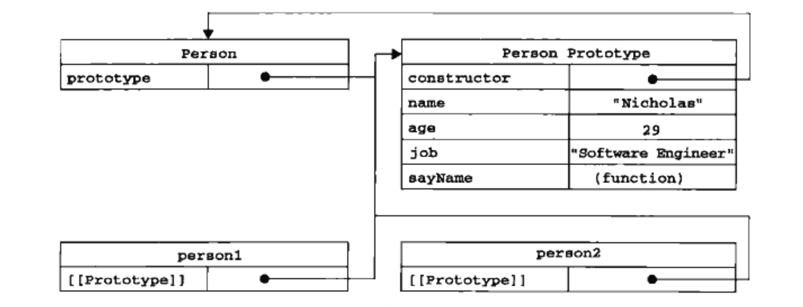
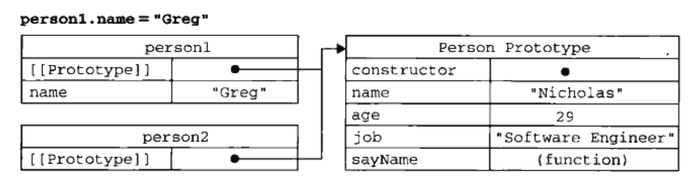
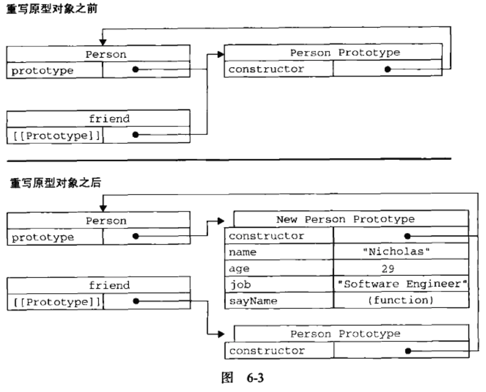
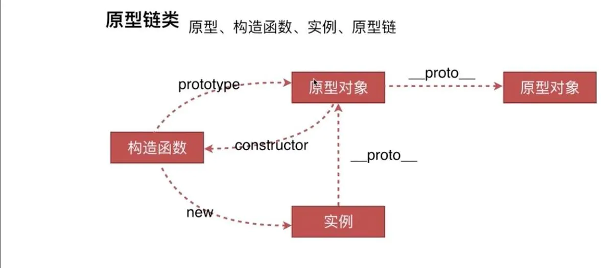
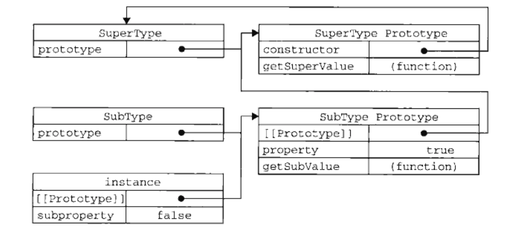
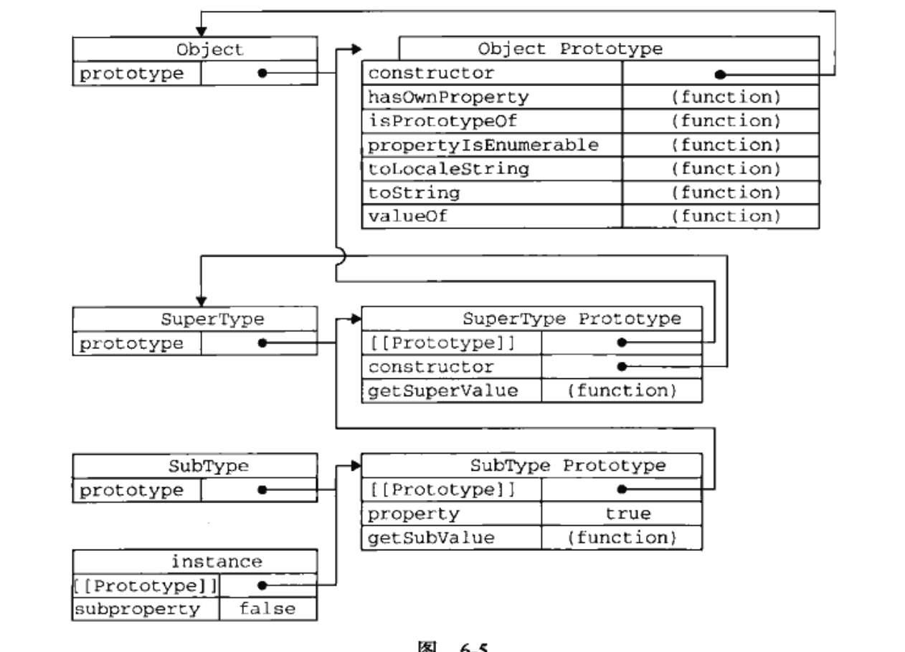

## 本文内容

- 对象属性
- 创建对象
- 继承

面向对象的语言有一个标志，那就是他们都有类的概念，而通过类可以创建任意多个具有相同属性和方法的对象，但是ECMAScript中，没有类的概念。

可以把ECMAScript的对象想像成散列表。

每个对象都是基于一个引用类型创建的，这个引用类型可以是第5章讨论的原生类型，也可以是开发人员定义的类型。

## 理解对象

- 创建自定义对象的最简单方式就是创建一个`Object`的实例，然后再为他添加属性和方法。

```javascript
var person = new Object();
person.name = "Nicholas";
person.age = 29;
person.job = "Software Engineer";

person.sayName = function() {
    alert(this.name);
}
```

------------------------------------------------------------------

- 对象字面量

```javascript
var person = {
    name: "Nicholas",
    age: 29,
    job: "Software Engineer",

    sayName: function() {
      alert(this.name);
  }
}
```

### 属性类型

ECMA-262第5版定义了只有美不采用的特性，描述了属性的各种特征，在JavaScript中不能直接访问它们，为了表示特性是内部值，规范把它们放在两对儿方括号中，例如`Enumerable`。

ECMAScript中有两种属性：数据属性和访问器属性。

#### 数据属性

数据属性包含一个数据值的位置。在这个位置可以读取和写入值。数据属性有4个描述其行为的特性。

- [[Configurable]]: 表示能否通过delete删除属性从而重新定义属性，能否修改属性的特性，或者能否把属性修改为访问器属性。默认值为true。
- [[Enumerable]]:表示能否通过for-in循环返回属性。默认值为true。
- [[Writable]]:表示能否修改属性的值。默认值为true。
- [[Value]]:包含这个属性的数据值。默认值为undefined。


- 要修改默认属性的特性，需要使用`Object.defineProperty()`方法。这个方法接收三个参数：属性所在的对象、属性的名字和一个描述符对象。
  - 描述符对象的属性必须是：configurable、enumerable、writable和value。

```
var person = {};
Object.defineProperty(person, "name", {
    writable: false,
    value: "Nicholas"
});

alert(person.name);  // Nicholas
person.name = "Greg";
alert(person.name);  // Nicholas
```

#### 访问器属性

访问器属性不包含数据值；它们包含一对儿getter和setter函数（非必须）。

- getter：**读取访问器属性时调用**，返回有效的值。
- setter：**写入访问器属性时调用**，并返回新值，此函数负责如何处理数据。

访问器属性特性：

- [[Configurable]]: 表示能否通过delete删除属性从而重新定义属性，能否修改属性的特性，或者能否把属性修改为数据属性。默认值为true。
- [[Enumerable]]:表示能否通过for-in循环返回属性。默认值为true。
- [[Get]]:表示能否修改属性的值。默认值为undefined。
- [[Set]]:包含这个属性的数据值。默认值为undefined。

- 访问器属性不能直接定义，需要使用`Object.defineProperty()`方法。

eg：

```javascript
var book = {
    _year = 2004;
    edition: 1
};

Object.defineProperty(book, "year", {
    get: function() {
        return this._year;
    },
    set: function(newValue) {
        if (newValue>2004) {
            this._year = newValue;
            this.edition += newValue - 2004;
        }
    }
});

book.year = 2005;
alert(book.edition);  //2
```

> 使用访问器属性的常见方式，即设置一个属性的值会导致其他属性的变化。
> 不一定非要同时指定getter和setter。
> 只指定getter意味着属性不能写，尝试写入属性会被忽略。只指定setter函数属性不能读。

- 非标准方法： `__defineGetter__`和`__defineSetter__`

eg：

```javascript
var book = {
    _year = 2004;
    edition: 1
};

book.__defineGetter__("year", function() {
    return this._year;
})

book.__defineSetter__("year", function(newValue) {
    if (newValue>2004) {
        this._year = newValue;
        this.edition += newValue - 2004;
    }
})

book.year = 2005;
alert(book.edition);  //2
```

### 定义多个属性

`Object.defineProperties()`


### 读取属性的特性

`Object.getPropertyDescriptor()`，取得给定属性的描述符。

参数：
- 属性所在的对象
- 读取其描述符的属性名称，返回值是一个对象。

在JavaScript中，可以针对任何对象——包括DOM和BOM对象，使用`Object.getPropertyDescriptor()`。

## 创建对象

- new Object
- 对象字面量

### 工厂模式

ECMAScript中无法创建类，开发人员就发明了一种函数，用函数来封装以特定接口创建对象的细节。

```javascript
function createPerson(name, age, job) {
    var o = new Object();
    o.name = name;
    o.age = age;
    o.job = job;
    o.sayName = function() {
        alert(this.name);
    }
    return o;
}

var person1 = createPerson("Nicholas", 29, "Software Engineer");
var person2 = createPerson("Greg", 27, "Docter");
```

### 构造函数模式

创建自定义的构造函数，从而定义自定义对象类型的属性和方法。

eg：

```javascript
function Person(name, age, job) {
    this.name = name;
    this.age = age;
    this.job = job;
    this.sayName = function() {
        alert(this.name);
    }
}

var person1 = new Person("Nicholas", 29, "Software Engineer");
var person2 = new Person("Greg", 27, "Docter");
```

- 没有显式地创建对象
- 直接将属性和方法赋给了this对象
- 没有return语句
- 构造函数始终应该以一个大写字母开头
- person1和person2属于两个不同的实例对象
- 要创建Person的新实例，必须使用new操作符。调用构造函数实际上会经历以下4个步骤：
  - 创建一个新对象；
  - 将构造函数的作用域赋给新对象（因此this就指向了这个新对象）；
  - 执行构造函数中的代码（为这个新对象添加属性）；
  - 返回新对象；

------------------------------------------------------------------

此部分的例子最后person1和person2对象，都有一个`constructor`（构造函数）属性，该属性指向Person。

```javascript
alert(person1.constructor == Person) // true
alert(person1 instanceof Person) // true
alert(person1 instanceof Object) // true
```

- 不存在定义构造函数的特殊语法。
- 任何函数，只要通过new操作符来调用，那它就可以作为构造函数。
- 普通函数：属性和方法都被添加给window对象。

构造函数的主要问题：
- 每个方法都要在每个实例上重新创建一遍
- 会导致不同的作用域链和标识符解析


### 原型模式

每个函数都有prototype属性，这个属性是一个指针，指向一个对象，这个对象包含可以由特定类型的所有实例共享的属性和方法。

**使用原型的好处是可以让所有对象实例共享它所包含的属性和方法。**

eg：

```javascript
function Person() {
}

Person.prototype.name = "Nicholas";
Person.prototype.age = 29;
Person.prototype.job = "Software Engineer";
Person.prototype.sayName = function() {
    alert(this.name);
};

var person1 = new Person();
person1.sayName();  // "Nicholas"


var person2 = new Person();
person2.sayName();  // "Nicholas"

alert(person1.sayName == person2.sayName);  // true
```

> person1和person2共享实例方法

#### 理解原型对象

- 只要创建了一个新函数，就会根据特定规则为函数创建一个prototype属性，此属性指向函数的原型对象。

- 默认情况下，所有原型对象都会自动获得一个constructor属性，指向prototype属性所在函数的指针。
  


- 可以通过`isPrototypeOf()`来确定对象之间是否存在这种关系
- ECMAScript5新增方法：`getPrototypeOf()`，返回[[PrototypeOf]]的值

eg:

```javascript
alert(Person.prototype.isPrototypeOf(person1));  // true
alert(Object.getPrototypeOf(person1) == Person.prototype);  // true
```

- `person1.sayname()`执行两次搜索：
  - **在对象实例中**，若是找到了具有给定名字的属性，则返回该属性的值；
  - 若是没找到，在原型对象中查找。


- 不能通过对象实例重写原型中的值。
- 若是添加重复的实例属性，会**屏蔽(不是修改)**原型中原来的属性。
- delete操作符可以删除实例属性。



------------------------------------------------------------------

- `hasOwnProperty()`可以检测一个属性存在雨实例中，还是存在于原型中。
- **此方法只在（从Object继承而来）只会喜爱给定属性存在于对象实例中时才会返回true。**

eg：

```javascript
function Person() {
}

Person.prototype.name = "Nicholas";
Person.prototype.age = 29;
Person.prototype.job = "Software Engineer";
Person.prototype.sayName = function() {
    alert(this.name);
};

var person1 = new Person();
var person2 = new Person();

alert(person1.hasOwnProperty("name"));   // false

person1.name = "Greg";
alert(person1.name);   // Greg  来自实例
alert(person1.hasOwnProperty("name"));   // true


alert(person2.name);   // "Nicholas"  来自原型
alert(person1.hasOwnProperty("name"));   // false

```

#### 原型与in操作符

in操作符的2种使用方式：
- 单独使用
  - `in`操作符会在通过对象能够访问给定属性时返回true，无论该属性存在于实例中还是原型中。
- for-in：返回的是所有能通过对象访问的、可枚举的属性。

eg：

```javascript
function Person() {
}

Person.prototype.name = "Nicholas";
Person.prototype.age = 29;
Person.prototype.job = "Software Engineer";
Person.prototype.sayName = function() {
    alert(this.name);
};

var person1 = new Person();
var person2 = new Person();

alert(person1.hasOwnProperty("name"));   // false
alert("name" in person1);   // true

```

------------------------------------------------------------------

`hasPrototypeProperty()`

eg：

```javascript
function Person() {
}

Person.prototype.name = "Nicholas";
Person.prototype.age = 29;
Person.prototype.job = "Software Engineer";
Person.prototype.sayName = function() {
    alert(this.name);
};

var person = new Person();

alert(hasPrototypeProperty(person, "name"));   // true

person.name = "Greg";
alert(hasPrototypeProperty(person, "name"));   // false
```

ECMAScript5将constructor和prototype属性的[[Enumerable]]特性设为false，但是并不是所有浏览器都照此实现。

> 获取对象上所有可枚举属性，可以用Object.keys()

#### 更简单的原型语法

常见的做法是用一个包含所有属性和方法的对象字面量来重写整个原型对象。

例：

```javascript
function Person() {
}

Person.prototype = {
    // constructor : Person 重设constructor属性会导致他的[[Enumerable]]特性被设置为true，可以使用Object.defineProperty()
    name : name;
    age : age;
    job : job;
    sayName : function() {
        alert(this.name);
    }
}
```
这个例子中，**constructor不再指向Person了**，我们在这里使用的语法，本质上完全重写了默认的prototype对象，因此constructor属性也变成了新对象的constructor属性（指向Object构造函数），不再指向Person函数。

```javascript
var friend = new Person();
alert(friend instanceof Object);  // true
alert(friend instanceof Person);  // true
alert(friend.constructor == Person);  // false
alert(friend.constructor == Object);  // true
```

#### 原型的动态性

在原型中查找值的过程是一次搜索，原型对象的任何修改都能够立即从实例上反映出来。

例：

```javascript
var friend = new Person();

Person.prototype.sayHi : function() {
    alert("hi");
}

friend.sayHi();   // hi
```

上述例子结果的原因是：首先会在实例中搜索名为sayHi的属性，没找到会继续搜索原型。**实例与原型之间的连接只不过是一个指针，而非一个副本，因此就可以在新的原型中找到sayHi并返回相应结果。**

重写整个原型对象：调用构造函数时会为实例添加一个指向最初原型的指针，而把原型修改为另一个对象就等于切断了构造函数和最初原型之间的联系。实例中的指针仅指向原型，而不指向构造函数。

例：

```javascript
function Person() {
}

Person.prototype = {
    constructor : Person 
    name : name;
    age : age;
    job : job;
    sayName : function() {
        alert(this.name);
    }
}

friend.sayName();   // error
```



#### 原生对象的原型

所有原生饮用类型（Object、Array等等）都在其构造函数的原型上定义了方法。

```javascript
alert(typeof Array.prototype.sort);  // "function"
```

#### 原型对象的问题

原型对象的最大问题是其共享本性。

### 组合使用构造函数模式和原型模式

这是创建自定义类型最常见方式。

- 构造函数模式：定义实例属性
- 原型模式：定义方法和共享属性
- 每个实例都有自己的一份实例属性的副本
- 共享着对方法的引用
- 支持向构造函数传递参数

eg：

```javascript
function Person(name, age, job) {
    this.name = name;
    this.age = age;
    this.job = job;
    this.friends = ["Shelby", "Court"];
}

Person.prototype = {
    constructor : Person 
    sayName : function() {
        alert(this.name);
    }
}
var person1 = new Person("Nicholas", 29, "Software Engineer");
var person2 = new Person("Greg", 27, "Docter");

person1.friends.push("Van");
alert(person1.friends);  // "Shelby", "Court", "Van"
alert(person2.friends);  // "Shelby", "Court"
alert(person1.friends === person2.friends);  // false
alert(person1.sayName === person2.sayName);  // true
```

### 动态原型模式

可以通过检查某个应该存在的方法是否有效，来决定是否需要初始化原型。

### 寄生构造函数模式

这种模式的基本思想是创建一个函数，该函数的作用仅仅是封装创建对象的代码，然后再返回新创建的对象；但是从表面上看，这个函数又很像是典型的构造函数。

eg:

```javascript
function Person(name, age, job) {
    var o = new Object();
    o.name = name;
    o.age = age;
    o.job = job;
    o.sayName = function() {
        alert(this.name);
    }
    return o;
}

var friend= new Person("Nicholas", 29, "Software Engineer");
friend.sayName();  // "Nicholas"
```

这个模式可以在特殊的情况下用来为对象创建构造函数。假设我们想创建一个具有额外方法的特殊数组，由于不能直接修改Array构造函数，因此可以使用这个模式。

关于寄生构造函数模式：首先，返回的对象与构造函数或者与构造函数的原型属性之间没有关系；也就是说，构造函数返回的对象与在构造函数外部创建的对象并没有什么区别，为此不能依赖instanceof操作符来确定对象类型。

### 稳妥构造函数模式

**稳妥对象：没有公共属性，而且其方法也不引用this的对象**。最适合在一些安全的环境中（这些环境中禁止使用this和new），或者防止数据被其他应用程序改动时使用。

稳妥构造函数遵循与寄生构造函数类似的模式，但是有2点不同：
- 新创建对象的实例方法不引用this
- 不使用new操作符调用构造函数

eg：

```javascript
function Person(name, age, job) {
    var o = new Object();
    // 可以在这里定义私有变量和函数

    // 添加方法
    o.sayName = function() {
        alert(this.name);
    }
    return o;
}

var friend= Person("Nicholas", 29, "Software Engineer");
friend.sayName();  // "Nicholas"
```

变量friend中保存的是一个稳妥对象，而除了调用sayName()方法外，没有别的方法可以访问其数据成员。


## 继承

OO语言的两种继承方式：接口继承+实现继承

**ECMAScript只支持实现继承，而且其实现继承主要是依靠原型链来实现的。**

### 原型链

原型链继承：其基本思想是利用原型让一个引用类型继承另一个引用类型的属性和方法。

原型链：实例与原型的链条



构造函数、原型和实例的关系：

每个构造函数都有一个原型对象，原型对象都包含一个指向构造函数的指针，而实例都包含一个指向原型对象的内部指针。若是让原型对象等于另一个类型的实例，则可以层层递进，构成实例与原型的链条，具体见下面例子。

eg:

```javascript
function SuperType() {
    this.property = true;
};

SuperType.prototype.getSuperValue() {
    return this.property;
};

function SubType() {
    this.subproperty = false;
};

// 继承了SuperType
SubType.prototype = new SuperType();

SubType.prototype.getSubValue = function () {
    return this.subproperty;
};

var instance = new SubType();
alert(instance.getSuperValue());   // true
```



> 注意⚠️：`getSuperValue()`方法仍在`SuperType.prototype`中，但是`property`却在`SubType.prototype`中，这是因为`property`是一个实例属性，而`getSuperValue()`则是一个原型方法。既然`SubType.prototype`现在是`SuperType`的实例，那么`property`当然就位于该实例中了。

#### 默认原型

所有函数的默认原型都`Object.prototype`，这也正是所有自定义类型都会继承toString、valueOf等默认方法的根本原因。



#### 确定原型和实例的关系

有两种方式来确定原型和实例之间的关系：
- `instanceof`：用这个操作符来测试实例与原型链中出现过的构造函数，结果就会返回true。
- `isPrototypeOf()`：用这个来测试原型链中出现过的原型，结果就会返回true。

#### 谨慎定义方法

给原型添加方法的代码一定要放在替换原型的语句之后。

必须在用`SuperType`实例替换原型后，再定义这两个方法。

eg:

```javascript
function SuperType() {
    this.property = true;
};

SuperType.prototype.getSuperValue() {
    return this.property;
};

function SubType() {
    this.subproperty = false;
};

// 继承了SuperType
SubType.prototype = new SuperType();

// 添加新方法
SubType.prototype.getSubValue = function () {
    return this.subproperty;
};

// 重写超类型中的方法
SuperType.prototype.getSuperValue() {
    return false;
};

var instance = new SubType();
alert(instance.getSuperValue());   // true
```

通过原型链继承时，不能使用对象字面量创建原型方法。因为这样会重写原型链。


### 借用构造函数

在子类型构造函数内部调用超类型构造函数，用`apply()`和`call()`也可以在（将来）新创建的对象上执行构造函数。

eg:

```javascript
function SuperType() {
    this.colors = ["red", "blue", "green"];
};

function SubType() {
    // 继承了SuperType
    SuperType.call(this);
};

var instance1 = new SubType();
instance1.colors.push("black");
alert(instance1.colors);   // "red", "blue", "green", "black"

var instance2 = new SubType();
alert(instance2.colors);   // "red", "blue", "green"
```

#### 传递参数

可以在子类型构造函数中向超类型构造函数传递参数。

```javascript
function SuperType(name) {
    this.name = name;
};

function SubType() {
    // 继承了SuperType，同时传递了参数
    SuperType.call(this, "Nicholas");

    // 实例属性
    this.age = 29;
};

var instance = new SubType();
alert(instance.name);   // "Nicholas"
alert(instance.age);   // 29
```

### 组合继承

将原型链和借用构造函数的技术组合到一块。
- 使用原型链实现对原型属性和方法的继承
- 借用构造函数来实现对实例属性的继承

eg:

```javascript
function SuperType(name) {
    this.name = name;
    this.colors = ["red", "blue", "green"];
};

SuperType.prototype.sayName = function() {
    alert(this.name);
}
function SubType(name, age) {
    // 继承属性
    SuperType.call(this, name);

    this.age = age;
};

// 继承方法
SubType.prototype = new SuperType();
SubType.prototype.construtor = SubType;
SubType.prototype.sayAge = function() {
    alert(this.age);
}


var instance1 = new SubType("Nicholas", 29);
instance1.colors.push("black");
alert(instance1.colors);   // "red", "blue", "green", "black"
instance1.sayName();   // "Nicholas"
instance1.sayAge();    // 29

var instance2 = new SubType("Greg", 27);
alert(instance2.colors);   // "red", "blue", "green"
instance2.sayName();   // "Greg"
instance2.sayAge();    // 27
```

### 原型式继承

浅复制

`Object.create()`，两个参数：
- 用作新对象原型的对象
- （可选）一个为新对象定义额外属性的对象

```javascript
var person = {
    name: "Nicholas",
    friends: ["Shelby", "Court", "Van"]
};

var anotherPerson = Object.create(person);
anotherPerson.name = "Greg";
anotherPerson.friends.push("Rob");

var yetPerson = Object.create(person);
anotherPerson.name = "Linda";
anotherPerson.friends.push("Barbie");

alert(person.friends);  // "Shelby", "Court", "Van", "Rob", "Barbie"
```
------------------------------------------------------------------

第二个参数：指定的任何属性都会覆盖原型对象上的同名属性。

### 寄生式继承

创建一个仅用于封装继承过程的函数，该函数在内部以某种方式来增强对象，最后再像真谛是它做了所有工作一样返回对象。

eg:

```javascript
function createAnother(original) {
    var clone = object(original);  // 通过调用函数创建一个新对象
    clone.sayHi = function() {     // 以某种方式来增强这个对象
        alert("hi");
    }
    return clone;   // 返回这个对象
}

var person = {
    name: "Nicholas",
    friends: ["Shelby", "Court", "Van"]
};

var anotherPerson = createAnother(person);
anotherPerson.sayHi();  // "hi"
```

### 寄生组合式继承

通过借用构造函数来继承属性，通过原型链的混成形式来继承方法。被认为是引用类型最理想的继承方式。

本质上，就是使用寄生式继承来继承超类型的原型，然后再将结果指定给子类型的原型。

基本模式如下：

```javascript
function inheritPrototype(subType, superType) {
    var prototype = object(superType.prototype); // 创建对象
    prototype.constructor = subType;             // 增强对象
    subType.prototype = prototype;               // 指定对象
}
```

eg:

```javascript
function SuperType(name) {
    this.name = name;
    this.colors = ["red", "blue", "green"];
};

SuperType.prototype.sayName = function() {
    alert(this.name);
}

function SubType(name, age) {
    // 继承属性
    SuperType.call(this, name);

    this.age = age;
};

inheritPrototype(SubType, SuperType);

SubType.prototype.sayAge = function() {
    alert(this.age);
}
```