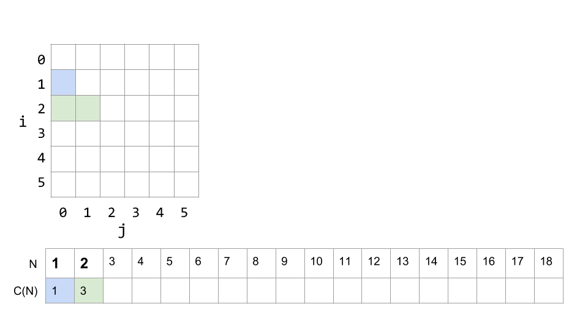
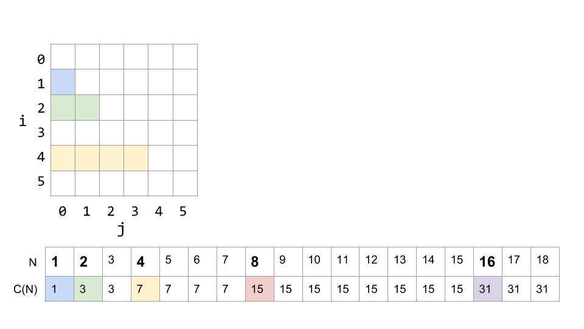
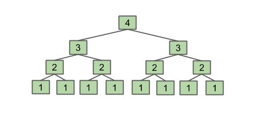

- 执行消耗
    - 时间复杂度
    - 空间复杂度

## 时间复杂度

- 「 大O符号表示法 」，即` T(n) = O(f(n))`
- 在 大O符号表示法中，时间复杂度的公式是： `T(n) = O( f(n) )`，其中`f(n)` 表示每行代码执行次数之和，而 `O` 表示正比例关系，这个公式的全称是：**算法的渐进时间复杂度**。
<!--more-->
- 常见的时间复杂度量级有：
    - 常数阶O(1)
    - 对数阶O(logN)
    - 线性阶O(n)
    - 线性对数阶O(nlogN)
    - 平方阶O(n²)
    - 立方阶O(n³)
    - K次方阶O(n^k)
    - 指数阶(2^n)

### 寻找重复元素

```java
int N = A.length;
for (int i = 0; i < N; i += 1)
   for (int j = i + 1; j < N; j += 1)
      if (A[i] == A[j])
         return true;
return false;
```

主要操作是比较器，所以我们主要查看一定会发生的`===`操作，外层的第1次循环，内部循环运行`N-1`次；外层的第2次循环，内部循环运行`N-2`次……

最坏的情况，我们需要遍历每个元素。

最后，我们发现比较的次数是：

```
C=1+2+3+...+(N−3)+(N−2)+(N−1)=N(N−1)/2
```

`N(N−1)/2`属于N2的范畴，因为`===`是一个常数时间操作，最坏情况下的整体运行时间是`θ(N2)`。


### 例2

```java
public static void printParty(int N) {
   for (int i = 1; i <= N; i = i * 2) {
      for (int j = 0; j < i; j += 1) {
         System.out.println("hello");   
         int ZUG = 1 + 1;
      }
   }
}
```

第一层循环每次`i*2`前进，内层循环从0到`i`，循环内部的两个操作都是常数时间的，所以我们观察，`print`操作一共执行了多少次。

N是1时：`print`执行了1次。


N是2时：循环`i`执行了`1∗2=2`次， `j`可以到1，`print`执行次数为3。


.
.
.
.
.
.
N=18时，



如果我们将循环各阶段的所有计数加起来，则打印语句的数量为：

`C(N) = 1 + 2 + 4 + ... + N =2N−1  (if N is a power of 2)`

通过去除较小的项和乘法常数，我们知道2N-1在线性族中。 所以，此过程的时间复杂度是O(n)。

- 这是经常看到的两个重要总和，并且应记住：

```
1+2+3+...+Q=Q(Q+1)/2=Θ(Q2) (Sum of First Natural Numbers)

1 + 2 + 4 + 8 + ... + Q = 2Q - 1 = Θ(Q) (Sum of First Powers of 2)
```

### 递归示例

```java
public static int f3(int n) {
   if (n <= 1) 
      return 1;
   return f3(n-1) + f3(n-1);
}
```

如果我们调用`f3（4）`，它将返回分别为`f3（3-1）+ f3（3-1）`和`f3（2-1）的f3（4-1）+ f3（4-1） + f3（2-1）`，每一个返回1。

因此，我们看到最终`f3（2-1）`总计为8次，等于8。我们可以将其可视化为树，其中每个级别都是该函数的参数:



看到此函数返回`2 ^ {N-1}` 。这对于了解函数的功能很有用。

直觉上可以看到，运行次数是`2 ^ {N-1}`。

```
C(1)=1 C(2) = 1 + 2C(2)=1+2 C(3) = 1 + 2 + 4C(3)=1+2+4 C(N) = 1 + 2 + 4 + ... +C(N)=1+2+4+...+ ???;

C(4)=1+2+4+8 and C(5) = 1 + 2 + 4 + 8 + 16C(5)=1+2+4+8+16;

C(N)=1+2+4+...+2^(N−1);
​​
```

`1+2+4+8+...+Q=2Q−1`, 此时，`Q = 2^(N−1)`, 所以，`C(N)=2Q−1=2(2^(N−1))−1=2^N−1`，时间复杂度是`O(2^N)`。

### 二叉搜索

二进制搜索是一种在列表中搜索特定项目的好方法。它要求列表按排序顺序，并使用该事实快速查找元素。

要进行二进制搜索，我们从列表的中间开始，然后检查这是否是我们想要的元素。如果不是，我们问：这个元素比我们的元素大还是小。

如果它更大，那么我们知道只需要查看包含较小元素的列表的一半即可。如果它太小，那么我们只看具有较大元素的那一半。这样，我们可以将每一步剩下的选项数量减少一半，直到找到它为止。

最糟糕的情况是什么？当我们想要的元素根本不在列表中时。然后，我们将进行比较，直到我们消除了列表的所有区域，并且不再剩下更大或更小的一半。

我们从n个选项开始，然后是`n/2`，然后是`n/4` ...，直到只有1。每次将数组切成两半，所以最后我们必须执行总共`log_2(n)`次操作。因此，整体运行时是`log_2(n)`。

