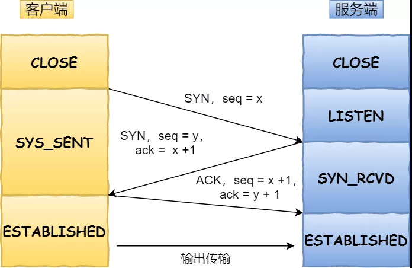
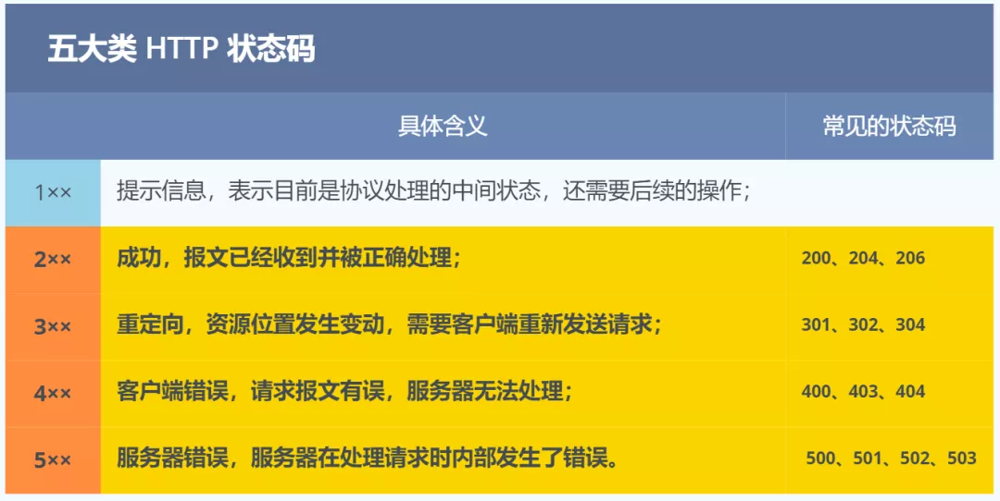

## 1. 「当键入网址后，到网页显示，其间发生了什么」
参考链接：https://mp.weixin.qq.com/s/5TRgCmD7uu2gErbVCbIxAw

### 浏览器做的第一步工作是解析 URL

首先浏览器做的第一步工作就是要对 URL 进行解析，从而产生发送给 Web 服务器的请求信息。

生产 HTTP 请求信息。

### 真实地址查询 —— DNS

通过浏览器解析 URL 并生成 HTTP 消息后，需要委托操作系统将消息发送给 Web  服务器。

但在发送之前，还有一项工作需要完成，那就是**查询服务器域名对于的 IP 地址**，因为委托操作系统发送消息时，必须提供通信对象的 IP 地址。

## 2. TCP 三次握手  四次挥手

**三次握手**

> TCP 传输数据之前，要先三次握手建立连接

- 一开始，客户端和服务端都处于 CLOSED 状态。先是服务端主动监听某个端口，处于 LISTEN 状态。

- 然后客户端主动发起连接 SYN，之后处于 SYN-SENT 状态。

- 服务端收到发起的连接，返回 SYN，并且 ACK 客户端的 SYN，之后处于 SYN-RCVD 状态。

- 客户端收到服务端发送的 SYN 和 ACK 之后，发送 ACK 的 ACK，之后处于 ESTABLISHED 状态，因为它一发一收成功了。

- 服务端收到 ACK 的 ACK 之后，处于 ESTABLISHED 状态，因为它也一发一收了。

> 所以三次握手目的是保证双方都有发送和接收的能力.

**四次挥手**

- 刚开始双方都处于 ESTABLISHED 状态，假如是客户端先发起关闭请求。四次挥手的过程如下：

- 第一次挥手：客户端发送一个 FIN 报文，报文中会指定一个序列号。此时客户端处于 FIN_WAIT1 状态。
即发出连接释放报文段（FIN=1，序号seq=u），并停止再发送数据，主动关闭TCP连接，进入FIN_WAIT1（终止等待1）状态，等待服务端的确认。

- 第二次挥手：服务端收到 FIN 之后，会发送 ACK 报文，且把客户端的序列号值 +1 作为 ACK 报文的序列号值，表明已经收到客户端的报文了，此时服务端处于 CLOSE_WAIT 状态。
即服务端收到连接释放报文段后即发出确认报文段（ACK=1，确认号ack=u+1，序号seq=v），服务端进入CLOSE_WAIT（关闭等待）状态，此时的TCP处于半关闭状态，客户端到服务端的连接释放。客户端收到服务端的确认后，进入FIN_WAIT2（终止等待2）状态，等待服务端发出的连接释放报文段。

- 第三次挥手：如果服务端也想断开连接了，和客户端的第一次挥手一样，发给 FIN 报文，且指定一个序列号。此时服务端处于 LAST_ACK 的状态。
即服务端没有要向客户端发出的数据，服务端发出连接释放报文段（FIN=1，ACK=1，序号seq=w，确认号ack=u+1），服务端进入LAST_ACK（最后确认）状态，等待客户端的确认。

- 第四次挥手：客户端收到 FIN 之后，一样发送一个 ACK 报文作为应答，且把服务端的序列号值 +1 作为自己 ACK 报文的序列号值，此时客户端处于 TIME_WAIT 状态。需要过一阵子以确保服务端收到自己的 ACK 报文之后才会进入 CLOSED 状态，服务端收到 ACK 报文之后，就处于关闭连接了，处于 CLOSED 状态。
即客户端收到服务端的连接释放报文段后，对此发出确认报文段（ACK=1，seq=u+1，ack=w+1），客户端进入TIME_WAIT（时间等待）状态。此时TCP未释放掉，需要经过时间等待计时器设置的时间2MSL后，客户端才进入CLOSED状态。

## 3. [http 状态码](https://developer.mozilla.org/zh-CN/docs/Web/HTTP/Status)

**2xx (成功)表示成功处理了请求的状态代码。代码 说明**

200 (成功) 服务器已成功处理了请求。 通常，这表示服务器提供了请求的网页。

201 (已创建) 请求成功并且服务器创建了新的资源。

202 (已接受) 服务器已接受请求，但尚未处理。

203 (非授权信息) 服务器已成功处理了请求，但返回的信息可能来自另一来源。

204 (无内容) 服务器成功处理了请求，但没有返回任何内容。

205 (重置内容) 服务器成功处理了请求，但没有返回任何内容。

206 (部分内容) 服务器成功处理了部分 GET 请求。

**3xx (重定向) 表示要完成请求，需要进一步操作。 通常，这些状态代码用来重定向。代码 说明**

300 (多种选择) 针对请求，服务器可执行多种操作。 服务器可根据请求者 (user agent) 选择一项操作，或提供操作列表供请求者选择。

**301 (永久移动) 请求的网页已永久移动到新位置。 服务器返回此响应(对 GET 或 HEAD 请求的响应)时，会自动将请求者转到新位置**。

**302 (临时移动) 服务器目前从不同位置的网页响应请求，但请求者应继续使用原有位置来进行以后的请求**。

303 (查看其他位置) 请求者应当对不同的位置使用单独的 GET 请求来检索响应时，服务器返回此代码。

**304 (Not Modified) 自从上次请求后，请求的网页未修改过。 服务器返回此响应时，不会返回网页内容**。

305 (使用代理) 请求者只能使用代理访问请求的网页。 如果服务器返回此响应，还表示请求者应使用代理。

307 (临时重定向) 服务器目前从不同位置的网页响应请求，但请求者应继续使用原有位置来进行以后的请求。

**4xx(请求错误) 这些状态代码表示请求可能出错，妨碍了服务器的处理。代码 说明**

400 (错误请求) 服务器不理解请求的语法。

401 (未授权) 请求要求身份验证。 对于需要登录的网页，服务器可能返回此响应。

403 (禁止) 服务器拒绝请求。

404 (未找到) 服务器找不到请求的网页。

405 (方法禁用) 禁用请求中指定的方法。

406 (不接受) 无法使用请求的内容特性响应请求的网页。

407 (需要代理授权) 此状态代码与 401(未授权)类似，但指定请求者应当授权使用代理。

408 (请求超时) 服务器等候请求时发生超时。

409 (冲突) 服务器在完成请求时发生冲突。 服务器必须在响应中包含有关冲突的信息。

410 (已删除) 如果请求的资源已永久删除，服务器就会返回此响应。

411 (需要有效长度) 服务器不接受不含有效内容长度标头字段的请求。

412 (未满足前提条件) 服务器未满足请求者在请求中设置的其中一个前提条件。

413 (请求实体过大) 服务器无法处理请求，因为请求实体过大，超出服务器的处理能力。

414 (请求的 URI 过长) 请求的 URI(通常为网址)过长，服务器无法处理。

415 (不支持的媒体类型) 请求的格式不受请求页面的支持。

416 (请求范围不符合要求) 如果页面无法提供请求的范围，则服务器会返回此状态代码。

417 (未满足期望值) 服务器未满足"期望"请求标头字段的要求。

**5xx(服务器错误)这些状态代码表示服务器在尝试处理请求时发生内部错误。 这些错误可能是服务器本身的错误，而不是请求出错。代码 说明**

500 (服务器内部错误) 服务器遇到错误，无法完成请求。

501 (尚未实施) 服务器不具备完成请求的功能。 例如，服务器无法识别请求方法时可能会返回此代码。

502 (错误网关) 服务器作为网关或代理，从上游服务器收到无效响应。

503 (服务不可用) 服务器目前无法使用(由于超载或停机维护)。 通常，这只是暂时状态。

504 (网关超时) 服务器作为网关或代理，但是没有及时从上游服务器收到请求。

505 (HTTP 版本不受支持) 服务器不支持请求中所用的 HTTP 协议版本。

## 4. HTTP 与 HTTPS 有哪些区别？

- HTTP 是超文本传输协议，信息是明文传输，存在安全风险的问题。HTTPS 则解决 HTTP 不安全的缺陷，在 TCP 和 HTTP 网络层之间加入了 SSL/TLS 安全协议，使得报文能够加密传输。

- HTTP 连接建立相对简单， TCP 三次握手之后便可进行 HTTP 的报文传输。而 HTTPS 在 TCP 三次握手之后，还需进行 SSL/TLS 的握手过程，才可进入加密报文传输。

- HTTP 的端口号是 80，HTTPS 的端口号是 443。

- HTTPS 协议需要向 CA（证书权威机构）申请数字证书，来保证服务器的身份是可信的。

## 5.强缓存和协商缓存 

缓存分为两种：强缓存和协商缓存，根据响应的header内容来决定。

|获取资源形式|状态码|发送请求到服务器|
|:------------|:-----------|

强缓存
从缓存取
200（from cache）
否，直接从缓存取
协商缓存
从缓存取
304（not modified）
是，通过服务器来告知缓存是否可用

强缓存相关字段有expires，cache-control。如果cache-control与expires同时存在的话，cache-control的优先级高于expires。
协商缓存相关字段有Last-Modified/If-Modified-Since，Etag/If-None-Match

## 6. 闭包优缺点

**闭包的好处**：

1.希望一个变量长期保存内存中；

2.避免全局变量污染；

3.私有成员的存在。

**闭包的缺点**：

1.常驻内存，增加内存使用量；

2.使用不当造成内存泄漏。

## 7. http2.0

首先补充一下，http和https的区别，相比于http,https是基于ssl加密的http协议
简要概括：http2.0是基于1999年发布的http1.0之后的首次更新。
- 提升访问速度（可以对于，请求资源所需时间更少，访问速度更快，相比http1.0）

- 允许多路复用：多路复用允许同时通过单一的HTTP/2连接发送多重请求-响应信息。改善了：在http1.1中，浏览器客户端在同一时间，针对同一域名下的请求有一定数量限制（连接数量），超过限制会被阻塞。
- 二进制分帧：HTTP2.0会将所有的传输信息分割为更小的信息或者帧，并对他们进行二进制编码