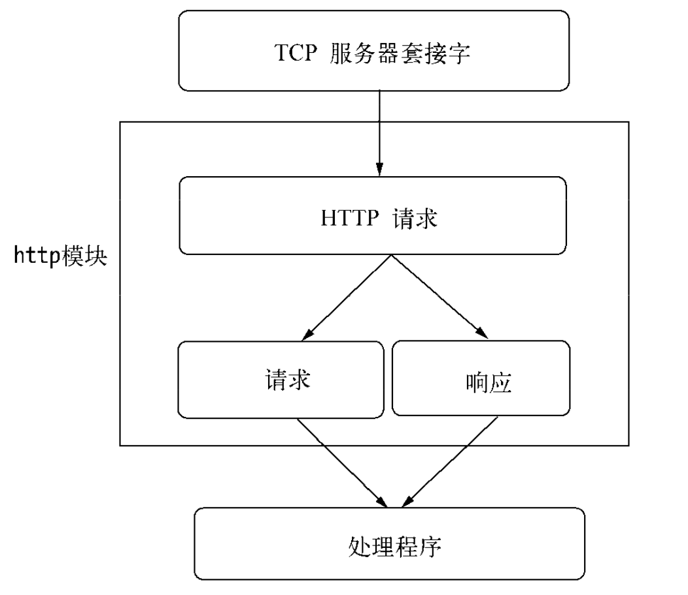
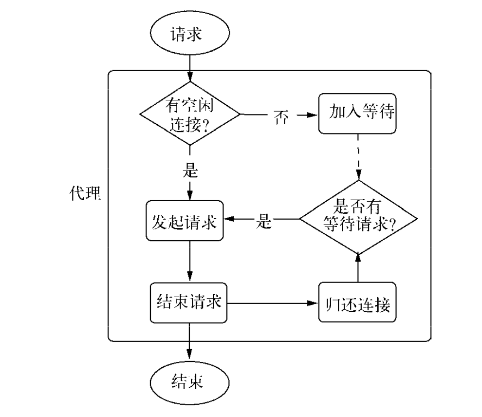
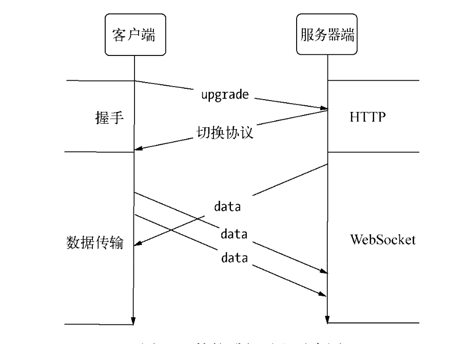
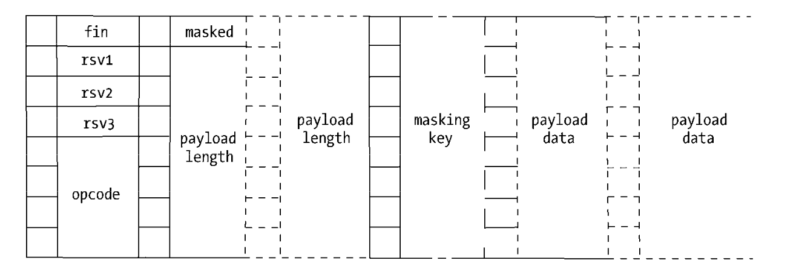
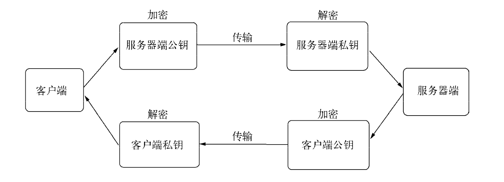
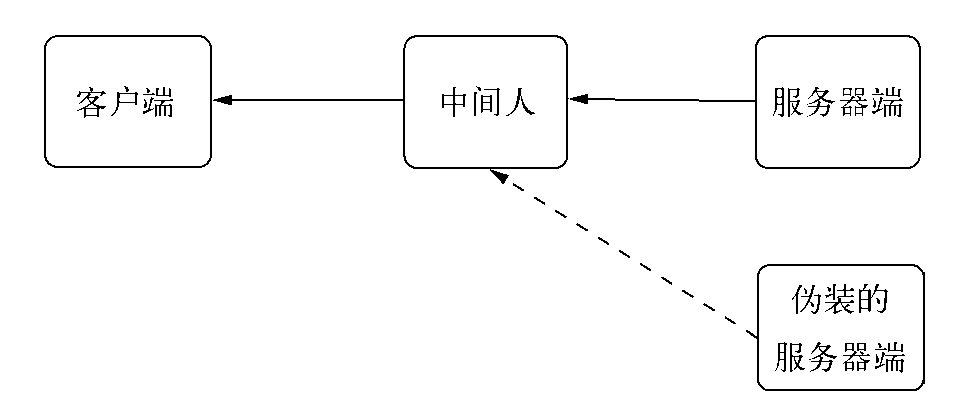
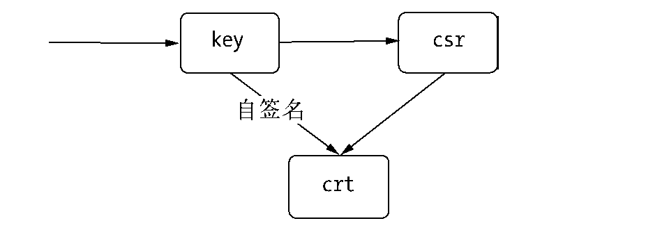
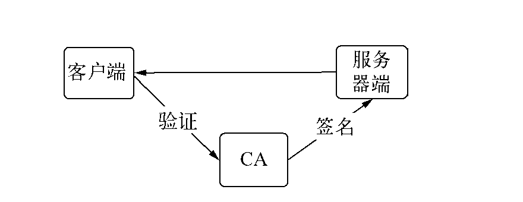

## 前言

Node面向网络而生：
- 事件驱动
- 无阻塞
- 单线程
- 轻量，适合在分布式网络中使用
- API贴合网络
- 对于Node，只需要几行代码即可构建服务器，无需额外的容器
- Node提供了`net`、`dgram`、`http`、`https`4个模块，分别用于处理TCP、UDP、HTTP、HTTPS，适用于服务器端和客户端。

## 构建TCP服务

### 创建TCP服务器

```javascript
var net  = require('net');

var server = net.createServer(function (socket) {
    // 新的连接
    socket.on('data', function (data) {
        socket.write("hello");
    });

    socket.on('end', function () {
        socket.write("disconnect");
    });

    socket.write("Welcome to nodeJS\n");
});

server.listen(8124, function () {
    console.log('server bound');
});
```

### TCP服务的事件

|  服务器事件   |              | 
|:-----------:|:------------:|
| listening | 调用`server.listen`绑定端口或者Domain Socket后触发，`server.listen(port, listeningListener)`|
| connection |  每个客户端套接字连接到服务器端时触发，`net.createServer()`，最后一个参数传递 |
| close | 服务器关闭时触发，调用`server.close`后，服务器将停止接收新的套接字连接，但是保持当前存在的连接，等待所有连接都断开后，触发该事件 |
| error | 服务器发生异常时，将会触发该事件 |

|  连接事件   |              | 
|:-----------:|:------------:|
| data | 一端调用`write`发送方数据时，另一端会触发data事件，事件传递的数据即是`write`发送的数据|
| end |  连接中的任意一端发送了FIN数据时，将会触发该事件 |
| connect | 该事件用于客户端，当套接字与服务器端连接成功时会被触发 |
| drain | 任意一端调用`write`发送方数据时，当前这端会触发此事件 |
| error | 发生异常时，将会触发该事件 |
| close | 套接字完全关闭时，触发该事件 |
| timeout | 一定时间后连接不再活跃时，该事件将会被触发，通知用户当前此连接已经被闲置了 |

------------------------------------------------------------------
TCP套接字是可写可读的Stream对象，可以利用`pipe()`方法巧妙的实现管道操作。

> 在Node中，TCP默认开启了Nagle算法，可以调用`socket.setNoDelay(true)`去掉Nagle算法，使得`write`可以立即发送数据到网络中。

> 尽管在网络的一端调用`write`会触发另一端的data事件，但是不意味和每次`write`都会触发一次data事件，在关闭Nagle算法后，接收端可能接收到多个小数据包的合并，然后只触发一次data事件。

## 构建UDP服务

UDP特点：
- 不面向连接
- 不可靠信息传输服务，网络差时，丢包严重
- 无需连接，资源消耗低，处理快速且灵活
- 用于丢少量包不会影响的场景，如音频，视频等
- 应用广泛，DNS服务基于它实现

### UDP套接字创建

```javascript
var dgram = require('dgram');
var socket = dgram.createSocket("udp4");
```

### UDP服务器端创建

UDP套接字接收网络消息，只要调用`dgram.bind(port, [address])`方法绑定网卡和端口即可。绑定完成后，触发listening事件。

eg:

```javascript
var dgram = require('dgram');
var server = dgram.createSocket("udp4");

server.on("message", function (msg, rinfo) {
    console.log("server got:" + msg + "from" + rinfo.address + ":" + rinfo.port);
});

server.on("listening", function () {
    var address = server.address();
    console.log("server listening " + address.address + ":" + address.port);
});

server.bind(41234);
```

### UDP客户端创建

```javascript
var dgram = require('dgram');

var message = new Buffer("nodeJs");
var client = dgram.createSocket("udp4");
client.send(message, 0, message.length, 41234, "localhost", function(err, bytes) {
    client.close();
});
```

socket.send(buf, offset, length, port, adress, [callback])
- 要发送的buffer、buffer的偏移，buffer的长度，目标端口，目标地址，发送完成后的回调

### UDP套接字事件

|  UDP套接字事件   |              | 
|:-----------:|:------------:|
| message | UDP套接字侦听网卡端口后，接收到消息时触发该事件，触发携带的数据为消息buffer对象和一个远程地址信息 |
| listening |  UDP套接字开始侦听时触发该事件 |
| close | 调用`close`方法时触发该事件，并不再触发`message`事件 |
| error | 发生异常时，将会触发该事件，如果不侦听，异常将直接抛出，使进程退出 |

## 构建HTTP服务

### http模块

- 在Node中，HTTP服务继承于TCP服务器（net模块）
- 能够与多个客户端保持连接
- 采用事件驱动
- 不为每一个连接创建额外的线程或进程，保持很低的内存占用，所以能实现高并发

HTTP服务与TCP服务区别：
- 开启keepalive后，一个TCP可以用于多次请请求响应
- TCP服务以connection 为单位服务，HTTP服务以request为单位服务

**http在底层将连接所用套接字的读写抽象为ServerRequest和ServerResponse对象**。请求产生过程中，http拿到连接中传来的数据，调用二进制模块http_parser进行解析，解析请求报文完成后，触发request事件，调用用户的业务逻辑。



#### http请求

对于TCP连接的读操作，http将其封装为ServerRequest，报文头通过http_parser进行解析。

请求报文：
```
> GET / HTTP/1.1
> User-Agent: curl/7.24.0 (x86_64-apple-darwin12.0) libcurl/7.24.0 OpenSSL/0.9.8r zlib/1.2.5 2
> Host: 127.0.0.1:1337 > Accept: */*
>
```

报文头第一行GET/HTTP/1.1被解析之后分解为如下属性。
- req.method：值为GET，为请求方法，常见的请求方法有有GET、POST、DELETE、PUT、CONNECT等。
- eq.ur：值为/。
- req.httpVersion：值为1.1。

 其余报头是规律的的Key: Value格式，解析后放在req.headers传给业务逻辑供调用。

 报文体部分抽象为一个只读流对象，若是业务逻辑需要读取报问题中的数据，则要在这个流结束后再操作。

 #### http响应

 报文头部信息：的API为`res.setHeader()`和`res. writeHead()`。

 `res.writeHead(200, {'Content-Type': 'text/plain'});`

```
< HTTP/1.1 200 OK
< Content-Type: text/plain
```

可以调用`res.setHeader()`进行多次设置，但是只有调用`res. writeHead()`后，报头才会写入连接中。

------------------------------------------------------------------

报文体部分：则是调用`res.write()`和`res.end()`方法实现。

`res.end()`先调用`write()`发送数据，然后发送信号告知此次响应结束，响应结束后，HTTP服务器可能将当前连接用于下一次请求或是关闭连接。

> 报头是在报文体发送前发送的，一旦开始了数据的发送，`res.setHeader()`和`res. writeHead()`将不再生效。
> 务必在结束时调用`res.end()`，否则客户端一直处于等待状态。


 #### http服务事件

|  http服务事件   |              | 
|:-----------:|:------------:|
| connection事件 |  在开始HTTP请求和响应前，客户端与服务端要建立底层的TCP连接，这个连接可能因为开启keep-alive，可以在多次请求和响应之间使用；这个连接建立时，服务端触发一次connection事件。|
| request事件 |  建当请求发送到服务端，在解析出HTTP请求头后触发该事件。 |
| close事件 | 已有的连接都断开后，触发该事件。 |
| checkContinue事件 | 某些客户端在发送较大的数据时，并不会将数据直接发送，而是先发送一个头部带Expect: 100-continue的请求到服务器，服务器将会触发checkContinue事件；如果没有为服务器监听这个事件，服务器将自动响应客户端100 Continue的状态码，表示接受数据上传；如果不接受的数据较多时，响应客户端400 Bad Request拒绝客户端继续发送数据即可。和request事件互斥。 |
| connect事件 | 客户端发起CONNECT请求时触发。 |
| upgrade事件 | 客户端要求升级连接的协议时，需要和服务器端协商，客户端会在请求头中带上Upgrade字段，服务器端会在接受到这样的请求时触发该事件。 |
| clientError事件 | 发生异常时，将会触发该事件，错误传到服务端 |

### HTTP客户端

- 产生报文头和报文体
- `http.request(options, connect)`构造客户端，options请求头内容。

```javascript
var options = { 
    hostname: '127.0.0.1', 
    port: 1334,
    path: '/',
    method: 'GET'
 };

var req = http.request(options, function(res) { 
    console.log('STATUS: ' + res.statusCode); 
    console.log('HEADERS: ' + JSON.stringify(res.headers)); res.setEncoding('utf8');
    res.on('data', function (chunk) { console.log(chunk);
    });
 });
req.end();

$ node client.js
STATUS: 200
HEADERS: {"date":"Sat, 06 Apr 2013 11:08:01 GMT","connection":"keep-alive","transfer-encoding":"chunked"} Hello World
```
#### http代理

为了重用TCP连接，http模块包含一个默认的客户端代理对象`http.globalAgent`，它对每个服务端（host+port）创建的连接进行管理，实质是一个连接池。



默认情况，通过ClientRequest对同一个服务端发起的HTTP请求最多可以创建5个连接。若是调用客户端同时对一个服务器发起10次http请求，实质上只有5个请求处于并发状态，后续请求需要等待某个请求完成服务才真正发出。

可以设置options的agent选项为false，以脱离线程池的管理，使得请求不受并发的限制。

#### http客户端事件

|  http客户端事件 |
|:-----------:|
| response |
| socket |
| connect |
| upgrade |
| continue |

## 构建WebSocket服务

- WebSocket客户端机基于事件驱动，可以与Node应用良好
- WebSocket实现了客户端与服务器端之间的长连接
- 客户端与服务器端之间之间只建立一个TCP连接
- WebSocket服务器端可以推送数据到客户端
- 更轻量级的协议头，减少数据传送量
- 可以双向通信
- WebSocket协议属于应用层协议
- WebSocket握手的部分由HTTP完成，一次握手，握手成功后，数据就直接从TCP通道传输，与Http无关
- **WebSocket的协议主要分为两个部分：握手和数据传输**
- `socket.io`在此基础上实现

eg: 
```javascript
var socket = new WebSocket('ws://127.0.0.1:12010/updates');
socket.onopen = function () {
    // 向服务器发送数据
    setInterval(function() {
        if (socket.bufferedAmount == 0)
            socket.send(getUpdateData());
        }, 50);
};
// 接收服务器端传来的数据
socket.onmessage = function (event) {
// TODO:event.data 
};
```

WebSocket之前，Comet：
- 长轮询或iframe流
- **长轮询**
  - 客户端向服务端发起请求，服务器端只在超时或有数据响应时断开连接(`res.send()`)；客户端在收到数据或者超时后重新发起请求。

### WebSocket握手

- 客户端建立连接时，通过HTTP发起请求报文，如下所示：

```
GET /chat HTTP/1.1
Host: server.example.com
Upgrade: websocket   // 表示请求服务器端升级协议为Websocket
Connection: Upgrade
Sec-WebSocket-Key: dGhlIHNhbXBsZSBub25jZQ==  // 用于安全校验
Sec-WebSocket-Protocol: chat, superchat  // 指定子协议和版本号
Sec-WebSocket-Version: 13  
```
--------------------------------------------------------------
- 服务器端在处理完请求后，响应如下报文

```
HTTP/1.1 101 Switching Protocols
Upgrade: websocket
Connection: Upgrade 
Sec-WebSocket-Accept: s3pPLMBiTxaQ9kYGzzhZRbK+xOo=
Sec-WebSocket-Protocol: chat
```
告知客户端正在更换协议，更新应用层协议为WebSocket协议，并在当前的套接字连接上应用新协议。客户端将会校验`Sec-WebSocket-Accept`的值，如果成功，将开始数据传输。

**一旦WebSocket握手成功后，服务器端与客户端将会呈现对等的效果，都能接收和发送消息。**

### WebSocket数据传输

握手顺利完成后，当前连接不再进行HTTP的交互，而是开始WebSocket的数据帧协议。



握手完成后，客户端的`onopen()`将会被触发。

```javascript
socket.onopen = function () { 
    // TODO: opened()
};
```
--------------------------------------------------------------
为了完成TCP套接字事件到WebSocket事件的封装，需要在**接收数据时进行处理**，WebSocket数据帧协议即是在底层data事件上封装完成的。

```javascript
WebSocket.prototype.setSocket = function (socket) { 
    this.socket = socket;
    this.socket.on('data', this.receiver);
};
```

发送数据时，也要封装：

```javascript
WebSocket.prototype.send = function (data) { 
    this._send(data);
};
```
--------------------------------------------------------------

- 客户端调用`send`发送数据时，服务端触发`onmessage`，反之亦然。
- 调用`send`发送1条数据时，协议可能将这个数据封装为一帧或多帧数据，然后逐帧发送。
- 为了安全考虑，客户端需要对发送的数据帧进行掩码处理，服务器一旦收到无掩码帧（比如中间拦截破坏），连接将关闭。
- 服务器发送到客户端的数据帧则无需做掩码处理，若是客户端收到带掩码的数据帧，连接也会关闭。

WebSocket数据帧定义，8位为一列：


|  WebSocket数据的定义   |              | 
|:-----------:|:------------:|
| fin | 如果这个数据帧是最后一帧，这个fin位为1，其余情况为0。当一个数据没有被分为多帧时，它既是第一帧也是最后一帧。 |
| rsv1、rsv2、rsv3 | rsv1、rsv2、rsv3：各为1位长，3个标识用于扩展，当有已协商的扩展时，这些值可能为1，其余情况为0。|
| opcode | 长为4位的操作码，可以用来表示0到15的值，用于解释当前数据帧。0表示附加数据帧，1表示文本数据帧，2表示二进制数据帧，8表示发送一个连接关闭的数据帧，9表示ping数据帧，10表示pong数据帧，其余值暂时没有定义。ping数据帧和pong数据帧用于心跳检测，当一端发送ping数据帧时，另一端必须发送pong数据帧作为响应，告知对方这一端仍然处于响应状态。|
| masked | 表示是否进行掩码处理，长度为1。客户端发送给服务器端时为1，服务器端发送给客户端时为0 |
| payload length | 一个7、7+16或7+64位长的数据位，标识数据的长度，如果值在0~125之间，那么该值就是数据的真实长度；如果值是126，则后面16位的值是数据的真实长度；如果值是127，则后面64位的值是数据的真实长度 |
| masking key | 当masked为1时存在，是一个32位长的数据位，用于解密数据 |
| payload data | 我们的目标数据，位数为8的倍数 |

客户端发送消息时，需要构造一个或多个数据帧协议报文。由于hello  world!较短，不存在分割为多个数据帧的情况，又由于hello  world!会以文本的方式发送，它的payload  length长度为96（12字节x8位/字节），二进制表示为1100000。所以报文应当如下：
```
fin(1) + res(000) + opcode(0001) + masked(1) + payload length(1100000) +  masking  key(32位) + payload data(hello world!加密后的二进制)
```

客户端发送消息后，服务器端在data事件中接收到这些编码数据，然后解析为相应的数据帧，再以数据帧的格式，通过掩码将真正的数据解密出来，然后触发`onmessage()`执行，如下所示：
```javascript
socket.onmessage  =  function  (event)  {
// TODO: event.data
};
```
回复：
```
fin(1)  +  res(000)  +  opcode(0001)  +  masked(0)  +  payload  length(1100000)  +  payload  data(yakexi的二进制)
```

如何解析数据帧和触发`onmessage()`，请参考ws模块的实现。


## 网络服务与安全

SSL协议（Secure Sockets Layer，安全套接层）
- 一种安全协议，在传输层提供对网络连接加密的功能
- 对于应用层而言，是透明的，数据在传递到应用层之前就已经就已经完成了加密和解密的过程
- IETF标准化后，称为TLS(Transport Layer Security，安全传输层协议)

Node在网络安全方面提供了3个模块
- crypto：主要用于加密解密，SHA1、MD5等加密算法都在其中有体现
- tls：建立在TLS/SSL加密的tcp连接之上
- https

### TLS/SSL

1. 密钥

- TLS/SSL是一个公钥/私钥的结构
- 非对称结构
- 每个客户端和服务端都有自己的公私钥
- **公钥用来加密要传输的数据，私钥用来解密接收到的数据**
- **公钥和私钥是配对的，通过公钥加密的数据，只有通过私钥才能解密，所以在建立安全传输之前，客户端和服务端之间要先互换公钥**
- 客户端发送数据时要通过服务端的公钥进行加密，服务端发送数据时则需要客户端公钥加密



--------------------------------------------------------------

- Node底层采用的是openssl实现TLS/SSL的，生成公钥和私钥可以通过openssl完成

```javascript
//  生成服务器端私钥
$  openssl  genrsa  -out  server.key  1024
//  生成客户端私钥
$  openssl  genrsa  -out  client.key  1024"
```
上述命令生成了两个1024位长的RSA私钥文件，我们可以通过它继续生成公钥，如下所示：
```javascript
$ openssl rsa -in server.key -pubout -out server.pem
$ openssl rsa -in client.key -pubout -out client.pem
```
--------------------------------------------------------------

公私钥的非对称加密虽好，但是网络中依然可能存在窃听的情况，典型的例子是**中间人攻击**。
客户端和服务器端在交换公钥的过程中，中间人对客户端扮演服务器端的角色，对服务器端扮演客户端的角色，因此客户端和服务器端几乎感受不到中间人的存在。为了解决这种问题，数据传输过程中还需要对得到的公钥进行认证，以确认得到的公钥是出自目标服务器。如果不能保证这种认证，中间人可能会将伪造的站点响应给用户，从而造成经济损失。图7-9是中间人攻击的示意图。



**为了解决这个问题，TLS/SSL引入了数字证书来认证**。与直接用公钥不同，数字证书中包含了服务器的名称与主机名、服务器的公钥、签名颁发机构的名称、来自签名颁发机构的签名。在连接建立之前，通过证书中的签名确认收到的公钥是来自目标服务器的，从而产生信任关系。

2. 数字证书

**CA**(Certificate Authority，数字证书认证中心)，为站点颁发证书，且这个证书中具有CA通过自己的公钥和私钥实现的签名。

**为了得到签名证书，服务器端需要通过自己的私钥生成CSR（Certificate Signing Request，证书签名请求）文件。CA机构将通过CSR颁发属于该服务器端的签名证书，只要通过CA机构就能验证证书是否合法。**

通过CA机构颁发证书通常是一个烦琐的过程，需要付出一定的精力和费用。对于中小型企业而言，多半是采用**自签名证书**来构建安全网络的。所谓自签名证书，就是自己扮演CA机构，给自己的服务器端颁发签名证书。以下为生成私钥、生成CSR文件、通过私钥自签名生成证书的过程：
```
$ openssl genrsa -out ca.key 1024  // 生成私钥
$ openssl req -new -key ca.key -out ca.csr   // 生成CSR文件
$ openssl x509 -req -in ca.csr -signkey ca.key -out ca.crt  // 通过私钥自签名生成证书
``` 



客户端在发起安全连接前会去获取服务器端的证书，并通过CA的证书验证服务器端证书的真伪。除了验证真伪外，通常还含有对服务器名称、IP地址等进行验证的过程。



CA机构将证书颁发给服务器端后，证书在请求的过程中会被发送给客户端，客户端需要通过CA的证书验证真伪。如果是知名的CA机构，它们的证书一般预装在浏览器中。如果是自己扮演CA机构，颁发自有签名证书则不能享受这个福利，客户端需要获取到CA的证书才能进行验证。上述的过程中可以看出，签名证书是一环一环地颁发的，但是在CA那里的证书是不需要上级证书参与签名的，这个证书我们通常称为**根证书**。

### TLS服务

#### 创建服务器端

将构建服务所需要的证书都备齐之后，我们通过Node的tls模块来创建一个安全的TCP服务，这个服务是一个简单的echo服务，代码如下：

```javascript
var tls = require('tls');
var fs = require('fs');
var options = {
    key: fs.readFileSync('./keys/server.key'),
    cert: fs.readFileSync('./keys/server.crt'),
    requestCert: true,
    ca: [ fs.readFileSync('./keys/ca.crt') ]
};
var server = tls.createServer(options, function (stream) {
    console.log('server connected', stream.authorized ? 'authorized' : 'unauthorized');
    stream.write("welcome!\n");
    stream.setEncoding('utf8');
    stream.pipe(stream);
});
server.listen(8000, function() {
    console.log('server bound');
});

$ openssl s_client -connect 127.0.0.1:8000
```

#### TLS客户端

在构建我们的客户端之前，需要为客户端生成属于自己的私钥和签名，代码如下：

```
// 创建私钥
$  openssl  genrsa  -out  client.key  1024
//  生成CSR
$  openssl  req  -new  -key  client.key  -out  client.csr
//  生成签名证书
$  openssl  x509  -req  -CA  ca.crt  -CAkey  ca.key  -CAcreateserial  -in  client.csr  -out  client.crt
```

```javascript
var options = {
    key: fs.readFileSync('./keys/client.key'),
    cert: fs.readFileSync('./keys/client.crt'),
    ca: [ fs.readFileSync('./keys/ca.crt') ]
};
var stream = tls.connect(8000, options, function () {
    console.log('client connected', stream.authorized ? 'authorized' : 'unauthorized');
    process.stdin.pipe(stream);
});
stream.setEncoding('utf8');
stream.on('data', function(data) {
    console.log(data);
});
stream.on('end', function() {
    server.close();
});
```

### HTTPS服务

**HTTPS服务就是工作在TLS/SSL上的HTTP。**

- HTTPS服务需要用到私钥和签名证书，我们可以直接用上文生成的私钥和证书。
- 创建HTTPS服务
  - 创建HTTPS服务只比HTTP服务多一个选项配置

```javascript
var https = require('https');
var fs = require('fs');
var options = {
    key: fs.readFileSync('./keys/server.key'),
    cert: fs.readFileSync('./keys/server.crt')
};

https.createServer(options, function (req, res) {
    res.writeHead(200);
    res.end("hello world\n");
}).listen(8000);
```

启动之后通过curl进行测试，相关代码如下所示：

```
$ curl https://localhost:8000/
curl: (60) SSL certificate problem, verify that the CA cert is OK. Details:
error:14090086:SSL routines:SSL3_GET_SERVER_CERTIFICATE:certificate verify failed
More details here: http://curl.haxx.se/docs/sslcerts.html
curl performs SSL certificate verification by default, using a "bundle"
of Certificate Authority (CA) public keys (CA certs). If the default
bundle file isn't adequate, you can specify an alternate file
using the --cacert option.
If this HTTPS server uses a certificate signed by a CA represented in
the bundle, the certificate verification probably failed due to a
problem with the certificate (it might be expired, or the name might
not match the domain name in the URL).
If you'd like to turn off curl's verification of the certificate, use
the -k (or --insecure) option.
```

- curl工具尤法验证服务器端证书是否正确，所以出现了上述的抛错，要解决上面的问题有两种方式。一种是加-k选项，让curl工具忽略掉证书的验证，这样的结果是数据依然会通过公钥加密传输，但是无法保证对方是可靠的，会存在中间人攻击的潜在风险。其结果如下所示：

```
$ curl -k https://localhost:8000/
hello world
```

- 另一种解决的方式是给curl设置--cacert选项，告知CA证书使之完成对服务器证书的验证，如下所示：
```
$ curl --cacert keys/ca.crt https://localhost:8000/
hello world
```

#### HTTPS客户端

指定证书和相关参数：

```javascript
var https = require('https');
var fs = require('fs');
var options = {
    hostname: 'localhost',
    port: 8000,
    path: '/',
    method: 'GET',
    key: fs.readFileSync('./keys/client.key'),
    cert: fs.readFileSync('./keys/client.crt'),
    ca: [fs.readFileSync('./keys/ca.crt')]
};
options.agent = new https.Agent(options);
var req = https.request(options, function(res) {
    res.setEncoding('utf-8');
    res.on('data', function(d) {
        console.log(d);
    });
});
req.end();
req.on('error', function(e) {
    console.log(e);
});

$ node  client.js
hello  world
```

- 如果不设置ca选项，将会得到如下异常：
`[Error:  UNABLE_TO_VERIFY_LEAF_SIGNATURE]`
- 解决该异常的方案是添加选项属性`rejectUnauthorized`为false，它的效果与curl工具加-k一样，都会在数据传输过程中会加密，但是无法保证服务器端的证书不是伪造的.