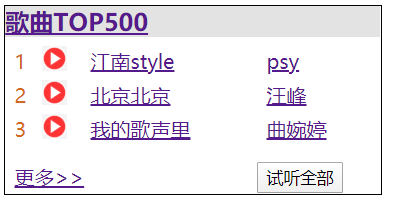

```
<!DOCTYPE html>
<html>
    <script>

    </script>
    <style>
        .list-head {
            width: 300px;
            height: 150px;
            border: 1px black solid;
            display: flex;
            flex-direction: column;
        }

        .head {
            background-color: rgb(228, 227, 227);
            font-weight: bold;
            color: black;
            font-size: larger;
        }

        .head a:link {
            color: black;
        }

        .list {
            padding: 5px 5px 5px 5px;
            font-size: medium;
        }

        .list1:hover {
            font-size: large;
            font-weight: bold;
        }

        .list2:hover {
            font-size: large;
            font-weight: bold;
        }

        .list3:hover {
            font-size: large;
            font-weight: bold;
        }

        .num {
            color: chocolate;
            margin-right: 10px;
        }
        .list1,.list2,.list3 {
            margin-bottom: 10px;
            padding: 1px 5px 5px 5px;
        }

        li {
            display: inline-block;
        }
        .desc {
            margin: auto 30px;
        }
        img {
            width: 20px;
            height: 20px;
        }
    </style>
    <head></head>
    <body>
        <div class="list-head">
            <div class="head"><a href="#">歌曲TOP500</a></div>
            <table class="list">
                <tr class="list1">
                    <td class="num">1</td>
                    <td></td>
                    <td><a href="#">江南style  </a></td>
                    <td class="desc"><a href="#">psy</a></td>
                </tr>
                <tr class="list2">
                    <td class="num">2</td>
                    <td></td>
                    <td><a href="#">北京北京  </a></li>
                    <td class="desc"><a href="#">汪峰</a></td>
                </tr>
                <tr class="list3">
                    <td class="num">3</td>
                    <td></td>
                    <td><a href="#">我的歌声里</a></td>
                    <td class="desc"><a href="#">曲婉婷</a></td>
                </tr>
                
            </table>
            <table class="list">
                <tr>
                    <td><a href="#">更多>></a></td>
                    <td>&nbsp;&nbsp;&nbsp;&nbsp;&nbsp;&nbsp;&nbsp;&nbsp;</td>
                    <td>&nbsp;&nbsp;&nbsp;&nbsp;&nbsp;&nbsp;&nbsp;&nbsp;&nbsp;&nbsp;</td>
                    <td><button>试听全部</button></td>
                </tr>
            </table>
        </div>
        
    </body>

</html>
```
效果：

