## 前言

**传输层服务的基本理论和基本机制**：
- 多路复用/分用
- 可靠数据传输机制
- 流量控制机制
- 拥塞控制机制

**掌握Internet的传输层协议**：
- UDP：无连接传输服务
- TCP：面向连接的传输服务
- TCP拥塞控制

## 传输层服务和协议

传输层协议为运行在不同Host(主机)上的进程提供了一种**逻辑通信机制**。

端系统运行传输层协议：
- 发送方：将应用递交的消息分成一个或多个segment，并向下传给网络层。
- 接收方：将收到的segment组装成消息，并上交给应用层。

**传输层可以为应用提供多种协议**：
- Internet上的TCP
- Internet上的UDP

**网络层 vs 传输层**

网络层：提供主机之间的额逻辑通信机制。

传输层：提供应用进程之间的逻辑通信机制
- 位于网络层之上
- 依赖于网络层服务
- 对网络层服务进行(可能的)增强

**Internet传输层协议**
- 可靠、按序的交付服务(TCP)
  - 拥塞控制
  - 流量控制
  - 连接建立
- 不可靠的交付服务(UDP)
  - 基于“尽力而为”的网络层，没有可靠性方面的拓展
- 两种服务均不保证
  - 延迟
  - 带宽

## 多路分用和多路复用

> 如果某层的一个协议对应直接上层的多个协议/实体，则需复用/分用。

### 分用如何工作：
- 主机接收到IP数据报
  - 每个数据报携带源IP地址、目的IP地址。
  -  每个数据报携带一个传输层的段(Segment）。
  -  每个段携带源端口号和目的端口号。

- 主机收到Segment之后，传输层协议提取IP地址和端口号信息，将Segment导向相应的Socket。
  - TCP做更多处理

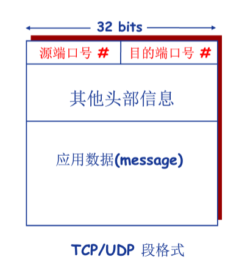

### 无连接分用：
- 利用端口号创建Socket
```
DatagramSocket mySocket1 = new
DatagramSocket(99111);
DatagramSocket mySocket2 = new
DatagramSocket(99222);
```
- UDP的Socket用二元组标识(目的IP地址，目的端口号)
- 主机收到UDP段后,检查段中的目的端口号
- 将UDP段导向绑定在该端口号的Socket
- 来自不同源IP地址和/或源端口号的IP数据包被导向同一个Socket


### 面向连接的分用：
- TCP的Socket用四元组标识
  - 源IP地址
  - 源端口号
  - 目的IP地址
  - 目的端口号
- 接收端利用所有的四个值将Segment导向合适的Socket
- 服务器可能同时支持多个TCP Socket
  - 每个Socket用自己的四元组标识
- Web服务器为每个客户端开不同的Socket

## UDP

- **基于Internet IP协议**
  - 复用/分用
  - 简单的错误校验
- **“Best effort”服务，UDP段可能**
  - 丢失
  - 非按序到达
- **无连接**
  - UDP发送方和接收方不需要握手
  - 每个UDP段的处理独立于其他段
  
<br>

- 无需建立连接(减少延迟)
- 实现简单：无需维护连接状态
- 头部开销少
- 没有拥塞控制：应用更好的控制发送时间和速率

<br>

- 常用于流媒体应用
- UDP还用于
  - DNS
  - SNMP
- 在UDP实现可靠传输
  - 在应用层添加可靠性机制
  - 应用特定的错误恢复机制

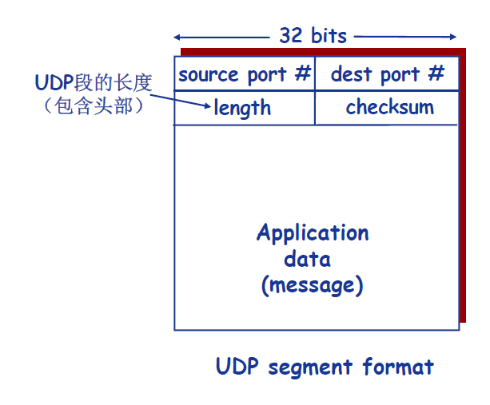

### UDP校验和(checksum)

目的： 检测UDP段在传输中是否发生错误。

发送方：
- 将段的内容视为16-bit整数
- 校验和计算：计算所有整数的和，进位加在和的后面，将得到的值按位求反，得到校验和
- 发送方将校验和放入校验和字段

接收方：
- 计算所收到段的校验和
- 将其与校验和字段进行对比
  - 不相等：检测出错误
  - 相等：没有检测出错误（但可能有错误）

## 可靠数据传输原理

> 可靠传输：不丢、不乱、不错

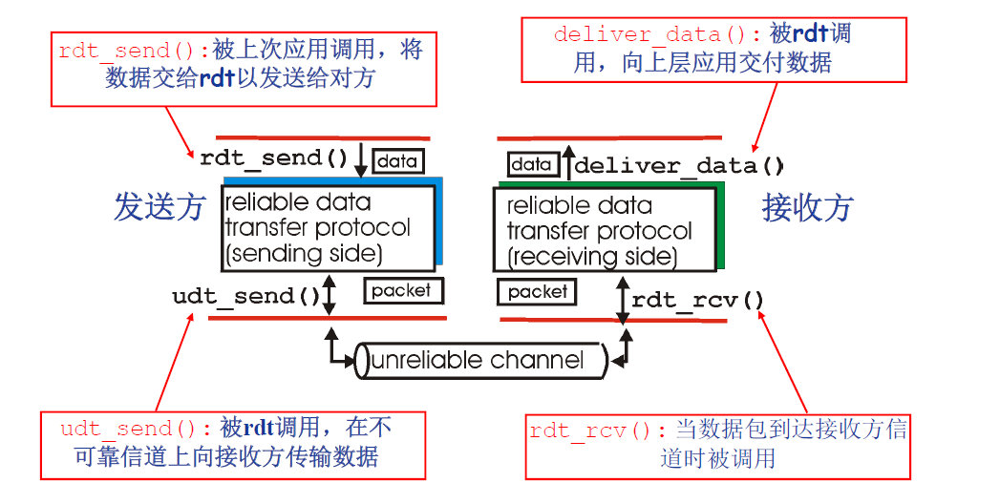

### rdt2.0

- 底层信道可能翻转分组中的位(bit)
  - 利用**校验和**检测**位错误**

- 如何从错误中恢复？
  - 确认机制(**Acknowledgements, ACK**): 接收方显式地告知发送方分组已正确接收
  - NAK:接收方显式地告知发送方分组有错误
  - 发送方收到NAK后，重传分组
  - 基于这种重传机制的rdt协议称为**ARQ**(Automatic Repeat reQuest)协议
   
- Rdt 2.0中引入的新机制
  - 差错检测
  - 接收方反馈控制消息: ACK/NAK
  - 重传

### rdt2.1和2.2

**rdt2.1**

- **如果ACK/NAK消息发生错误/被破坏(corrupted)会怎么样**？
  - 为ACK/NAK增加校验和，检错并纠错
  - 发送方收到被破坏ACK/NAK时不知道接收方发生了什么，添加额外的控制消息
  - 如果ACK/NAK坏掉，发送方重传
  - 不能简单的重传：产生重复分组

- **如何解决重复分组问题**？
  - 序列号(**Sequence number**): 发送方给每个分组增加序列号
  - 接收方丢弃重复分组

**rdt2.2**：无NAK消息协议

- 与rdt 2.1功能相同，但是只使用ACK
- 如何实现？
  - 接收方通过ACK告知最后一个被正确接收的分组
  - 在ACK消息中显式地加入被确认分组的序列号
  - 发送方收到重复ACK之后，采取与收到NAK消息相同的动作
  - 重传当前分组

### rdt3.0

如果信道既可能发生错误，也可能丢失分组，怎么办？
- “校验和+ 序列号+ ACK + 重传”够用吗？
  
- 方法：发送方等待“合理”时间
  - 如果没收到ACK，重传
  - 如果分组或ACK只是延迟而不是丢了
  - 重传会产生重复，序列号机制能够处理
  - 接收方需在ACK中显式告知所确认的分组
  - 需要定时器

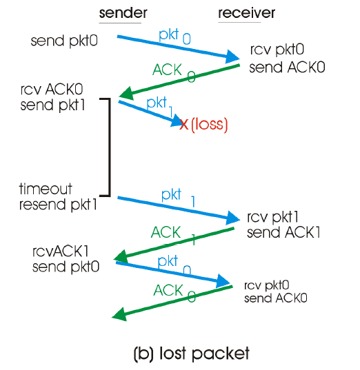
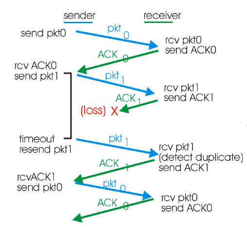
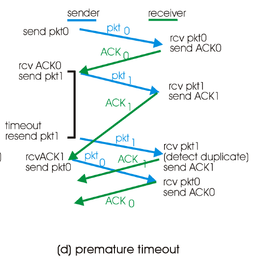

## 滑动窗口协议


## 面向连接的传输协议——TCP

### TCP概述

- 点对点
  - 一个发送方一个接收方
- 可靠的、按序的字节流
- 流水线机制
  - TCP拥塞控制和流量控制机制设置窗口尺寸
- 发送方/接收方缓存
- 全双工(full-duplex)
  - 同一连接中能够传输双向数据流
- 面向连接
  - 通信双方必须在发送数据之前建立连接
  - 连接状态只在连接的两端中维护，在沿途节点中并不维护
  - TCP连接包括：两台主机上的缓存、连接状态变量、socket等
- 流量控制机制

### TCP段结构

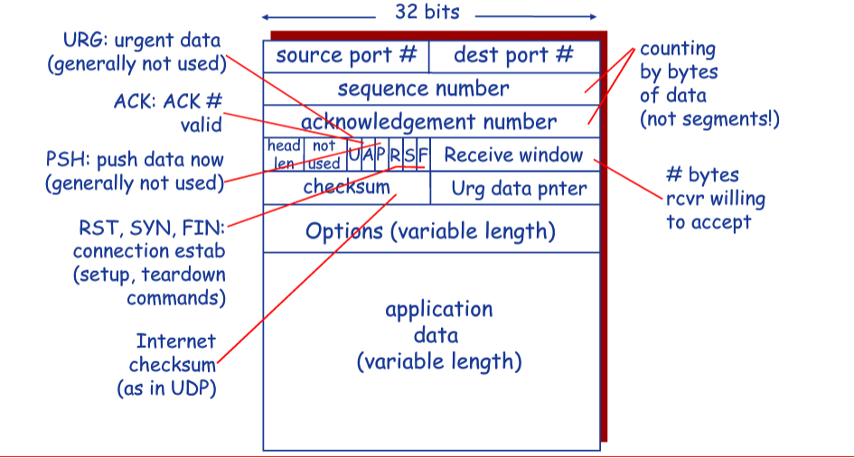
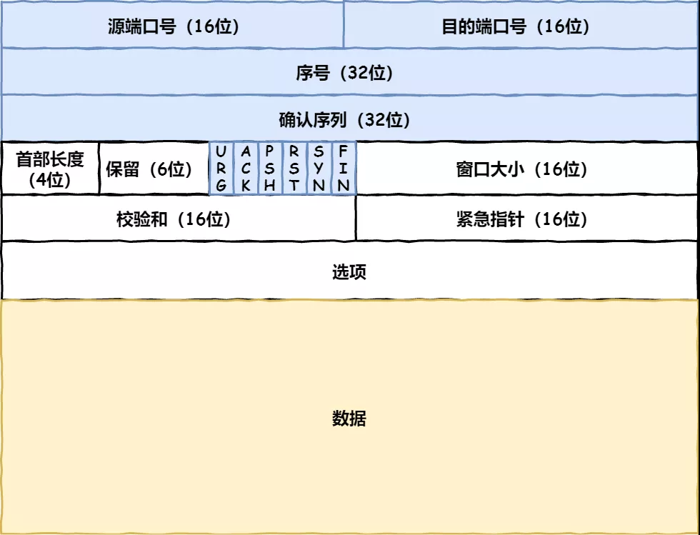

- 序列号(sequence number)
  - 序列号指的是segment中第一个字节的编号，而不是segment的编号
  - 建立TCP连接的时候，双方会随机选择序列号

- ACKS(acknowledgement number)
  - 希望接收到的下一个字节的序列号
  - 累计确认：该序列号之前的所有字节均已经被正确接收到

Q：接收方如何处理乱序到达的segment？
- A：TCP规范中没有规定，由TCP的实现者做出决策

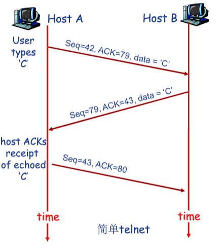

## TCP可靠数据传输

- TCP在IP层提供的不可靠服务基础上实现可靠数据传输服务
- 流水线机制
- 累计确认
- TCP使用单一重传定时器
- 出发重传的事件
  - 超时
  - 收到重复ACK
- 渐进式
  - 暂不考虑重复ACK
  - 暂不考虑流量控制
  - 暂不考虑拥塞控制

### TCP RTT和超时

- EstimatedRTT = (1- α) * EstimatedRTT + α*SampleRTT

> 指数加权移动平均典型值：0.125

- 定时器超时时间的设置：
  - EstimatedRTT+“安全边界”
  - EstimatedRTT变化大→较大的边界
- 测量RTT的变化值: SampleRTT与EstimatedRTT的差值
  - DevRTT = (1- β) * DevRTT + β * |SampleRTT-EstimatedRTT|
  - (typically, β = 0.25)
- 定时器超时时间的设置：
  - TimeoutInterval = EstimatedRTT + 4*DevRTT

### TCP发送方事件

- 创建segment
- 序列号是segment第一个字节的编号
- 开启计时器
- 设置超时时间TimeoutInterval
- 超时
  - 重传引起超时的segment
  - 重启定时器
- 收到ACK
  - 如果确认此前未确认的segment
    - 更新sendbase
    - 如果窗口中还有未确认的分组，重新启动定时器

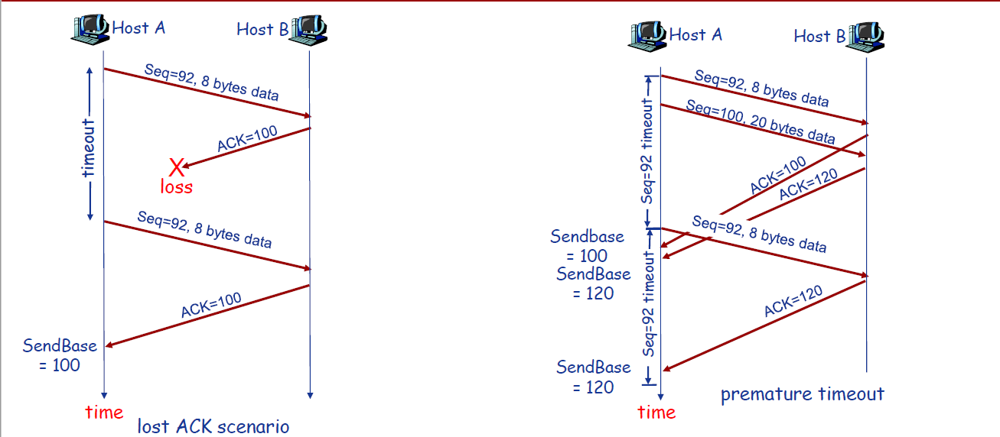
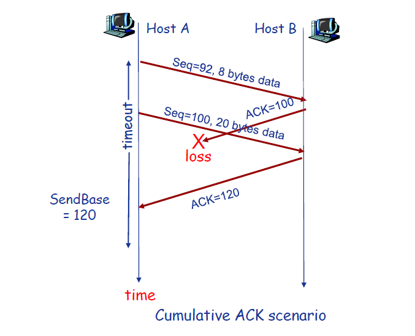

#### 快速重传机制

- TCP的实现中，如果发生超时，超时时间间隔将重新设置，即将超时时间间隔加倍，导致其很大
  - 重发丢失的分组之前要等待很长时间
- 通过重复的ACK来检测分组丢失
  - Sender会背靠背的发送多个分组
  - 如果某个分组丢失，可能会引发多个重复的ACK
- 如果sender收到对同一数据的3个ACK，则假定该数据之后的段已经丢失
  - 快速重传：在定时器超时之前即进行重传


### TCP流量控制

- 接收方为TCP连接分配buffer
  - 上层应用可能处理buffer中数据较慢
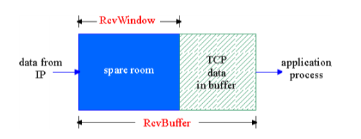
- 发送方不会传输的太多、太快以至于淹没接收方（buffer溢出）
- 速度匹配机制

- (假定TCP receiver丢弃乱序的segments)
  - Buffer中的可用空间(spareroom)
    = RcvWindow  <br>
    = RcvBuffer-[LastByteRcvd -LastByteRead]

- Receiver通过在Segment的头部字段将RcvWindow 告诉Sender
- Sender限制自己已经发送的但还未收到ACK的数据不超过接收方的空闲RcvWindow尺寸
- Receiver告知Sender  RcvWindow=0,会出现什么情况？
  - 会出现卡死，发送方不发数据了。

### TCP连接管理

- TCP sender和receiver在传输数据前需要**建立连接**
- 初始化TCP变量
  - Seq. #
  - Buffer和流量控制信息
- Client：连接发起者
  - Socket clientSocket = new
  - Socket("hostname","port number");
- Server: 等待客户连接请求
  - Socket connectionSocket =
  - welcomeSocket.accept();


<font style="color:blue">**TCP连接的三次握手**</font>


- 第一次握手(SYN=1, seq=x):

客户端发送一个 TCP 的 SYN 标志位置1的包，指明客户端打算连接的服务器的端口，以及初始序号 X,保存在包头的序列号(Sequence Number)字段里。

发送完毕后，客户端进入 SYN_SEND 状态。

- 第二次握手(SYN=1, ACK=1, seq=y, ACKnum=x+1):

服务器发回确认包(ACK)应答。即 SYN 标志位和 ACK 标志位均为1。服务器端选择自己 ISN 序列号，放到 Seq 域里，同时将确认序号(Acknowledgement Number)设置为客户的 ISN 加1，即X+1。 发送完毕后，服务器端进入 SYN_RCVD 状态。

- 第三次握手(ACK=1，ACKnum=y+1)

客户端再次发送确认包(ACK)，SYN 标志位为0，ACK 标志位为1，并且把服务器发来 ACK 的序号字段+1，放在确定字段中发送给对方，并且在数据段放写ISN的+1

发送完毕后，客户端进入 ESTABLISHED 状态，当服务器端接收到这个包时，也进入 ESTABLISHED 状态，TCP 握手结束。


**为什么需要三次握手？**

为了防止已经失效的连接请求报文段突然又传到服务端，因而产生错误”，这种情况是：

一端(client)A发出去的第一个连接请求报文并没有丢失，而是因为某些未知的原因在某个网络节点上发生滞留，导致延迟到连接释放以后的某个时间才到达另一端(server)B。本来这是一个早已失效的报文段，但是B收到此失效的报文之后，会误认为是A再次发出的一个新的连接请求，于是B端就向A又发出确认报文，表示同意建立连接。如果不采用“三次握手”，那么只要B端发出确认报文就会认为新的连接已经建立了，但是A端并没有发出建立连接的请求，因此不会去向B端发送数据，B端没有收到数据就会一直等待，这样B端就会白白浪费掉很多资源。如果采用“三次握手”的话就不会出现这种情况，B端收到一个过时失效的报文段之后，向A端发出确认，此时A并没有要求建立连接，所以就不会向B端发送确认，这个时候B端也能够知道连接没有建立。

问题的本质是，信道是不可靠的，但是我们要建立可靠的连接发送可靠的数据，也就是数据传输是需要可靠的。在这个时候三次握手是一个理论上的最小值，并不是说是tcp协议要求的，而是为了满足在不可靠的信道上传输可靠的数据所要求的。

**第二次握手是否会分配资源**

ACK没发过来的话，资源会保留一段时间，确认连接不需要 再释放。

**不执行第三次握手会怎么样？**

> 详解可参考：https://zhuanlan.zhihu.com/p/86426969

<font style="color:blue">**TCP连接的四次挥手**</font>

- 第一次挥手(FIN=1，seq=x)

假设客户端想要关闭连接，客户端发送一个 FIN 标志位置为1的包，表示自己已经没有数据可以发送了，但是仍然可以接受数据。

发送完毕后，客户端进入 FIN_WAIT_1 状态。

- 第二次挥手(ACK=1，ACKnum=x+1)

服务器端确认客户端的 FIN 包，发送一个确认包，表明自己接受到了客户端关闭连接的请求，但还没有准备好关闭连接。

发送完毕后，服务器端进入 CLOSE_WAIT 状态，客户端接收到这个确认包之后，进入 FIN_WAIT_2 状态，等待服务器端关闭连接。

- 第三次挥手(FIN=1，seq=y)

服务器端准备好关闭连接时，向客户端发送结束连接请求，FIN 置为1。

发送完毕后，服务器端进入 LAST_ACK 状态，等待来自客户端的最后一个ACK。

- 第四次挥手(ACK=1，ACKnum=y+1)

客户端接收到来自服务器端的关闭请求，发送一个确认包，并进入 TIME_WAIT状态，等待可能出现的要求重传的 ACK 包。

服务器端接收到这个确认包之后，关闭连接，进入 CLOSED 状态。

客户端等待了某个固定时间（两个最大段生命周期，2MSL，2 Maximum Segment Lifetime）之后，没有收到服务器端的 ACK ，认为服务器端已经正常关闭连接，于是自己也关闭连接，进入 CLOSED 状态。


**TCP为什么四次挥手？**

本质的原因是tcp是全双公的，要实现可靠的连接关闭，A发出结束报文FIN，收到B确认后A知道自己没有数据需要发送了，B知道A不再发送数据了，自己也不会接收数据了，但是此时A还是可以接收数据，B也可以发送数据；当B发出FIN报文的时候此时两边才会真正的断开连接，读写分开。


## 拥塞控制管理

### 拥塞

- 非正式定义：太多发送主机发送了太多数据或发送速度太快，以至于网络无法处理。

- 表现：
  - 分组丢失(路由器缓存溢出)
  - 分组延迟过大(路由器缓存中排队)

- 拥塞控制(网络无法处理) vs 流量控制(接收方无法处理)

### 拥塞的代价和成因

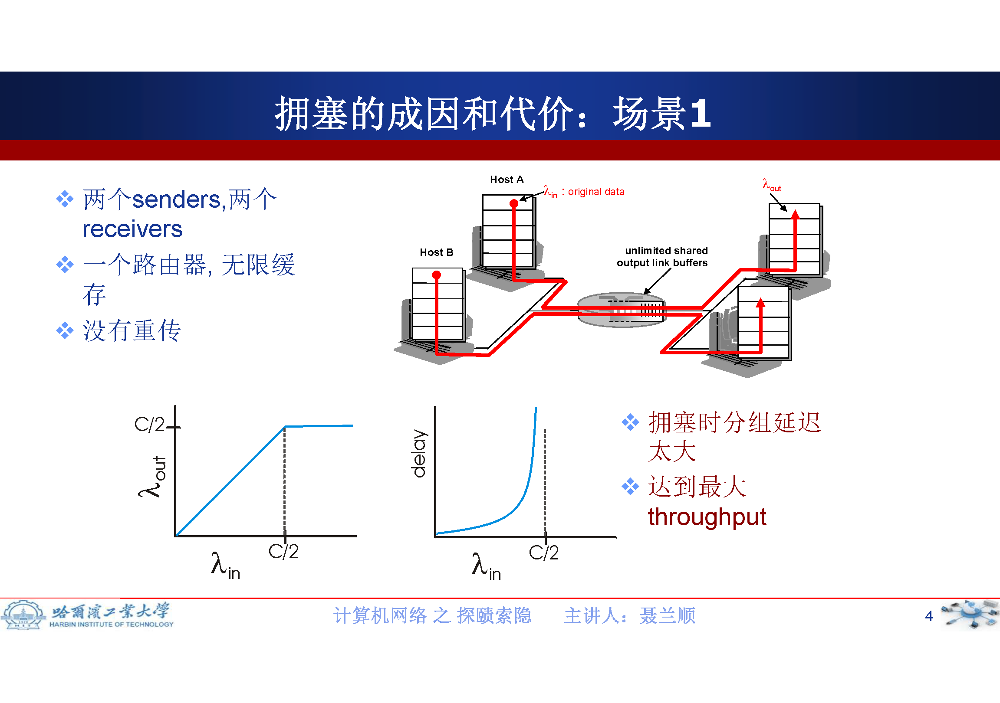
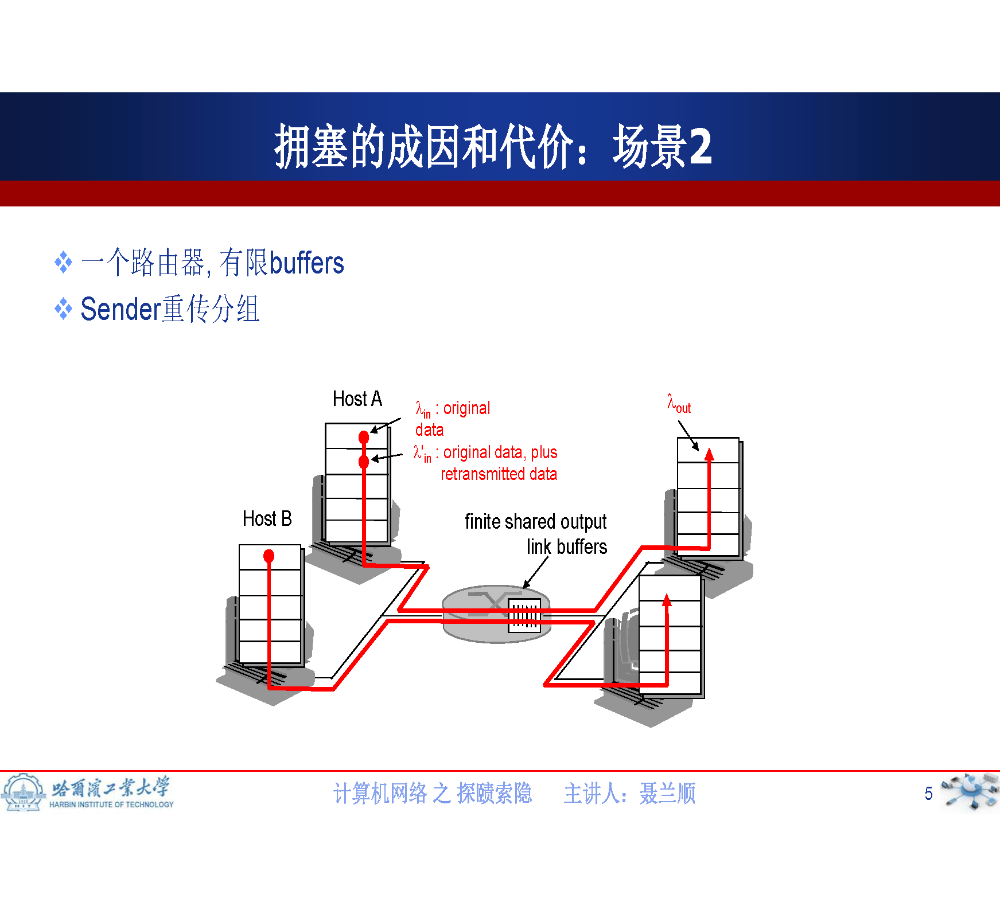
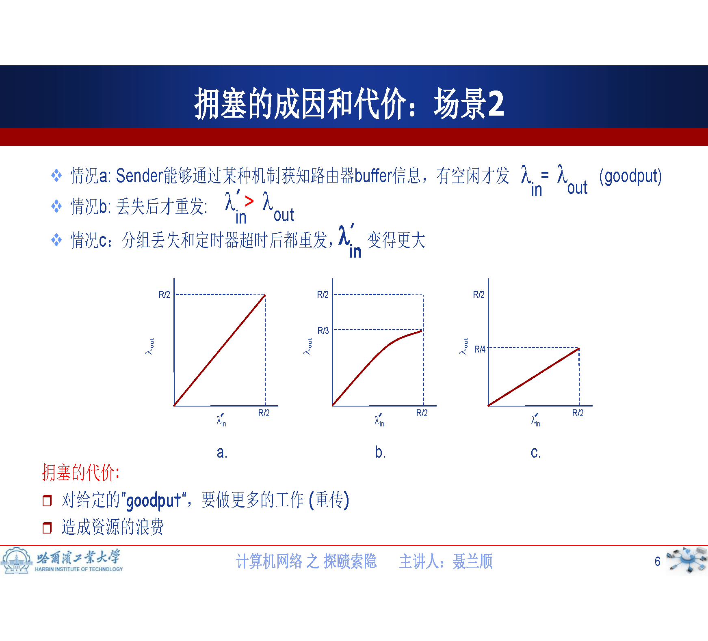
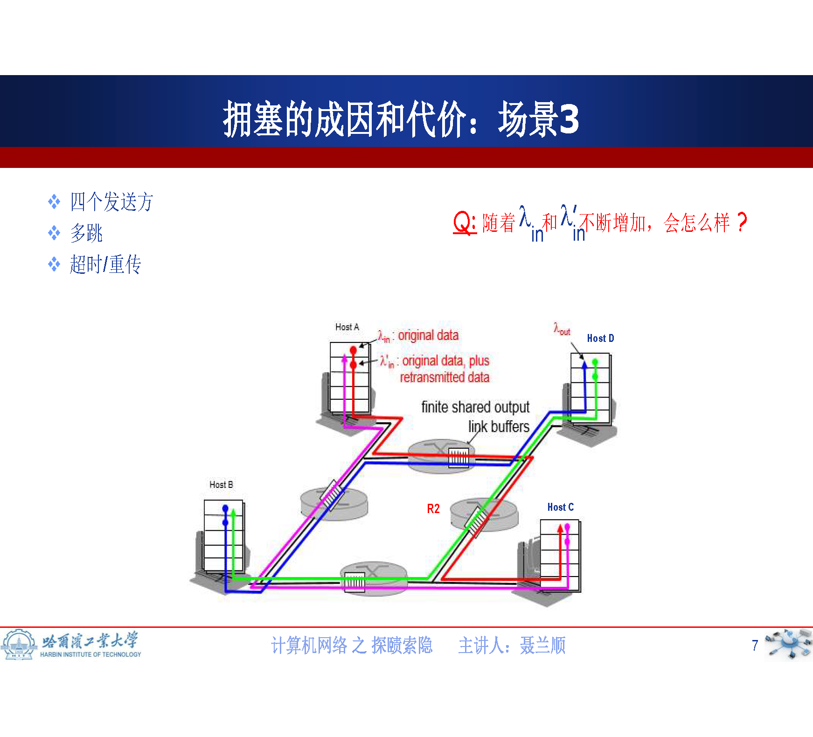
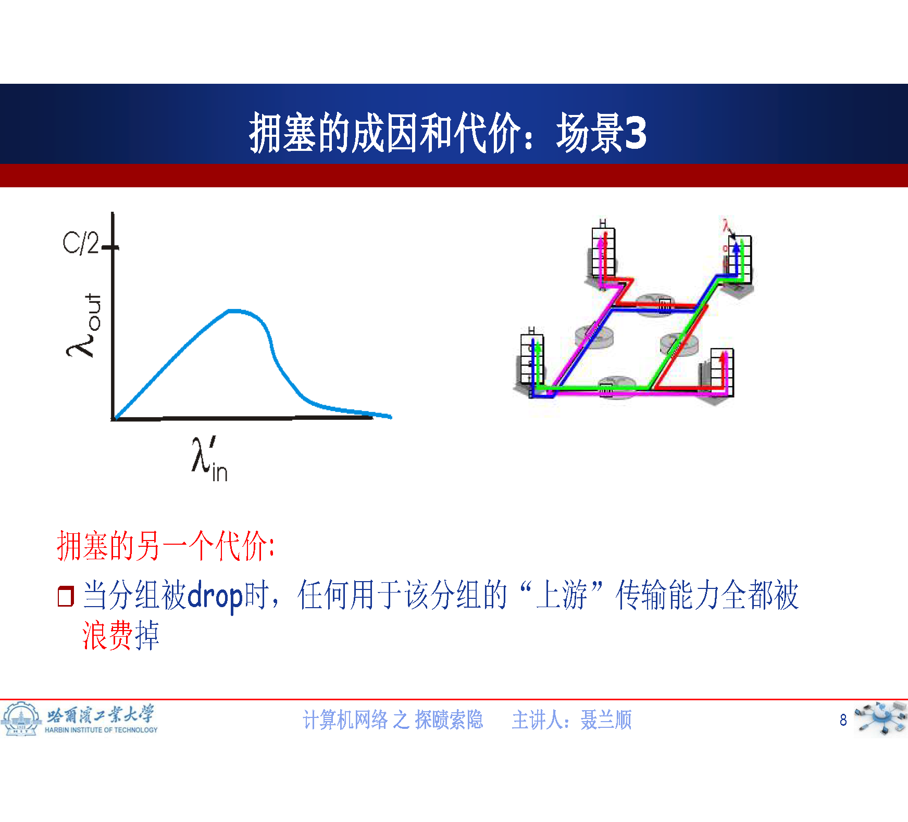

### 拥塞控制的方法

#### 端到端拥塞控制

- 网络层不需要显式的提供帮助
- 端系统通过观察loss、delay等网络行为判断是否发生拥塞
- TCP采用这种策略

#### 网络辅助的拥塞控制

- 路由器向发送方显式的反馈网络拥塞信息
- 简单的拥塞指示
- 指示发送方应该采取何种速率

## TCP拥塞控制的基本原理

- sender限制发送速率

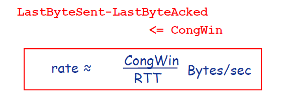

- CongWin
  - 动态调整以改变发送速率
  - 反映所感知到的网络拥塞

- 如何感知网络拥塞
  - Loss事件=timeout 或 3个重复ACK
  - 发生loss事件后，发送方降低速率

- 如何合理的调整发送速率
  - 加性增--乘性减：AIMD
  - 慢启动：SS

#### 加性增--乘性减：AIMD

- 原理：逐渐增加发送速率，谨慎探测可用带宽，直到发生loss
- 方法: AIMD
  - Additive Increase: 每个RTT将CongWin增大一个MSS(最大段的长度)——拥塞避免
  - Multiplicative Decrease: 发生loss后将CongWin减半

#### TCP慢启动: SS

- TCP连接建立时，CongWin=1
  - 例：MSS=500 byte,RTT=200msec
  - 初始速率=20k bps
- 可用带宽可能远远高于初始
速率：
  - 希望快速增长
  
- 原理：当连接开始时，指数性增长

慢启动算法：
```
initialize: Congwin = 1
for (each segment ACKed)
  Congwin++
until (loss event OR
  CongWin > threshold)
```

- 指数性增长
  - 每个RTT将CongWin翻倍
  - 收到每个ACK进行操作
- 初始速率很慢，但是快速攀升

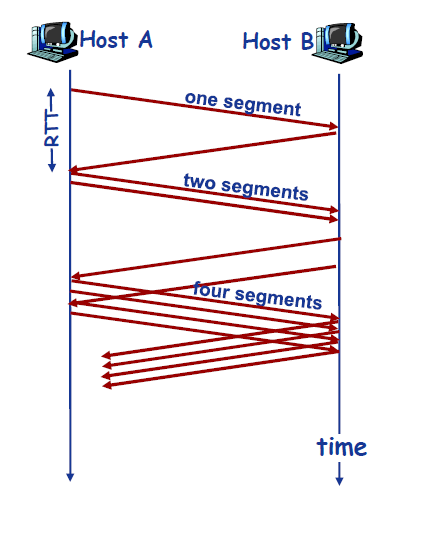

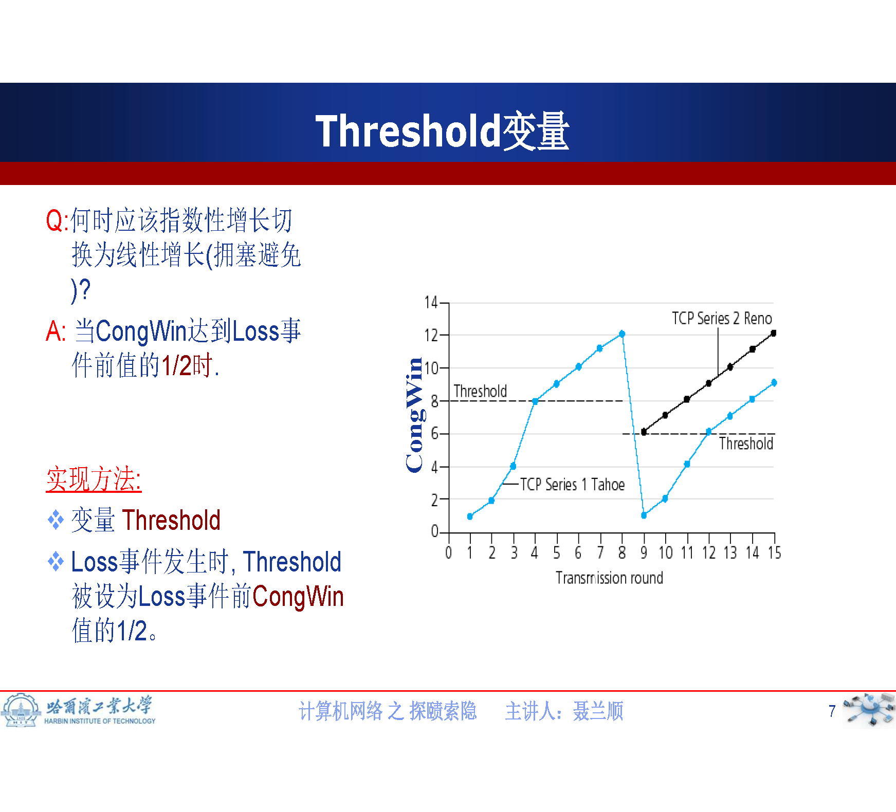

#### loss事件的处理

- 3个重复的ACKs
  - CongWin切到一半
  - 然后线性增长

- Timeout事件
  - CongWin直接设为1个MSS
  - 然后指数增长
  - 达到threshold后, 再线性增长

- 3个重复ACKs表示网络
还能够传输一些segments
- timeout事件表明拥塞更为严重

#### 总结

当CongWin低于Treshhold时，发送器处于慢启动阶段，窗口CongWin呈指数增长。
当CongWin 高于 Threshold, 发送 方 在 拥塞 避免 阶段, 窗口CongWin线性增长。
当3个重复 的ACK 产生, Threshold = CongWin/2，CongWin = Threshold。
出现超时时, Threshold  = CongWin/2 和 CongWin 设为1MSS。


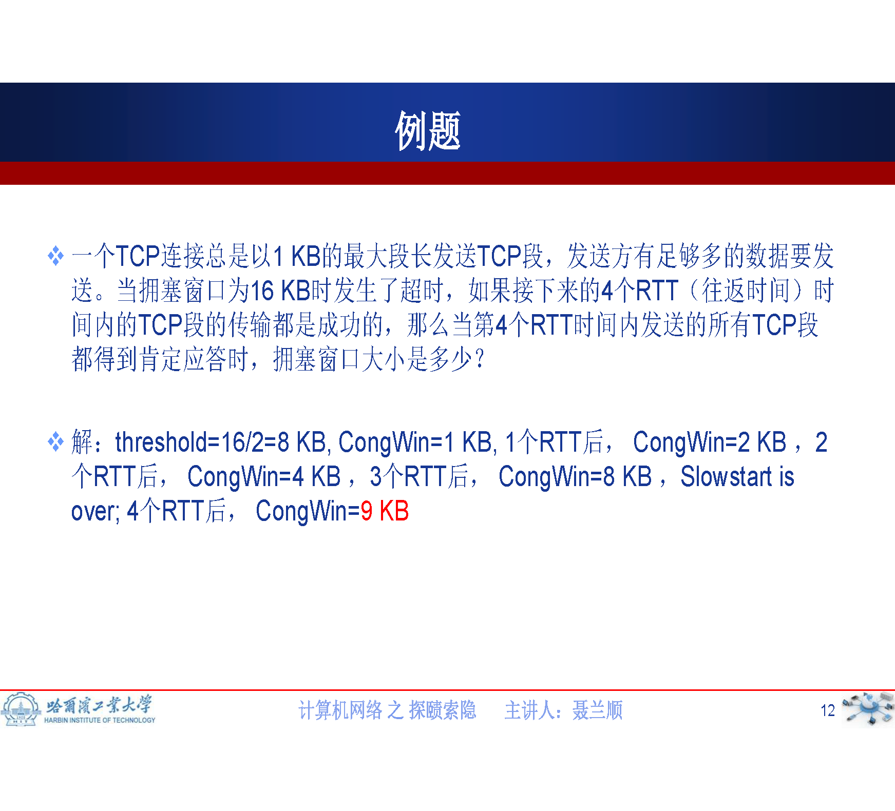
