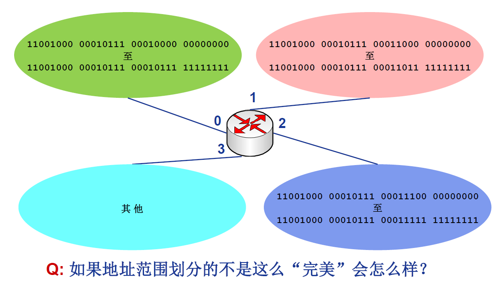
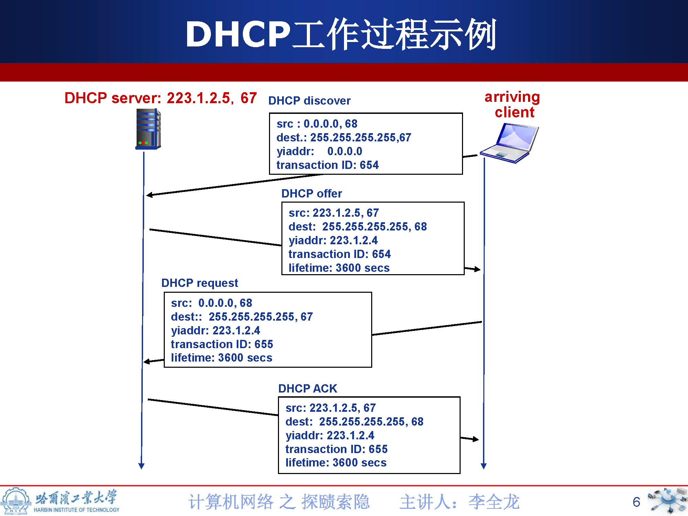

# 网络层服务

- 从发送主机向接受主机发送数据(segment)
- 发送主机：将数据段封装到数据报(datagram)中
- 接收主机：向传输层交付数据段(segment)
- 每个主机和路由器都运行网络层协议
- 路由器检验所有穿越它的IP数据报的头部域
  - 决策如何处理IP数据报

### 网络层核心功能-转发与路由

- 转发
  - 将分组从路由器的输入端口转移到合适的输出端口


- 路由：确定分组从源到目的的经过的路径
  - 路由算法

### 网络层核心功能-连接建立

- 某些网络的重要功能
  - ATM，帧中继，X.25
- 数据分组传输之前，两端主机首先需要建立虚拟/逻辑连接
  - 网络设备(如路由器)参与连接的建立

- 网络层连接与传输层连接的对比：
  - 网络层连接：两个主机之间(路径上的路由器等网络设备参与其中)
  - 传输层连接：两个网络进程之间(对中间网络设备透明)

### 网络层服务模型

- 无连接服务(connection-less service)
  - 不事先为系列分组的传输确定传输路径
  - 每个分组独立确定传输路径
  - 不同分组可能传输路径不同
  - **数据报网络**(datagram network )

- 连接服务(connection service):
  - 首先为系列分组的传输确定从源到目的经过的路径(建立连接)
  - 然后沿该路径（连接）传输系列分组
  - 系列分组传输路径相同
  - 传输结束后拆除连接
  - **虚电路网络**(virtual-circuit network )

# 虚电路网络与数据报网络

## 虚电路网络

**数据报(datagram)网络与虚电路(virtual-circuit)网络是典型两类分组交换网络。**

- 数据报网络提供网络层无连接服务
- 虚电路网络提供网络层连接服务
- 类似于传输层的无连接服务（UDP）和面向连接服务（TCP），但是网络层服务：
- 主机到主机服务
- 网络核心实现

- 虚电路：一条从源主机到目的主机，类似于电路的路径(逻辑连接)
  - **分组交换**
  - 每个**分组的传输利用链路的全部带宽**
  - 源到目的路径经过的**网络层设备共同完成**虚电路功能

- 通信过程：
  - 呼叫建立(call setup)→数据传输→拆除呼叫
- 每个分组携带**虚电路标识(VC ID)**，而不是目的主机地址
- 虚电路经过的**每个网络设备 （如路由器），维护每条经过它的虚电路连接状态**
- 链路、网络设备资源(如带宽、缓存等)可以面向VC进行预分配
  - 预分配资源=可预期服务性能
  - 如ATM的电路仿真（CBR）

#### VC的具体实现

每条虚电路包括:
  - 1.从源主机到目的主机的**一条路径**
  - 2.**虚电路号（VCID）**， 沿路每段链路一个编号
  - 3.沿路每个网络层设备（如路由器），利用转发表记录经过的每条虚电路
- 沿某条虚电路**传输的分组，携带对应虚电路的VCID**，而不是目的地址
- 同一条VC ，在每段链路上的VCID通常不同
- 路由器转发分组时**依据转发表改写/替换虚电路号**

#### VC转发表


#### 虚电路信令协议(signaling protocols)

- 用于VC的建立、维护与拆除
  - 路径选择
- 应用于虚电路网络
  - 如ATM、帧中继(frame-relay)网络等
- 目前Internet不采用


## 数据报网络

- 网络层无连接
- 每个分组携带目的地址
- 路由器根据分组的目的地址转发分组
  - 基于路由协议/算法构建转发表
  - 检索转发表
  - 每个分组独立选路


#### 数据报转发表





# IPv4协议

## IP协议-IP数据报

### Internet网络


### IP数据报分组格式


- 版本号字段占4位：IP协议的版本号
  - E.g. 4→IPv4，6 → IPv6
- 首部长度字段占4位：IP分组首部长度
  - 以4字节为单位
  - E.g. 5→IP首部长度为20(5×4)字节
- 服务类型(TOS)字段占8位：指期望获得哪种类型的服务
  - 1998 年这个字段改名为区分服务
  - 只有在网络提供区分服务(DiffServ)时使用
  - 一般情况下不使用，通常IP分组的该字段(第2字节)的值为00H
- 总长度字段占16位：IP分组的总字节数(首部+数据)
  - 最大IP分组的总长度：65535B
  - 最小的IP分组首部：20B
  - IP分组可以封装的最大数据：65535-20=65515B
- 生存时间（TTL）字段占8位：IP分组在网络中可以通过的路由器数（或跳步数）
  - 路由器转发一次分组，TTL减1
  - 如果TTL=0，路由器则丢弃该IP分组
- 协议字段占8位：指示IP分组封装的是哪个协议的数据包
  - 实现复用/分解
  - E.g. 6为TCP，表示封装的为TCP段；17为UDP，表示封装的是UDP数据报
- 首部校验和字段占16位：实现对IP分组首部的差错检测
  - 计算校验和时，该字段置全0
  - 采用反码算数运算求和，和的反码作为首部校验和字段
  - 逐跳计算、逐跳校验
- 源IP地址、目的IP地址字段各占32位：分别标识发送分组的源主机/路由器(网络接口)和接收分组的目的主机/路由器（网络接口）的IP地址
- 选项字段占长度可变，范围在1~40B之间：携带安全、源选路径、时间戳和路由记录等内容
  - 实际上很少被使用
- 填充字段占长度可变，范围在0~3B之间：目的是补齐整个首部，符合32位对齐，即保证首部长度是4字节的倍数
- 标识字段占16位：标识一个IP分组
  - IP协议利用一个计数器，每产生IP分组计数器加1，作为该IP分组的标识
- 标志位字段占3位：
  - DF (Don't Fragment)
    - DF =1：禁止分片；
    - DF =0：允许分片
  - MF (More Fragment)
    - MF =1：非最后一片；
    - MF =0：最后一片(或未分片)
- 片偏移字段占13位：一个IP分组分片封装原IP分组数据的相对偏移量
  - 片偏移字段以8字节为单位
  
### IP协议-IP分片

**最大传输单元(MTU)**:

- 网络链路存在MTU (最大传输单元)—链路层数据帧可封装数据的上限
  - 不同链路的MTU不同


### IP分片与重组

- **大IP分组向较小MTU链路转发时，可以被“分片” (fragmented)**
  - 1个IP分组分为多片IP分组
  - IP分片到达目的主机后进行“重组” (reassembled)
- IP首部的相关字段用于标识分片以及确定分片的相对顺序
  - 总长度、标识、标志位和片偏移


### IP分片过程

- 假设原IP分组总长度为L，待转发链路的MTU为M
- 若L>M，且DF=0，则可以/需要分片
- 分片时每个分片的标识复制原IP分组的标识
- 通常分片时，除最后一个分片，其他分片均分为MTU允许的最大分片
- 一个最大分片可封装的数据应该是**8的倍数**，因此，一个最大分片可封装的数据为：
`d=[(m-20)/8](向上取整)*8`
- 需要的总片数为：`n=[n-20]/d(向下取整)`
  


### IP编址

- IP分组：
  - 源地址(SA)-从哪儿来
  - 目的地址(DA)-到哪儿去
- 接口(interface): 主机/路由器与物理链路的连接
  - 实现网络层功能
  - 路由器通常有多个接口
  - 主机通常只有一个或两个接口 (e.g.，有线的以太网接口，无线的802.11接口)

**IP地址：32bit(IPv4)，编号标识主机、路由器的接口(每8位转换为十进制)**
<br>


**IP地址与每个接口关联**

#### IP子网subnets

- IP地址：
  - 网络号(NetID)-高比特位
  - 主机号(HostID)-低比特位

```
————————————————————————————————————————
|                    |                  |
|      NetID         |      HostID      |
|                    |                  |
————————————————————————————————————————
```
**网络号相同：**


- **IP子网**
  - IP地址具有相同网络号的设备接口
  - 不跨越路由器(第三及以上层网络设备)可以彼此物理联通的接口

### 有类IP地址


私有IP地址：

<table style="text-align:center">
  <tr>
    <td>class</td>
    <td>NetID</td>
    <td>HostID</td>
  </tr>
  <tr>
    <td>A</td>
    <td>10</td>
    <td>1</td>
  </tr>
  <tr>
    <td>B</td>
    <td>172.16 TO 172.31</td>
    <td>16</td>
  </tr>
  <tr>
    <td>C</td>
    <td>192.168.O TO 192.168.255</td>
    <td>256</td>
  </tr>
</table>

### IP子网划分与子网掩码

#### 子网划分

- IP地址:
  - 网络号(NetID) – 高位比特
  - 子网号(SubID) – 原网络主机号部分比特
  - 主机号(HostID) – 低位比特


#### 子网掩码

- 形如IP地址
  - 32位
  - 点分十进制形式
- 取值：
  - NetID、SubID位全为1
  - HostID全为0

例如：
- A网的默认子网掩码为：255.0.0.0
- B网的默认子网掩码为：255.255.0.0
- C网的默认子网掩码为：255.255.255.0
- 借用3比特划分子网的B网的子网掩码为：255.255.224.0


**子网地址+子网掩码准确确定子网大小。**


- **将IP分组的目的IP地址与子网掩码按位与运算，提取子网地址**


# IP协议-CIDR与路由聚合

CIDR：无类域间路由
- 消除了传统的A类、B类和C类地址界限
  - NetID+SubID 的网络前缀可以是任意长度
- 融合子网地址与子网掩码，方便子网划分
- 无类地址格式：a.b.b.d/x，其中x为前缀长度
- 提高IPv4地址分配效率
- 提高路由效率
  - 将多个子网聚合为一个较大的子网
  - 构造超网
  - 路由聚合


# DHCP协议

一个主机如何获得IP地址？
- 硬编码
  - 静态配置
- **动态主机配置协议-DHCP**
  - 从服务器动态获取
    - IP地址
    - 子网掩码
    - 默认网关地址
    - DNS服务器名称与IP地址
  - 即插即用
  - 允许地址重用
  - 支持再用地址续租
  - 支持移动用户加入网络


新到主机需要本网IP地址：

- 主机广播 “DHCP discover”(发现报文)
- DHCP服务器利用 “DHCP offer” (提供报文) 进行响应
- 主机请求IP地址: “DHCP request” (请求报文)
- DHCP服务器分配IP地址: “DHCP ack” (确认报文)



- DHCP协议在应用层实现
  - 请求报文封装到UDP数据报中
  - IP广播
  - 链路层广播 (e.g. 以太网广播)
- DHCP服务器构造ACK报文
  - 包括分配给客户的IP地址、子网掩码、默认网关、DNS服务器地址

# 网络地址转换


动机:
- 只需/能从ISP申请一个IP地址
  - IPv4地址耗尽
- 本地网络设备IP地址的变更，无需通告外界网络
- 变更ISP时，无需修改内部网络设备IP地址
- 内部网络设备对外界网络不可见，即不可直接寻址(安全)

实现:
- **替换**
  - 利用(NAT IP地址,新端口号)替换每个外出IP数据报的(源IP地址,源端口号)
- **记录**
  - 将每对(NAT IP地址, 新端口号) 与(源IP地址, 源端口号)的替换信息存储到NAT转换表中
- **替换**
  - 根据NAT转换表，利用(源IP地址, 源端口号)替换每个进入内网IP数据报的(目的IP地址,目的端口号)，即(NAT IP地址, 新端口号)

