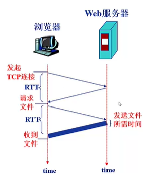
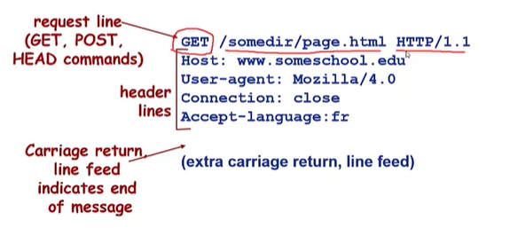
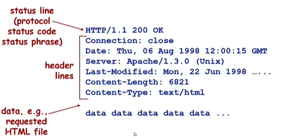
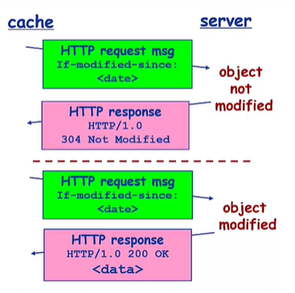
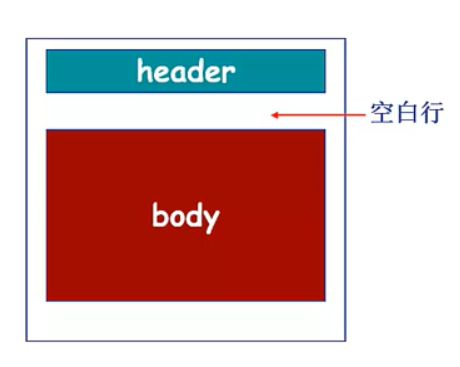
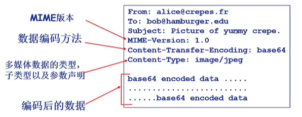
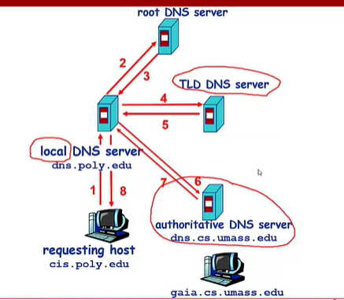
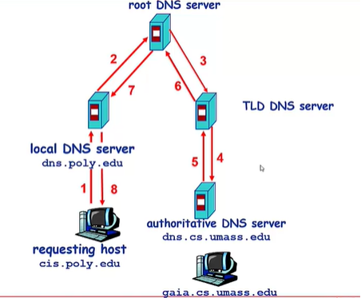

- 网络应用体系结构
  - 客户机/服务器
  - P2P(点对点结构 )
  - 混合结构
  
- 网络应用的服务需求
  - 可靠性
  - 带宽
  - 时延

- **Internet传输层服务模型**
  - TCP
  - UDP

- **特定网络应用协议**
  - HTTP
  - SMTP,POP,IMAP
  - DNS
  - P2P应用

- **Socket编程**
  - TCP
  - UDP

### 1. 网络应用体系结构

- 客户机/服务器
    - 服务器
      - 7*24小时提供服务
      - 永久性访问地址/域名
      - 利用大量服务器实现可拓展性

    - 客户机
      - 与服务器通信，使用服务器提供的服务
      - 间歇性接入网络
      - 可能使用动态IP地址
      - 不会与其他客户机直接通信

- P2P(点对点结构)
  - 纯P2P结构
    - 没有永远在线的服务器
    - 任意端系统/节点之间可以直接通信
    - 节点间歇性接入网络
    - 节点可能改变IP地址
  
- 混合结构

### 2. 网络应用进程通信

**网络应用的基础：进程间通信。**

进程：主机上运行的程序。

同一主机上运行的进程之间如何通信？
 - 进程间通信机制
 - 操作系统提供
  
不同主机上运行的进程间如何通信？
 - 消息交换

客户机进程：发起通信间的进程。

服务器进程：等待通信请求的进程。

**套接字：Socket**
  - 进程间利用socket发送/接受消息
  - 类似于寄信
    - 发送方将消息送到门外邮箱
    - 发送方依赖传输基础设施将消息传到接收方所在主机，并送到接收方的门外。
    - 接收方从门外获取信息
  - 传输基础设施向进程提供API
    - 传输协议的选择  
    - 参数的设置

**寻址进程**
- 不同主机上的进程间通信，每个进程必须拥有**标识符**。
- 寻址主机—— IP地址
- 端口号/port number
  - 为主机上每个需要通信的进程分配一个端口号
  - **HTTP Server：80**
  - Mail Server：25
- 进程的标识符
  - **IP地址+端口号**

### 3. 应用层协议
 
 网络应用需要遵循应用层协议。

 公开协议
- 由RFC(*Request For Comments*)定义
- 允许互操作
- **HTTP,SMTP……**

私有协议
- 多数P2P文件共享协议

**应用层协议的内容**
- 消息的类型
  - 请求消息
  - 响应消息
- 消息的语法(*syntax*)/格式
  - 字段
- 字段的语义
  - 字段中信息的含义
- 规则

### 4. 网络应用对传输服务的需求

数据丢失/可靠性
- 某些网络应用能够容忍一定的数据丢失：网络电话
- 某些要求100%可靠：文件传输，telnet
  
时延

带宽

### 4. Internet提供的传输服务

**TCP服务**
- 面向连接：客户/服务器进程间需要建立连接
- 可靠的传输
- 流量控制：发送方不会发送速度过快，超过接收方的处理能力
- 拥塞控制：当网络负载过重时能够限制发送方的发送速度
- 不提供时间/延迟保障
- 不提供最小带宽保障

**UDP服务**
- 无连接
- 不可靠的数据传输
- 不提供：
  - 可靠性保障
  - 流量控制
  - 拥塞控制
  - 延迟保障
  - 带宽保障
  
### 5. HTTP

网页包含多个对象：
- 对象：
- 基本HTML文件

对象的寻址：
- URL(*uniform resource locator*):统一资源定位器 RFC1738
- Schema：//host:port/path
  
**HTTP协议**
- 超文本传输协议
- C/S结构(*client-server*)
- **使用TCP传输协议**
  - 服务器在**80端口** 等待客户的请求
  - 浏览器发起到服务器的TCP连接
  - 服务器接受来自浏览器的TCP连接
  - 浏览器与Web服务器交换HTTP消息
  - 关闭TCP连接
- **无状态，不记录用户信息**
  - 服务器不维护任何有关客户端过去行为的信息

HTTP连接：
- 非持久性连接
  - 每个TCP连接最多允许传输**一**个对象
  - HTTP 1.0 版本使用**非持久性连接**
  - 每个对象需要2个RTT，时间长
  - 操作系统需要为每个TCP连接开销资源
  - 浏览器打开多个并行TCP，对服务器造成负担
- 持久性连接(*presistent http*)
  - 每个TCP连接允许传输**多个**对象
  - HTTP 1.1 版本默认使用**持久性连接**
  - 发送响应后，服务器保持TCP连接
    - **无流水的持久性连接**
      - 客户端只有收到前一个响应后才发送新的请求
      - 每个被引用的对象耗时一个RTT
    - 带有流水机制的持久性连接
      - HTTP 1.1的默认选项
      - 客户端只要遇到一个引用对象就尽快发出请求
      - 理想情况下，收到所有的引用对象只需耗时1个RTT

相应事件分析与建模：
- RTT(*Round Trip Time*)
- 响应时间
  - 发起、建立TCP连接
  - 发送HTTP请求消息到HTTP响应消息的前几个字节到达
  - 响应消息中所包含的文件/对象传输时间
  - total=2RTT + 文件发送时间

**HTTP请求消息**
- HTTP协议有两类消息
  - 请求消息

  - 响应消息

- 请求消息
  - ASCII：人直接可读

**上传输入的方法**
- **POST方法**
   - 网页经常需要填写表格
   - 在请求消息的消息体(*entity body*)中上传客户端的输入
- **URL方法**
  - 使用**GET**方法
  - 输入消息通过request行的URL字段上传
- **HEAD**
  - 请求Server不要将所请求的对象放入响应消息中
- **PUT(HTTP/1.1)**
  - 将消息体中的文件上传到URL字段所指定的路径
- **DELETE(HTTP/1.1)**
  - 删除URL字段指定的文件

**HTTP响应状态代码**
- 响应消息的第一行
- 示例：
  - 200 OK
  - 301 Moved Permanently
  - 400 Bad Request
  - 404 Not Found
  - 505 HTTP Version Not Supported
  - 500 Internet Server Error

### 6. Cookie

为什么需要Cookie？
- HTTP协议无状态，很多应用需要服务器掌握客户端的状态，如网上购物

Cookie技术：
- 某些网站为了辨别用户身份、进行session跟踪而储存在本地终端上的数据(通常经过加密)。
- RFC6265

**Cookie组件：**
- HTTP响应消息的cookie头部行
- HTTP请求消息的cookie头部行
- 保存在客户端主机上的cookie文件，由浏览器管理
- Web服务器端的后台数据库

Cookie的原理：
- 

cookie能够用于：
- 身份认证
- 购物车
- 推荐
- web email
- ……
- 隐私问题

### 7. Web缓存/代理服务器技术

功能：
- 在不访问服务器的前提下满足客户端的HTTP请求
- 缩短客户请求的响应时间
- 减少机构/组织的流量
- 在大范围实现有效的内容分发

Web缓存/代理服务器技术
- 用户设定浏览器通过缓存进行Web访问
- 浏览器向缓存/代理服务器发送所有的HTTP请求
  - 如果请求对象在缓存中，缓存返回对象
  - 否则，缓存服务器向原始服务器发送HTTP 请求，获取对象，然后返回给客户端并保存该对象
- 缓存既充当客户端，也充当服务器

HTTP 的条件性Get方法
- 如果缓存有最新的对象，则不需要发送请求对象
- 缓存：
  - 在HTTP请求消息中声明所持有版本的日期
  - If-modified-since:<date>
- 服务器
  - 如果缓存的版本是最新的，则响应消息中不包含对象
  - HTTP/1.0 304 Not Modified

### 8. email应用

Email应用的构成组件
- 异步应用
- 邮件客户端
  - 读、写Email消息
  - 与服务器交互，收发Email信息
  - outlook……
  - web客户端
- 邮件服务器
  - 邮箱：存储发给该客户的email
  - 消息队列：存储等待发送的email
- SMTP协议(*Simple Mail Transfer Protocol*)
  - 邮件服务器之间传递消息所使用的协议
  - 客户端：发送消息的服务器
  - 服务器：接收消息的服务器
  - 使用**TCP**进行email消息的可靠传输
  - 端口25
  - 传输过程的三个阶段
    - 握手
    - 消息传输
    - 关闭
  - **命令/响应交互模式**
    - 命令(*command*):ASCII文本
    - 响应(*response*):状态代码和语句
    - Email消息只能包含**7**位ASCII码
  - 使用持久性连接
  - SMTP服务器利用CRLF.CRLF确定消息的结束

**与HTTP 对比**：
- HTTP：拉式(*pull*)
- SMTP:退式(*push*)
- 都使用命令/响应交互模式
- 命令和状态代码都是ASCII代码
- HTTP:每个对象封装在独立的响应消息中
- SMTP：多个对象在由多个部分构成的消息中发送

Email消息格式
- RFC 822
  - 头部行(*header*)
    - To
    - From 与SMTP命令不同
    - Subject
  - 消息体(*body*)
    - 消息本身
    - 只能说ASCII字符                     
- 
- **多媒体拓展** RFC 2045 2056
  - MIME：多媒体邮件拓展
    - 通过在有键头部增加额外的行以声明MIME的内容类型  

邮件访问协议：从服务器获取邮件
- POP：Post Office Protocal
  - 认证/授权和下载
  - IMAP：Internet Mail Access Protocal
    - 能够操纵服务器上存储的消息
    - 所有消息统一保存在一个地方：服务器
    - 允许用户利用文件夹组织信息
    - 支持跨会话的用户状态
  - HTTP：163， QQ Mail……

### 9. DNS(*Domain Name System*)

Internet上主机/路由的识别问题
- **IP地址**
- **域名**
- 域名和IP地址之间如何映射？
  - 域名解析系统DNS
    - 多层命名服务器构成的**分布式层次式**数据库
    - 应用层协议：完成名字的解析
      - Internet核心功能，用应用层协议实现
      - 网络边界复杂

**DNS服务**
- 域名向IP地址的翻译
- 主机别名
- 邮件服务器别名
- 负载均衡：Web服务器

**客户端想要查询www.amazon.com的IP**
- 客户端查询根服务器
- 客户端查询com域名解析服务器，找到amazon.com域名解析服务器
- 客户端查询amazon.com域名解析服务器，获得www.amazon.com的IP地址

DNS根域名服务器
- 本地域名服务器无法解析域名时，访问根域名服务器
- 根域名服务器

TLD和权威域名解析服务器
- 顶级域名服务器(*top-level domain*)：负责com，org，net，edu等顶级域名和国家域名
- 权威域名解析服务器：组织的域名解析服务器，提供组织内部服务器的解析服务

**本地域名解析服务器**
- 不属于层级体系
- 每个ISP有一个本地域名服务器
  - 默认域名解析服务器
- 当主机进行DNS查询时，查询被发到本地域名服务器作为代理，将查询转发给层级式域名解析服务器系统

迭代查询
- 被查询服务器返回域名解析服务器的名字
- 
递归查询
- 将域名解析的任务交给所联系的服务器
- 

DNS记录缓存和更新
- 只要域名解析服务器获得域名——IP映射，即缓存这一映射
  - 本地域名服务器一般缓存顶级域名服务器的映射

DNS记录：
- 资源记录
- Type=A
  - name：主机域名
  - value：IP地址
  - Type=NS
    - name：域(*edu.cn*)
    - value：该域权威域名解析服务器的主机域名
  - Type=CNAME
    - name：某一真实域名的别名
    - value：真实域名
  - Type=MX
    - value是与name相对应的邮件服务器

DNS协议：
- 查询(*query*)和回复(*reply*)
- 消息格式相同
消息头部
- identification：16位查询编号，回复使用相同编号
- flags
  - 查询或回复
  - 期望递归
  - 递归可用
  - 权威回答
- 
