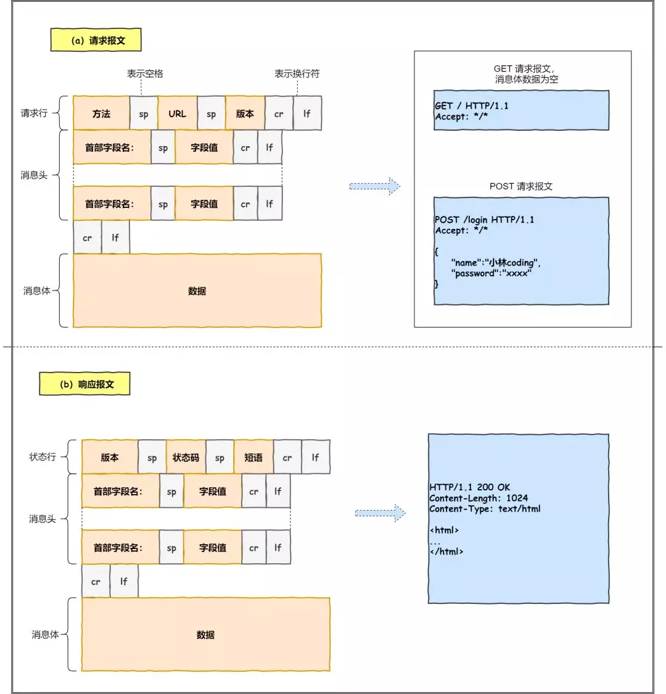
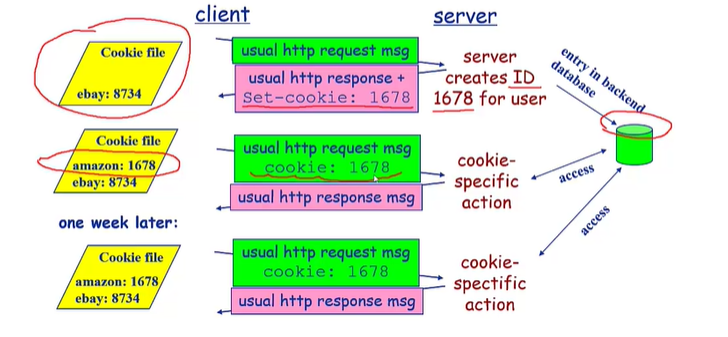
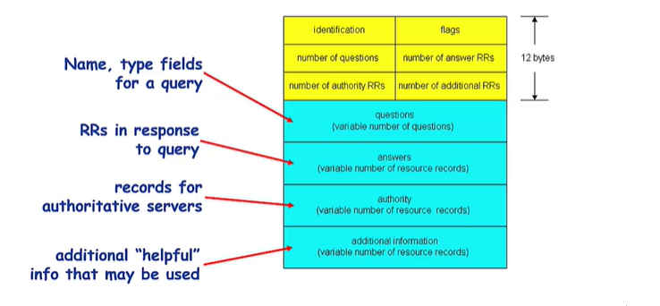
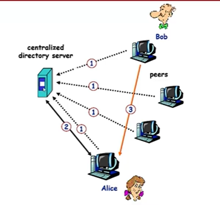
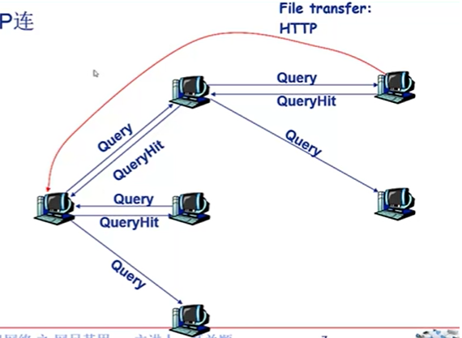
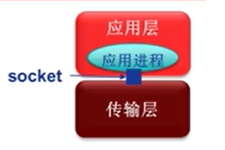
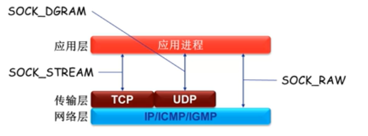
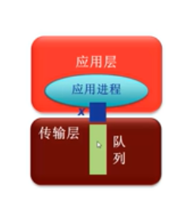
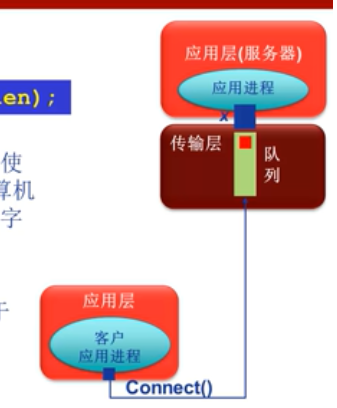
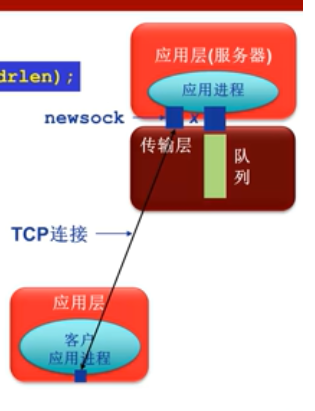

- 网络应用体系结构
  - 客户机/服务器
  - P2P(点对点结构 )
  - 混合结构
  
- 网络应用的服务需求
  - 可靠性
  - 带宽
  - 时延

- **Internet传输层服务模型**
  - TCP
    - 可靠(不丢失，不乱序等)、面向连接、字节流传输、点对点
  - UDP
    - 不可靠、无连接、数据报传输

- **特定网络应用协议**
  - HTTP
  - SMTP,POP,IMAP
  - DNS
  - P2P应用

- **Socket编程**
  - TCP
  - UDP

# 1. 网络应用体系结构

- 客户机/服务器
    - 服务器
      - 7*24小时提供服务
      - 永久性访问地址/域名
      - 利用大量服务器实现可拓展性

    - 客户机
      - 与服务器通信，使用服务器提供的服务
      - 间歇性接入网络
      - 可能使用动态IP地址
      - 不会与其他客户机直接通信

- P2P(点对点结构)
  - 纯P2P结构
    - 没有永远在线的服务器
    - 任意端系统/节点之间可以直接通信
    - 节点间歇性接入网络
    - 节点可能改变IP地址
  
- 混合结构

# 2. 网络应用进程通信

**网络应用的基础：进程间通信。**

进程：主机上运行的程序。

同一主机上运行的进程之间如何通信？
 - 进程间通信机制
 - 操作系统提供
  
不同主机上运行的进程间如何通信？
 - 消息交换

客户机进程：发起通信间的进程。

服务器进程：等待通信请求的进程。

**套接字：Socket**
  - 进程间利用socket发送/接受消息
  - 类似于寄信
    - 发送方将消息送到门外邮箱
    - 发送方依赖传输基础设施将消息传到接收方所在主机，并送到接收方的门外。
    - 接收方从门外获取信息
  - 传输基础设施向进程提供API
    - 传输协议的选择  
    - 参数的设置

**寻址进程**
- 不同主机上的进程间通信，每个进程必须拥有**标识符**。
- 寻址主机—— IP地址
- 端口号/port number
  - 为主机上每个需要通信的进程分配一个端口号
  - **HTTP Server：80**
  - Mail Server：25
- 进程的标识符
  - **IP地址+端口号**

# 3. 应用层协议
 
 网络应用需要遵循应用层协议。

 公开协议
- 由RFC(*Request For Comments*)定义
- 允许互操作
- **HTTP,SMTP……**

私有协议
- 多数P2P文件共享协议

**应用层协议的内容**
- 消息的类型
  - 请求消息
  - 响应消息
- 消息的语法(*syntax*)/格式
  - 字段
- 字段的语义
  - 字段中信息的含义
- 规则

### 4. 网络应用对传输服务的需求

数据丢失/可靠性
- 某些网络应用能够容忍一定的数据丢失：网络电话
- 某些要求100%可靠：文件传输，telnet
  
时延

带宽

# 4. Internet提供的传输服务

**TCP服务**
- 面向连接：客户/服务器进程间需要建立连接
- 可靠的传输
- 流量控制：发送方不会发送速度过快，超过接收方的处理能力
- 拥塞控制：当网络负载过重时能够限制发送方的发送速度
- 不提供时间/延迟保障
- 不提供最小带宽保障

**UDP服务**
- 无连接
- 不可靠的数据传输
- 不提供：
  - 可靠性保障
  - 流量控制
  - 拥塞控制
  - 延迟保障
  - 带宽保障
  
# 5. HTTP

网页包含多个对象：
- 对象：
- 基本HTML文件

对象的寻址：
- URL(*uniform resource locator*):统一资源定位器 RFC1738
- Schema：//host:port/path
  
**HTTP协议**
- 超文本传输协议
- C/S结构(*client-server*)
- **使用TCP传输协议**
  - 服务器在**80端口** 等待客户的请求
  - 浏览器发起到服务器的TCP连接
  - 服务器接受来自浏览器的TCP连接
  - 浏览器与Web服务器交换HTTP消息
  - 关闭TCP连接
- **无状态，不记录用户信息**
  - 服务器不维护任何有关客户端过去行为的信息

HTTP连接：
- 非持久性连接
  - 每个TCP连接最多允许传输**一**个对象
  - HTTP 1.0 版本使用**非持久性连接**
  - 每个对象需要2个RTT，时间长
  - 操作系统需要为每个TCP连接开销资源
  - 浏览器打开多个并行TCP，对服务器造成负担
- 持久性连接(*presistent http*)
  - 每个TCP连接允许传输**多个**对象
  - HTTP 1.1 版本默认使用**持久性连接**
  - 发送响应后，服务器保持TCP连接
    - **无流水的持久性连接**
      - 客户端只有收到前一个响应后才发送新的请求
      - 每个被引用的对象耗时一个RTT
    - 带有流水机制的持久性连接
      - HTTP 1.1的默认选项
      - 客户端只要遇到一个引用对象就尽快发出请求
      - 理想情况下，收到所有的引用对象只需耗时1个RTT

相应事件分析与建模：
- RTT(*Round Trip Time*)
- 响应时间
  - 发起、建立TCP连接
  - 发送HTTP请求消息到HTTP响应消息的前几个字节到达
  - 响应消息中所包含的文件/对象传输时间
  - total=2RTT + 文件发送时间

**HTTP请求消息**

- HTTP协议有两类消息
  - 请求消息

  - 响应消息

- 请求消息
  - ASCII：人直接可读

**上传输入的方法**
- **POST方法**
   - 网页经常需要填写表格
   - 在请求消息的消息体(*entity body*)中上传客户端的输入
- **URL方法**
  - 使用**GET**方法
  - 输入消息通过request行的URL字段上传
- **HEAD**
  - 请求Server不要将所请求的对象放入响应消息中
- **PUT(HTTP/1.1)**
  - 将消息体中的文件上传到URL字段所指定的路径
- **DELETE(HTTP/1.1)**
  - 删除URL字段指定的文件

**HTTP响应状态代码**
- 响应消息的第一行
- 示例：
  - 200 OK
  - 301 Moved Permanently
  - 400 Bad Request
  - 404 Not Found
  - 505 HTTP Version Not Supported
  - 500 Internet Server Error

# 6. Cookie

为什么需要Cookie？
- HTTP协议无状态，很多应用需要服务器掌握客户端的状态，如网上购物

Cookie技术：
- 某些网站为了辨别用户身份、进行session跟踪而储存在本地终端上的数据(通常经过加密)。
- RFC6265

**Cookie组件：**
- HTTP响应消息的cookie头部行
- HTTP请求消息的cookie头部行
- 保存在客户端主机上的cookie文件，由浏览器管理
- Web服务器端的后台数据库

Cookie的原理：
- 

cookie能够用于：
- 身份认证
- 购物车
- 推荐
- web email
- ……
- 隐私问题

# 7. Web缓存/代理服务器技术

功能：
- 在不访问服务器的前提下满足客户端的HTTP请求
- 缩短客户请求的响应时间
- 减少机构/组织的流量
- 在大范围实现有效的内容分发

Web缓存/代理服务器技术
- 用户设定浏览器通过缓存进行Web访问
- 浏览器向缓存/代理服务器发送所有的HTTP请求
  - 如果请求对象在缓存中，缓存返回对象
  - 否则，缓存服务器向原始服务器发送HTTP 请求，获取对象，然后返回给客户端并保存该对象
- 缓存既充当客户端，也充当服务器

HTTP 的条件性Get方法
- 如果缓存有最新的对象，则不需要发送请求对象
- 缓存：
  - 在HTTP请求消息中声明所持有版本的日期
  - If-modified-since:<date>
- 服务器
  - 如果缓存的版本是最新的，则响应消息中不包含对象
  - HTTP/1.0 304 Not Modified

# 8. email应用

Email应用的构成组件
- 异步应用
- 邮件客户端
  - 读、写Email消息
  - 与服务器交互，收发Email信息
  - outlook……
  - web客户端
- 邮件服务器
  - 邮箱：存储发给该客户的email
  - 消息队列：存储等待发送的email
- SMTP协议(*Simple Mail Transfer Protocol*)
  - 邮件服务器之间传递消息所使用的协议
  - 客户端：发送消息的服务器
  - 服务器：接收消息的服务器
  - 使用**TCP**进行email消息的可靠传输
  - 端口25
  - 传输过程的三个阶段
    - 握手
    - 消息传输
    - 关闭
  - **命令/响应交互模式**
    - 命令(*command*):ASCII文本
    - 响应(*response*):状态代码和语句
    - Email消息只能包含**7**位ASCII码
  - 使用持久性连接
  - SMTP服务器利用CRLF.CRLF确定消息的结束

**与HTTP 对比**：
- HTTP：拉式(*pull*)
- SMTP:退式(*push*)
- 都使用命令/响应交互模式
- 命令和状态代码都是ASCII代码
- HTTP:每个对象封装在独立的响应消息中
- SMTP：多个对象在由多个部分构成的消息中发送

Email消息格式
- RFC 822
  - 头部行(*header*)
    - To
    - From 与SMTP命令不同
    - Subject
  - 消息体(*body*)
    - 消息本身
    - 只能说ASCII字符                     
- 
- **多媒体拓展** RFC 2045 2056
  - MIME：多媒体邮件拓展
    - 通过在有键头部增加额外的行以声明MIME的内容类型  

邮件访问协议：从服务器获取邮件
- POP：Post Office Protocal
  - 认证/授权和下载
  - IMAP：Internet Mail Access Protocal
    - 能够操纵服务器上存储的消息
    - 所有消息统一保存在一个地方：服务器
    - 允许用户利用文件夹组织信息
    - 支持跨会话的用户状态
  - HTTP：163， QQ Mail……

# 9. DNS(*Domain Name System*)

Internet上主机/路由的识别问题
- **IP地址**
- **域名**
- 域名和IP地址之间如何映射？
  - 域名解析系统DNS
    - 多层命名服务器构成的**分布式层次式**数据库
    - 应用层协议：完成名字的解析
      - Internet核心功能，用应用层协议实现
      - 网络边界复杂
  
域名的层级关系类似一个树状结构：
- 根 DNS 服务器
- 顶级域 DNS 服务器（com）
- 权威 DNS 服务器（server.com）
- 根域的 DNS 服务器信息保存在互联网中所有的 DNS 服务器中，任何 DNS 服务器就都可以找到并访问根域 DNS 服务器了。
  

**DNS服务**
- 域名向IP地址的翻译
- 主机别名
- 邮件服务器别名
- 负载均衡：Web服务器

**域名解析的工作流程**

- 客户端首先会发出一个 DNS 请求，问 www.server.com 的 IP 是啥，并发给本地 DNS 服务器（也就是客户端的 TCP/IP 设置中填写的 DNS 服务器地址）。

- 本地域名服务器收到客户端的请求后，如果缓存里的表格能找到 www.server.com，则它直接返回 IP 地址。如果没有，本地 DNS 会去问它的根域名服务器：“老大， 能告诉我 www.server.com 的 IP 地址吗？” 根域名服务器是最高层次的，它不直接用于域名解析，但能指明一条道路。

- 根 DNS 收到来自本地 DNS 的请求后，发现后置是 .com，说：“www.server.com 这个域名归 .com 区域管理”，我给你 .com 顶级域名服务器地址给你，你去问问它吧。”

- 本地 DNS 收到顶级域名服务器的地址后，发起请求问“老二， 你能告诉我 www.server.com  的 IP 地址吗？”

- 顶级域名服务器说：“我给你负责 www.server.com 区域的权威 DNS 服务器的地址，你去问它应该能问到”。

- 本地 DNS 于是转向问权威 DNS 服务器：“老三，www.server.com对应的IP是啥呀？” server.com 的权威 DNS 服务器，它是域名解析结果的原出处。为啥叫权威呢？就是我的域名我做主。

- 权威 DNS 服务器查询后将对应的 IP 地址 X.X.X.X 告诉本地 DNS。

- 本地 DNS 再将 IP 地址返回客户端，客户端和目标建立连接。

**客户端想要查询www.amazon.com的IP**
- 客户端查询根服务器
- 客户端查询com域名解析服务器，找到amazon.com域名解析服务器
- 客户端查询amazon.com域名解析服务器，获得www.amazon.com的IP地址

DNS根域名服务器
- 本地域名服务器无法解析域名时，访问根域名服务器
- 根域名服务器

TLD和权威域名解析服务器
- 顶级域名服务器(*top-level domain*)：负责com，org，net，edu等顶级域名和国家域名
- 权威域名解析服务器：组织的域名解析服务器，提供组织内部服务器的解析服务

**本地域名解析服务器**
- 不属于层级体系
- 每个ISP有一个本地域名服务器
  - 默认域名解析服务器
- **当主机进行DNS查询时，查询被发到本地域名服务器作为代理，将查询转发给层级式域名解析服务器系统**

迭代查询
- 被查询服务器返回域名解析服务器的名字
- 
递归查询
- 将域名解析的任务交给所联系的服务器
- 

DNS记录缓存和更新
- 只要域名解析服务器获得域名——IP映射，即缓存这一映射
  - 本地域名服务器一般缓存顶级域名服务器的映射

DNS记录：
- 资源记录
- Type=A
  - name：主机域名
  - value：IP地址
  - Type=NS
    - name：域(*edu.cn*)
    - value：该域权威域名解析服务器的主机域名
  - Type=CNAME
    - name：某一真实域名的别名
    - value：真实域名
  - Type=MX
    - value是与name相对应的邮件服务器

DNS协议：
- 查询(*query*)和回复(*reply*)
- 消息格式相同
消息头部
- identification：16位查询编号，回复使用相同编号
- flags
  - 查询或回复
  - 期望递归
  - 递归可用
  - 权威回答
- 

# 10. P2P应用
peer to peer

## **纯P2P架构** ##
- 没有服务器
- 任意端系统之间直接通信
- 节点阶段性接入Internet
- 节点可能更换IP地址
- 节点同时作为客户端和服务器端。

## **文件分发** ##
问题：从一个服务器向N个节点分发一个文件需要多长时间？
us:服务器上传带宽；
ui:节点i的上传带宽；
di:节点i的下载带宽；
 - 服务器必须发送一个副本
   - 时间：F/us
   - 客户机i需要F/di
   - 总共需要下载NF比特
   - 最快的可能上传速率：us+ $\sum u_i$

## **索引技术** ##

### 搜索信息
- P2P系统的**索引**：信息到接待你位置(IP地址+端口号)的映射；
- 文件共享(电驴)：
  - 利用索引动态跟踪节点所共享的文件的位置
  - 节点需要告诉索引它拥有哪些文件
  - 节点搜索索引，从而能获知能够得到哪些文件
- 即时消息(QQ):
  - 索引负责将用户名映射到位置
  - 当用户开启IM应用时，需要通知索引它的位置
  - 接待你检索索引，确定用户的IP地址

### 集中式索引
- 节点加入时，通知中央服务器
  - IP地址
  - 内容
- Alice查找“HEY JUDE”
- Alice从Bob处请求文件

**集中式索引的问题**
- 内容和文件传输是分布式的，但是内容定位是高度集中的。
- 单点失效问题
- 性能瓶颈
- 版权问题

### 洪泛式查询：Query flooding
- 完全分布式架构
- 每个节点对它共享的文件进行索引，且只对它共享的文件进行索引
覆盖网络：Graph
- 节点X与Y之间如果有TCP连接，那么构成一个边
- 所有的活动节点和边构成覆盖网络
- 边：虚拟链路
- 节点一般邻居数少于10个
- 查询消息通过已有的TCP连接发送
- 节点转发查询消息
- 如果查询命中，则利用反向路径发回查询节点
- 洪泛式查询会大量消耗网络带宽，导致网络拥塞

### 层次式覆盖网络
- 介于集中式索引和洪泛查询之间的方法
- 每个节点或者是一个超级节点，或者被分配一个超级节点
  - 节点和超级节点间维持TCP连接
  - 某些超级节点对之间维持TCP连接
- 超级节点负责跟踪子节点的内容
- 案例应用：Skype
  - 本质上是P2P的：用户/节点对之间直接通信
  - 私有应用层协议
  - 采用层次式覆盖网络架构
  - 索引负责维护用户名与IP地址间的映射
  - 索引分布在超级节点上

# 11. Socket编程
**Socket API在传输层**

应用编程接口API：就是应用进程的控制权和操作系统的控制权进行转换的一个系统调用接口。**典型：socket**

## Socket API
- 标识通信端点(对外)：
  - 端口+IP
- 操作系统/进程如何管理套接字(对内)？
  - 套接字描述符(socket descriptor)
    - 小整数

## Socket API函数(WinSock)
### WSAStartup(初始化Windows Sockets API)
- 使用Socket的应用程序在使用Socket之前必须首先调用WSAStartup函数。
- 两个参数：
  - 第一个参数指明程序请求的WinSock版本，其中高位字节指明副版本、低位字节指明主版本。
    - 十六进制整数，例如0x102表示2.1版
  - 第二个参数返回实际的WinSock版本信息
    - 指向WSADATA结构的指针
应用程序
### WSACleanup 释放所使用的Windows Sockets DLL)
- 应用程序在完(成对请求的Socket库的使用，**最后**要调用WSACleanup函数
- 解除与Socket库的绑定
- 释放Socket库所占用的系统资源

### socket

sd = socket(protofamily, type, proto);
- 创建套接字
- 操作系统返回套接字描述符(*sd*)
- 第一个参数(协议族)：protofamily = PF_INET(TCP/IP)
- 第二个参数(套接字类型)：
  - **type = SOCK_STREAM(TCP),SOCK_DGRAM(UDP),SOCK_RAW(网络层)(TCP/IP)**
- 第三个参数(协议号)：默认0

### Closesocket

int closesocket(SOCKET sd)
- 关闭一个描述符为sd的套接字
- 如果多个进程共享一个套接字，调用closesocket将套接字引用计数减1，减至0才关闭
- 一个进程中的多线程对一个套接字的使用无计数
  - 如果进程中的一个线程调用closesocket将一个套接字关闭，该进程中的其他线程也将不能访问该套接字
- 返回值：0：成功
- SOCKET_ERROR: 失败

### bind

int bind = (sd, localaddr, adderlen)
- 绑定套接字的本地端点地址
  - IP+端口号
- 参数：
  - 套接字描述符(sd)
  - 端点地址(localaddr):结构：sockaddr_in
- 客户程序一般不必调用bind函数
- 服务器端？
  - 熟知端口号
  - IP

### listen

int listen(sd, queuesize)
- 置服务器的流套接字处于监听状态
  - **仅服务器端调用**
  - 仅用于面向连接的流套接字
- 设置连接请求队列大小
- 返回值：
  - 0：成功
  - SOCKET_ERROR:失败
  - 

### connect

connect(sd, saddr, saddrlen);
- 客户程序调用connect函数来使客户套接字(sd)与特定计算机的特定端口(saddr)的套接字进行连接
- 仅用于客户端
- 可用于TCP客户端也可以用于UDP客户端
  - TCP客户端：建立TCP连接
  - UDP客户端：指定服务器端点地址
- 

### accept

newsock = accept(sd, caddr, caddrlen)
- 服务程序调用accept函数从属于监听状态的流套接字sd的客户连接请求队列中取出排在最前的一个客户请求，并且创建一个新的套接字来与客户套接字创建连接通道
  - 仅用于TCP连接
  - 仅用于服务器
- 利用新创建的套接字(newsock)与客户通信
- 

### send sendto
### recv recvfrom

### setsockopt，getsockopt
setsockopt：设置套接字sd的选项参数
getsockopt：获取任意类型、任意状态套接口的选项当前值

### 总结：

<table style = "text-align: center">
  <tr>
    <td>函数名</td>
    <td>用途</td>
  </tr>
  <tr>
    <td>WSAStartup</td>
    <td>初始化socket库(winSock)</td>
  </tr>
  <tr>
    <td>WSACleanup</td>
    <td>清除/终止socket库使用</td>
  </tr>
  <tr>
    <td>socket</td>
    <td>创建套接字</td>
  </tr>
  <tr>
    <td>connect</td>
    <td>连接远端服务器(仅用于客户端)</td>
  </tr>
  <tr>
    <td>closesocket</td>
    <td>释放/关闭套接字</td>
  </tr>
  <tr>
    <td>bind</td>
    <td>绑定套接字的本地IP和端口号(通常客户端不需要)</td>
  </tr>
  <tr>
    <td>listen</td>
    <td>置服务器端TCP套接字为监听模式，并设置队列大小(仅用于服务器端TCP套接字)</td>
  </tr>
  <tr>
    <td>accept</td>
    <td>接受/提取一个连接请求，创建新套接字，通过新套接(仅用于服务器端的TCP套接字)</td>
  </tr>
  <tr>
    <td>recv</td>
    <td>接收数据(用于TCP套接字/连接模式的客户端UDP套接字)</td>
  </tr>
  <tr>
    <td>recvfrom</td>
    <td>接收数据报</td>
  </tr>
  <tr>
    <td>send</td>
    <td>发送数据(TCP套接字/连接模式的客户端UDP套接字)</td>
  </tr>
  <tr>
    <td>sendto</td>
    <td>发送数据报(非连接模式的客户端UDP套接字)</td>
  </tr>
  <tr>
    <td>setsocket</td>
    <td>设置套接字选项参数</td>
  </tr>
  <tr>
    <td>getsocket</td>
    <td>获取套接字选项参数</td>
  </tr>
</table>

### 关于网络字节顺序
- TCP/IP定义了标准的用于协议头中的二进制整数表示：网络字节顺序(network byte order)
- 某些Socket API函数的参数需要存储为网络字节顺序(IP地址，端口号等)
- 可以实现本地字节顺序与网络字节顺序转换的函数
  - *htons*：本地字节顺序-网络字节顺序(16bits)
  - *ntohs*：网络字节顺序-本地字节顺序(16bits)
  - *htonl*：本地字节顺序-网络字节顺序(32bits)
  - *ntohl*：网络字节顺序-本地字节顺序(32bits)

### 解析服务器IP地址

- 客户端可能域名或IP地址标识服务器
- IP协议需要使用32位二进制IP地址
- **需要将域名或IP地址转换为32位IP地址**
  - 函数*inet_addr*实现点分十进制IP地址到32位IP地址转换
  - 函数*gethostbyname*实现域名到32位IP地址转换
    - 返回一个指向结构hostent的指针

### 解析服务器(熟知)端口号

- 客户端还可能使用服务名(如HTTP)标识服务器端口
- 需要将服务名转换为熟知端口号
  - 函数*getservbyname*
    - 返回一个指向结构servent的指针

### 解析协议号

### TCP客户端软件流程

1. 确定服务器IP地址与端口号
2. 创建套接字
3. 分配本地端点地址(IP+端口号)
4. 连接服务器(套接字)
5. 遵循应用层协议进行通信

### UDP客户端软件流程

1. 确定服务器IP地址与端口号
2. 创建套接字
3. 分配本地端点地址(IP+端口号)
4. 指定服务器端点地址，构造UDP数据报
5. 遵循应用层协议进行通信

### 4种类型基本服务器

- 循环无连接服务器
- 循环面向连接服务器
- 并发无连接
- 并发面向连接

 

1. 循环无连接服务器基本流程
- UDP传输协议
- 创建套接字
- 绑定端点地址
- 反复接受来自客户端的请求
- 遵循应用层协议，构造响应报文，发送给客户
- 数据发送
  - 服务器端不能使用connect函数
  - 无连接服务器使用森低头函数发送数据报