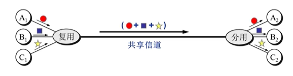
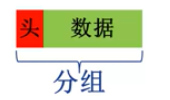
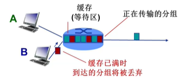
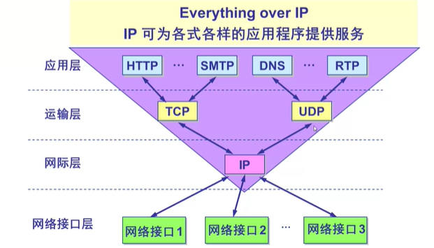

### 1. 计算机网络
   
计算机网络就是一互联的、自治的计算机集合。自治：无主从关系。通过交换网络互联主机。

计算机网络 = 通信技术+计算机技术

### 2. 计算机网络基础

协议是计算机网络有序运行的重要保证。

**硬件是计算机网络的基础。**

网络协议：协议规定了交换信息的格式、意义、顺序、针对收到的信息/发生的事件采取的actions。

协议的三要素：

    语法：
        数据与控制信息的结构或格式
        信号电平
    语义：
        需要发出何种控制信息
        完成何种动作以及做出何种响应
        差错控制
    时序：
        时间顺序
        协议匹配

### 3. 计算机网络结构

网络边缘：主机、网络应用

    主机（端系统）：位于“网络边缘”、运行网络应用程序
    客户/服务器应用模型：客户发送请求，接收服务器响应

接入网络，物理介质：有线/无线通信链路

**网络核心（核心网络）**：互联网的路由器/分组转发设备、网络之网络

    互联网的路由器网络
    网络核心的关键功能：路由+转发
    网络核心解决的基本问题：数据交换

网络结构：

    端系统通过接入ISP连接到Internet；接入ISP必须进一步互联；构成复杂的网络互连的网络。

### 4. 网络核心

最典型电路交换网络：电话网络

电路交换的三个阶段：

    建立连接（呼叫/电路建立）
    通信
    释放连接（拆除电路）

**多路复用（multiplexing）**，简称复用，是通信技术的基本概念。

链路/网络资源划分为“资源片”
    将资源片分配给各路“呼叫”
    每路呼叫独占分配到的资源片进行通信
    资源片可能闲置（无共享）

典型多路复用方法：
    频分多路复用FDM
    时分多路复用TDM
    波分多路复用WDM
    码分多路复用CDM：广泛应用于无线链路共享（如蜂窝网、卫星通信等）

### 5. 报文交换

**报文**：源（应用）发送信息整体.

报文交换：

    报文长度为M bits
    链路宽度为R bps
    每次传输报文需要M/R秒

分组交换：传输延迟

    报文被拆得分为多个分组
    分组长度为L bits
    每个分组传输时延为L/R秒
    跳步数：h
    路由器数：n

T = M/R+(h-1)L/R = M/R+NL/R

分组：报文分拆出来的一系列相对较小的数据包。

分组交换需要报文的拆分与重组,产生额外开销。

**报文交换与分组交换均采用存储-转发交换方式区别：**

    报文交换以完整报文进行“存储-转发”
    分组交换以较小的分组进行“存储-转发”

分组交换允许更多用户同时使用网络！--网络资源充分共享。适用于突发数据传输网络，可能产生拥塞(congestion)分组延迟和丢失。

### 6. 计算机网络性能

**速率**：数据率/数据传输速率/比特率。速率往往是指额定速率/标称速率。

单位时间(秒)传输信息量，计算机网络中最重要的一个性能指标。

**时延**：时延是指一个报文或分组从一个网络的一端传送到另一个端所需要的时间。

**带宽**：原本指信号具有的频带宽度，即最高频率与最低频率之差，单位是赫兹。

网络的带宽通常是数字信道所能传送的最高数据率，单位：b/s（bps）。

**时延带宽积** = 传播时延×带宽 = dprop</prop> × R(bits)

链路的时延带宽积又称为以比特为单位的链路长度。

**丢包：**

吞吐量/率：表示再发送端与接收端之间传送数据速率。

### 7. 计算机网络的体系结构：分层结构

* **OSI模型**：
  * 7：应用层（Apllication）
  * 6：表示层（Presentation）
  * 5：会话层（Session）
  * 4：传输层（Transport）
  * 3：网络层（Network）]
  * 2：数据链路层（Data link）
  * 1：物理层（Physical）

<table style="text-align:center">
    <tr>
        <td></td>
        <td>物理层</td>
        <td>数据链路层</td>
        <td>网络层</td>
        <td>传输层</td>
        <td>会话层</td>
        <td>表示层</td>
        <td>应用层</td>
    </tr>
    <tr>
        <td>功能</td>
        <td></td>
        <td>负责结点-结点数据传输</td>
        <td>源主机到目的主机数据分组交付;路由
        </td>
        <td>分段与重组，SAP寻址，流量控制</td>
        <td>对话控制，同步，最“薄”的一层</td>
        <td>数据表示转化，加密/解密，压缩/解压缩</td>
        <td>使用网络服务</td>
    </tr>
</table>

### 8. TCP/IP模型

- 5层参考模型
  - 应用层
  - 传输层
  - 网络层
  - 数据链路层
  - 物理层 

<table style="text-align:center">
    <tr>
        <td></td>
        <td>应用层</td>
        <td>传输层</td>
        <td>网络层</td>
        <td>数据链路层</td>
        <td>物理层</td>
    </tr>
    <tr>
        <td>功能</td>
        <td>支持各种网络应用;FTP,SMTP,HTTP</td>
        <td>进程-进程的数据传输;TCP,UDP</td>
        <td>源主机到目的主机的数据分组路由和转发;IP协议、路由协议</td>
        <td>相邻网络元素的数据传输;以太网，WIFI</td>
        <td>比特传输</td>
    </tr>
</table>